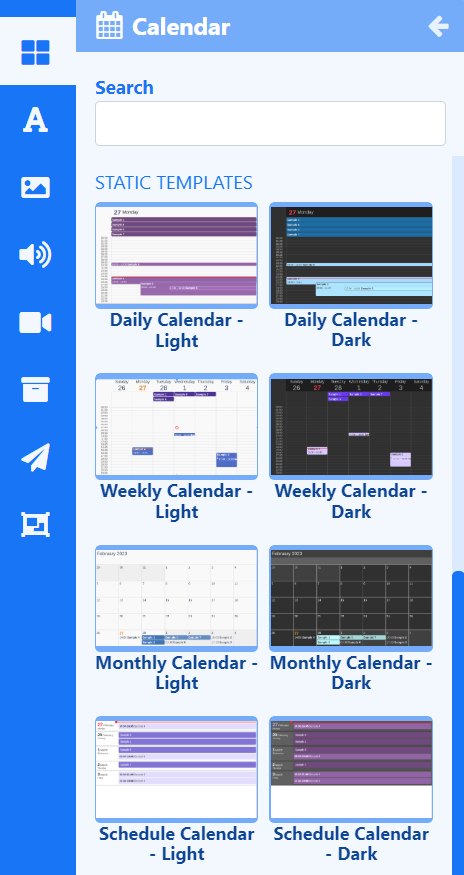

# Calendar

Display Calendar events pulled in from an iCal feed anywhere on a Layout using **Elements** or select a **Static Template** to display results in Layouts/Playlists.

{feat}Calendar View|v4{/feat}

Calendar data is provided by an iCal feed which will feed into configured Elements and Static Templates.

{tip}
Ensure that the ICS feed URL is available to the CMS. If the feed loads in a browser without authentication then the feed should display in the CMS without issue.

For further information on how to view your Google Calendar in applications, use the following link selecting the **Get your calendar (view only)** option: https://support.google.com/calendar/answer/37648?hl=en
{/tip}

## Calendar Elements

[Elements](layouts_editor#content-data-widgets-and-elements) are available for selection when adding the Calendar Widget to a [Layout](layouts_editor.html) to give Users more control over what components of the Calendar Widget to use and where they can be placed.

Each Element has a set of configuration options in the Properties Panel.  Enter the iCal feed to use to return results from the **Configure** tab.

Control how items should be cycled by specifying a [Data Slot](https://test.xibo.org.uk/manual/en/layouts_editor.html#content-data-slots) to use for each of the added Elements. Data Elements can be further complimented by adding [Global Elements](layouts_editor.html#content-global-elements) to add shapes and text which can all be put into an [Element Group](layouts_editor.html#content-grouping-elements) for easier configuration and positioning.

Take advantage of [Stencils](layouts_editor.html#content-stencils) to add a predesigned group of Elements to your Layout. 

{tip}
All Elements in the Stencil are treated as 'one' when configured and can be easily duplicated from a right click!
{/tip}

## Calendar Static Templates

[Static Templates](layouts_editor.html#content-static-templates) define how returned results should be laid out and styled and are a simple way to show your data using pre-styled templates.

Templates can be configured to make changes to the design appearance using a range of options in the Properties Panel. Enter an iCal to return results from the **Configure** tab for each Template added to the Layout/Playlist.

## Overview

- Return events within a specified date range.
- Options to exclude all day and current events from the feed so they won't be shown.
- Use event and calendar timezones.
- Set duration per item.
- Specify how many events to display.
- Execute a Web Hook trigger when certain conditions are detected.
- Data for this media is cached by the Players for off-line playback.

### Web Hook Triggers 

Trigger a Web Hook [Action](layouts_interactive_actions.html) when there is a **Current Event** or **No Event** from the Trigger tab.

{tip}
**Example Scenario**:

A user has a meeting room calendar configured using the Calendar Widget on a Layout which shows the current occupancy for a room and would like to change LED lights to show when vacant or in use.

- The user would first need to create [Shell Commands](displays_command_functionality.html#content-shell-commands) which issued commands to an LED IoT device or the inbuilt LEDS's on some of the Philips Commercial Displays.
- Next an [Interactive Action](layouts_interactive_actions.html) would need to be defined on the **Layout**, which would **Navigate to Widget** and **Target the Screen**, with the [Shell Command Widget.](media_module_shellcommand.html) 
- From the **Trigger** tab, assign the code's to trigger the **Web Hooks** for **Current Event** and **No Event**.

{/tip}

