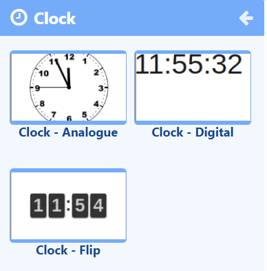

# 時計

**アナログ**、**フリップ**、**デジタル** スタイルの時計から選択します。

{feat}Clock|v4{/feat}

## 概要

- 明るいテーマまたは暗いテーマで、従来のアナログ時計の文字盤を表示します。
- テキスト/HTML を入力するか、提供されている日付形式を使用して、デジタル時計に使用する時間形式を指定します。
- アニメーション化されたフリップ時計を表示し、経過秒数を表示します。
- フリップ時計で時間、分、日次カウンター オプションを使用し、指定した日付/時刻から実行してカウントダウンを表示します。
- 現在の時刻に分単位のオフセットを適用します。

