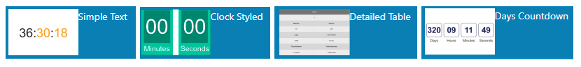

<!--toc=widgets-->

# カウントダウン

カウントダウンウィジェットは、選択された**期間**または**指定された日付**までのカウントダウンを表示するために使用することができます。

## ウィジェットを追加

[ウィジェット](layouts_widgets.html)ツールバーから**カウントダウン**をクリックし、追加またはドラッグ＆ドロップします。

追加すると、設定オプションがプロパティパネルに表示されます。

- 識別しやすいように **名前** を記入してください。
- 必要であれば、デフォルトの**期間**をオーバーライドするよう選択します。

### 設定

ドロップダウンメニューで、表示するカウントダウンの種類を選択します。

- **ウィジェットの期間 ** -カウントダウンはウィジェットの期間によって決定されます。
- **カスタム期間** - 秒単位でカウントダウンの期間を設定します。
- **目標日時** - 選択された日付と時刻までのカウントダウンします。

**警告日時**で、カウントダウンの残りの時間を'警告モード'に変更するタイミングを設定します。

{tip}
テンプレートをオーバーライド時に、CSSスタイルシートを用いて「警告」「終了」ステータスを設定することができます。
{/tip}

{tip}
このウィジェットの**水平**と**垂直**のアライメントを設定することができます。
{/tip}

### テンプレート

テンプレートタブをクリックし、ドロップダウンメニューから利用可能なプリセットテンプレートを1つを選択します。

## プリセットテンプレートの編集

プリセットされたテンプレートは、**テンプレートを上書き**のチェックボックスをクリックすることで編集することができます。

{tip}
テンプレートは自動的に拡大縮小されるため、意図した出力解像度に合わせた設計が必要です。テンプレートを編集する際には、以下のガイドラインを考慮する必要があります。

- テンプレートは一定の大きさでデザインすること
- フォント、マージン、幅、高さなど、すべての要素でpx単位の絶対サイズ指定が必要です。
- 位置決めを行う場合は、上、左から順に行う。
- テンプレートはbootstrapを使用することができます
- アスペクト比は[[PRODUCTNAME]]で固定され、リージョンに合わせたサイズに調整されます。
- テンプレートは静止画と同じ扱いになります
  {/tip}

オーバーライドテンプレートを選択した状態で、テキスト、HTML、CSSを入力することができます。

オーバーライドを選択したら、**テンプレートタブ**に戻り、編集するテンプレートを選択します。

 

##オプションのスタイルシート

上記のテンプレートに適用するCSSです。

## アクション

このウィジェットにはアクションを付けることができます。詳しくは[対話型アクション](layouts_interactive_actions.html)のページを参照してください。

## 補足情報

[[PRODUCTNAME]]は、正しいPHPの日付形式であるすべての日付形式を受け入れる必要があります。次の文字が認識され、使用できます。

| フォーマット文字 | 説明                                                  | 返される文字の例                 |
| ---------------- | :----------------------------------------------------------- | --------------------------------------- |
|                  | **日**                                                      |                                         |
| d                | ゼロから始まる２桁の日付              | 01 から 31                                |
| D                | 日を表すテキスト, ３文字            | Mon から Sun                         |
| j                | ゼロをつけない日付                       | 1 から 31                                 |
| l                | (小文字‘L’) 日を表す完全な文字列 | Sunday から Saturday                 |
| N                | ISO-8601で定義された曜日を表す数字(PHP 5.1.0で追加された) | 1 (月曜日) から 7 (日曜日)   |
| S                | 日にちに対する英語の序数サフィックス、2文字| st, nd, rd または thとともに使われる     |
| w                | 曜日の数字表現         | 0 (Sunday) から 6 (Saturday) |
| z                | 年初からの日（0から始まる)                        | 0 から 365                           |
|                  | **週**                                                     |                                         |
| W                | ISO-8601で規定する週の数字, 週は月曜日から始まる(PHP 4.1.0で追加) | 42 (一年の中の４２週目)          |
|                  | **月**                                                    |                                         |
| F                | 月のテキスト表現, January や March | January から December                |
| m                | ゼロで始まる月の数字表現        | 01 から 12                           |
| M                | 月の短いテキスト表現、３文字     | Jan から Dec                         |
| n                | 月の数字表現、先頭にゼロはつかない| 1 から 12                            |
| t                | 月の日数                            | 28 から 31                           |
|                  | **年**                                                     |                                         |
| L                | うるう年かどうか year                                     | 1 うるう年, 0 それ以外.    |
| o                | ISO-8601できていされた年. これはYと同じ値です。ただし、ISOの週番号（W）が前後の年に属している場合は、その年が代わりに 使用されます。(PHP 5.1.0で追加) | 1999 または 2003                            |
| Y                | 年の４桁数字表現            | 1999 または 2003                            |
| y                | 年の２桁数字表現                         | 99 or 0                                 |
|                  | **時間**                                                     |                                         |
| a                | 小文字アンティメリディアムとポストメリディアム                    | am または pm                                |
| A                | 大文字アンティメリディアムとポストメリディアム                    | AM または PM                                |
| B                | スウォッチインターネット時間                                         | 000 から 999                         |
| g                | 先行ゼロなしの時間の12時間形式              | 1 から 12                            |
| G                | 先行ゼロなしの時間の24時間形式              | 0 から 23                            |
| h                | 先行ゼロありの時間の12時間形式                 | 01 から 12                           |
| H                | 先行ゼロありの時間の２４時間形式                 | 00 から 23                           |
| i                | 先行ゼロ付き分                                   | 00 から 59                                |
| s                | 先行ゼロ付き秒                                  | 00 から 59                           |
| u                | マイクロ秒（PHP 5.2.2で追加） DateTimeがマイクロ秒で作成された場合、DateTime :: format（）はマイクロ秒をサポートする>のに対して、date（）は常に000000を生成します。 | 654321                                  |
|                  | **タイムゾーン**                                                 |                                         |
| e                | タイムゾーン識別子（PHP 5.1.0で追加）                     | UTC, GMT, Atlantic/Azores               |
| I                | （大文字のi）日付が夏時間であるかどうか| 夏時間の場合は1、それ以外の場合は0です。 |
| O                | グリニッジ時間（GMT）との時差                  | +0200                                   |
| P                | グリニッジ標準時（GMT）と時間と分の間の差（PHP 5.1.3で追加） | +02:00                                  |
| T                | タイムゾーンの略語                                        | EST, MDT …                              |
| Z                | 秒単位のタイムゾーンオフセット。 UTCより西のタイムゾーンのオフセットは常に負で、UTCより東のタイムゾーンのオフセットは常に正です。 | -43200 through 50400                    |
|                  | **フル日付/時刻**                                           |                                         |
| c                | ISO 8601 日付（PHP 5で追加）                               | 2004-02-12T15:19:21+00:00               |
| r                | » RFC 2822 フォーマット日付                                    | Thu, 21 Dec 2000 16:01:07 +0200         |

