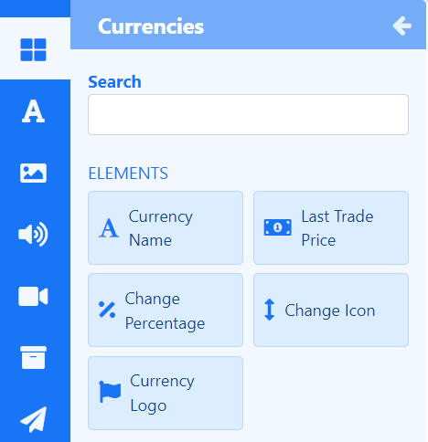

# Currencies

Display exchange rates for currency pairs anywhere on a Layout using **Elements** or select a **Static Template** to display results in Layouts/Playlists.

{feat}Currencies|v4{/feat}

The Currencies Widget relies in part on the [Alpha Vantage API](https://www.alphavantage.co/) to retrieve exchange rate data which feeds into configured Elements and Static Templates.

{tip}
Please visit [Alpha Vantage](https://www.alphavantage.co/support/#api-key) to create an account and obtain an API key to enter into the Alpha Vantage [Connector.](media_modules.html#content-connectors)
{/tip}

{nonwhite}
{cloud}
The Currencies Module is configured for **Xibo Cloud** hosted customers with an API key provided as part of the service.
{/cloud}
{/nonwhite}

## Currencies Elements

[Elements](layouts_editor#content-data-widgets-and-elements) are available for selection when adding the Currencies Widget to a [Layout](layouts_editor.html) to give Users more control over what components of the Currencies Widget to use and where they can be placed.

Each Element has a set of configuration options in the Properties Panel.  Enter **Currencies** using their acronyms/abbreviations you wish to show as well as a **Base** currency from the **Configure** tab.

Control how items should be cycled by specifying a [Data Slot](layouts_editor.html#content-data-slots) to use for each of the added Elements. Data Elements can be further complimented by adding [Global Elements](layouts_editor.html#content-global-elements) to add shapes and text which can all be put into an [Element Group](layouts_editor.html#content-grouping-elements) for easier configuration and positioning.

## Currencies Static Templates

[Static Templates](layouts_editor.html#content-static-templates) define how returned data should be laid out and styled and are a simple way to show your data using pre-styled templates.

Templates can be configured to make changes to the design appearance using a range of options in the Properties Panel. Enter **Currencies** using their acronyms/abbreviations you wish to show as well as a **Base** currency from the **Configure** tab for each Template added to the Layout/Playlist.

## Overview

- Reverse conversion to use the base currency as the comparison.
- Content for this media is cached by the Players for off-line playback.
- Duration can be applied per item or per page.

