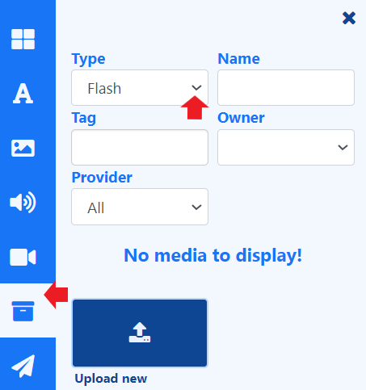

# Flash

[ライブラリ検索](layouts_editor.html#content-library-search) から、レイアウトとプレイリストに含める SWF ファイルを追加します。

「その他のメディア」検索を使用して、**タイプ** ドロップダウンから **Flash** を選択します。

{feat}Adobe Flash|v4{/feat}

{version}
**重要:** Adobe は Flash をサポートしなくなったため、時間の経過とともに段階的に廃止されます。このアプリケーションの開発とサポートが中止されたため、Android では Flash モジュールはサポートされなくなりました。徹底的なテストの結果、プレーヤーの不安定性によりプレーヤーが終了する可能性があることが判明しました。Flash モジュール経由または埋め込み Web サイトでの実行を引き続き選択する場合は、Flash アプリケーションが使用可能な場合はそれを使用してレンダリングされます。ただし、デバイスに安定性の問題がある場合は、Flash コンテンツの実行が原因である可能性があります。

現時点ではプレーヤーで Flash を再生できますが、オペレーティング システムやブラウザなどの他のサードパーティ コンポーネントを更新すると、Flash ファイルが再生できなくなる場合があります。

{/version}

{cloud}

このモジュールは、**Xibo Cloud Hosted** のお客様に対してはデフォルトで無効になっています。

{/cloud}

## 概要

- [ライブラリ検索](layouts_editor.html#content-library-search) から新しい SWF ファイルをプレイリスト/レイアウトに直接 [アップロード](media_library.html#content-add-media-upload) します。
- プレイリストとレイアウトに直接アップロードされたファイルは、再利用のために [ライブラリ](media_library.html) に自動的に保存されます。
- SWF ファイルを事前にライブラリにアップロードすることもできます。
- プレイリストに直接アップロードされた SWF ファイルの [開始時間と終了時間](media_playlists.html#content-widget-expiry-dates) を設定します。
- アップロード時に SWF ファイルを [フォルダー](tour_folders.html#content-saving-to-folders) に保存して、ユーザーへのアクセスを簡単に制御します。

