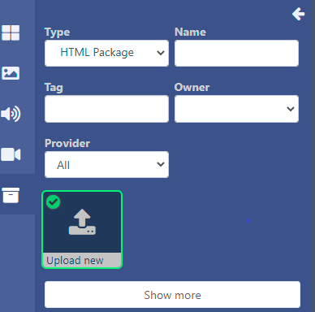
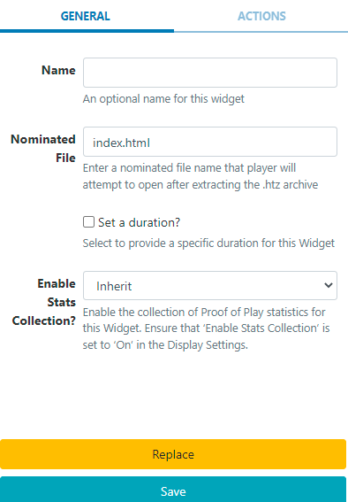

<!--toc=widgets-->

# HTMLパッケージ

HTMLパッケージモジュールは、プレーヤーに配布できる完全なHTMLパッケージのアップロードを可能にします。

## ウィジェットを追加

[ウィジェット](layouts_widgets.html)ツールバーの**HTMLパッケージ**をクリックして追加するかドラッグ＆ドロップしてください。 

{tip}
既にライブラリにアップロードされているHTMLパッケージファイルを追加するには、[ライブラリ検索](layouts_library_search.html)機能を使用します。
{/tip}

**ライブラリーのメディア検索**で、**タイプ**で絞り込み、**新規アップロード**を選択してレイアウトに追加してください。

## メディアファイルのアップロード

HTMLパッケージウィジェットを追加すると、ファイルアップローダーが起動します。

- **ファイルを追加する**をクリックし、アップロードするファイルを選択します。

- CMSで識別しやすいように**名前**を付け、オプションで**タグ**を付けてください。

{tip}
名前が空白の場合、アップロード時のファイル名と同じ名前になります。
{/tip}

HTMLパッケージは、指定した**フォルダ**に直接アップロードすることも可能です。

{tip}
フォルダに保存されたHTMLパッケージは、ユーザー/ユーザーグループのアクセス用に保存先フォルダに適用された表示、編集、削除、共有(users_features_and_sharing.html)オプションを引き継ぎます!
{/tip}

- **フォルダを選択**ボタンをクリックして展開し、保存するフォルダを選択します。
- フォルダを右クリックすることで、その他のオプションにアクセスすることができます。

{tip}
利用可能なフォルダーオプションは、ユーザー/ユーザーグループの有効な[機能と共有](users_features_and_sharing.html)オプションに基づきます。
{/tip}

- ファイルをアップロードするフォルダをクリックし、**完了**をクリックします
- **現在のフォルダ**には、選択したファイルのパスが表示されます。

{white}
フォルダアクセスとセットアップに関する詳細については、管理者にご相談ください。
{/white}

このウィジェットにアップロードされたファイルの**有効期限**と時間を設定するオプションがあります。

- **有効期限を設定**にチェックを入れます。

- 日付ピッカーで、**開始**と**終了**の日時を選択します。

- **アップロード開始**ボタンをクリックすると、アップロードが開始されます。
- アップロードに成功したら、**完了**をクリックします。

ファイルを個別にアップロードし、異なるフォルダの場所や有効期限を指定することも可能です。

アップロード開始ボタンをクリックするのではなく、フォルダの場所と有効期限を変更して追加したファイルの行の最後に表示される**青いアップロード**ボタンをクリックして、個別にアップロードしてください。

{tip}
タイムラインからウィジェットのアイコンをクリックして、有効期限を表示したり、変更したりできます。
{/tip}

## オプション設定

**タイムライン**から追加された**HTMLパッケージウィジェット**をクリックすると、**HTMLパッケージを編集**フォームで設定オプションが表示されます。

- 一般タブで 名前を編集し、必要に応じて特定の期間を指定します。
- .htzアーカイブを解凍した後、プレーヤーが開くファイル名を入力してください。
- 変更を保存します。

### アクション

このウィジェットにはアクションを付けることができます。詳しくは[対話型アクション](layouts_interactive_actions.html)のページを参照してください。

