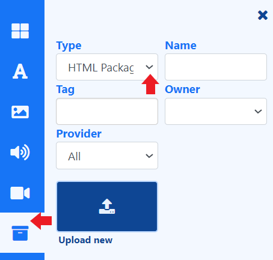

# HTML Package

Add a complete HTML Package on your Layouts and Playlists from the [Library Search](layouts_editor.html#content-library-search). 

Using the 'other media' search, use the **Type** drop down to select **HTML Package**.

{feat}HTML Package|v4{/feat}

## Overview

-  [Upload](media_library.html#content-add-media-upload) new files directly to Playlists/Layouts from the [Library Search](layouts_editor.html#content-library-search).
-  Files uploaded directly to Playlists and Layouts are automatically saved to the [Library](media_library.html) for re-use.
-  HTML files can be also be uploaded in advance to the Library.
-  Set [start and end times](media_playlists.html#content-widget-expiry-dates) for HTML files uploaded directly to a Playlist.
-  Save HTML files to [Folders](tour_folders.html#content-saving-to-folders) on upload, to easily control access to Users.

