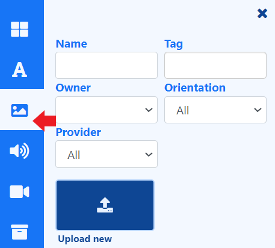

# 画像

[ライブラリ検索](layouts_editor.html#content-library-search) から、レイアウトとプレイリストに含める画像ファイルを追加します。

{feat}画像|v4{/feat}

## 概要

- 有効な拡張子: jpg、jpeg、png、bmp、gif、webp。

{tip}
アニメーション gif はどのプレーヤーでもサポートされていません。

{/tip}

- [ライブラリ検索](layouts_editor.html#content-library-search) から、新しい画像ファイルを直接プレイリスト/レイアウトに [アップロード](media_library.html#content-add-media-upload) します。
- プレイリストやレイアウトに直接アップロードされたファイルは、再利用できるように [ライブラリ](media_library.html) に自動的に保存されます。
- 画像ファイルを事前にライブラリにアップロードすることもできます。

{tip}
アップロードする画像ファイルを選択する際、ユーザーは画像の解像度を確認し、意図した画面サイズ内に収める必要があります。非常に大きな画像をアップロードすると、プレーヤーに問題が発生する可能性があるため、注意してください。
{/tip}

- プレイリストに直接アップロードされた画像ファイルの [開始時間と終了時間](media_playlists.html#content-widget-expiry-dates) を設定します。

- アップロード時に画像ファイルを [フォルダ](tour_folders.html#content-saving-to-folders) に保存して、ユーザーのアクセスを簡単に制御します。

- 中央揃え、ストレッチ、フィットのスケーリング。

- CMS を離れることなく、Pixabay から使用する画像を選択します。

**[[PRODUCTNAME]] では、ディスプレイに表示されるコンテンツを制御する手段を講じていないため、権利を所有していない場合は、使用する画像に適切な帰属表示を行う責任はお客様にあります。**

#### 次へ...

[画像のサイズ変更](tour_cms_settings#content-resizing-images)
