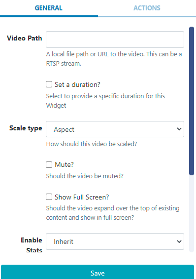

<!--toc=widgets-->

# ローカルビデオ

ローカル ビデオ ウィジェットは、以下のような、**ディスプレイ**上にのみ存在し、CMSにアップロードされないビデオに使用されます。

\- 手動で転送したビデオ
\- LAN上のビデオ
\- ストリームビデオ

## ウィジェットを追加

[ウィジェット](layouts_widgets.html)ツールバーの**ローカルビデオ**をクリックし、追加またはドラッグ＆ドロップします。

追加すると、設定オプションがプロパティパネルに表示されます。

- ビデオへのローカルファイルパスまたは URL を入力します（RTSP ストリームでも可）。
- オプションでデフォルトを上書きするデュレーションを設定します。
- ドロップダウンを使って、ビデオの**スケーリング**方法を選択します。
- チェックボックスで、ビデオのミュート／ミュート解除を行います。
- コンテンツの上のボタンをチェックすると、拡大表示され、フルスクリーンで表示されます。

{tip}
ビデオ スケーリングと RTSP ストリームは、Android、webOS、Linux プレーヤーでのみサポートされています。Window および Tizen プレーヤーで互換性のあるビデオ ストリームを表示するには、[HLS](media_module_hls.html) Widget を使用します。
{/tip}

{tip}
1つのレイアウトに表示できるRTSPストリームの数は、使用するデバイスに依存します。
{/tip}

{tip}
**注意** Tizenプレイヤーはトランジションに対応していません。
{/tip}

## アクション

このウィジェットにはアクションを付けることができます。詳しくは[対話型アクション](layouts_interactive_actions.html)のページを参照してください。

