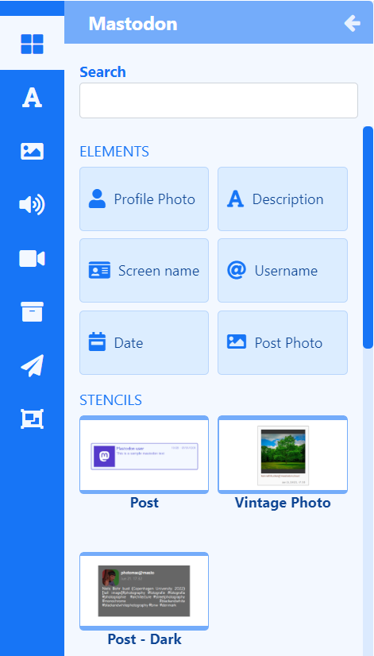

# Mastodon

エレメントを使用してレイアウト上の任意の場所に Mastodon ソーシャル フィード コンテンツを表示するか、レイアウト/プレイリストに事前にスタイル設定されたデザインの静的テンプレートを含めます。

{feat}Mastodon|v4{/feat}

Mastodon ウィジェットは、[モジュール](media_modules.html) に入力された URL からコンテンツを返します。このコンテンツは、構成されたエレメントと静的テンプレートにフィードされます。

## Mastodon 要素

Mastodon ウィジェットを [レイアウト](layouts_editor.html) に追加するときに [要素](layouts_editor#content-data-widgets-and-elements) を選択できるため、ユーザーは Mastodon ウィジェットのどのコンポーネントを使用するか、どこに配置できるかをより細かく制御できます。

各要素には、プロパティ パネルに一連の構成オプションがあります。レイアウトで使用される各要素の [構成] タブから結果を返すには、**ハッシュタグ** を指定する必要があります。追加された各要素に使用する [データ スロット](layouts_editor.html#content-data-slots) を指定して、アイテムの循環方法を制御します。データ要素は、[グローバル要素](layouts_editor.html#content-global-elements)を追加して図形やテキストを追加することでさらに強化できます。これらはすべて[要素グループ](layouts_editor.html#content-grouping-elements)にまとめられるため、構成や配置が簡単になります。

[ステンシル](layouts_editor.html#content-stencils)を利用して、事前にデザインされた要素のグループをレイアウトに追加します。

{tip}
ステンシル内のすべての要素は、構成時に「1 つ」として扱われ、右クリックで簡単に複製できます。

{/tip}

## Mastodon 静的テンプレート

[静的テンプレート](layouts_editor.html#content-static-templates)は、返されるアイテムのレイアウトとスタイルを定義するもので、事前にスタイル設定されたテンプレートを使用してアイテムを表示する簡単な方法です。

テンプレートは、返される結果の動作に影響を与えるように構成できるほか、プロパティ パネルのさまざまなオプションを使用してデザインの外観を変更することもできます。レイアウト/プレイリストに追加された各テンプレートの [**構成**] タブから結果を返すには、**ハッシュタグ** を指定する必要があります。

## 概要

- メディアが添付されている投稿のみを表示します。
- 投稿からメンション、ハッシュタグ、URL を削除します。
- ローカル サーバーまたはリモート サーバーからの投稿のみを表示します。
- パブリック ステータスを返すために、Mastodon ユーザー名を含めます。
- アイテムごとに期間を設定します。

{tip}
ほとんどの URL はデジタル サイネージに適していません。
{/tip}

