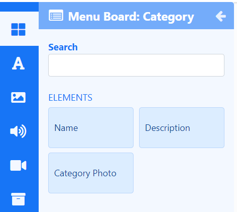

# Menu Boards: Category

Display data for Categories held in a Menu Board anywhere on a Layout using **Elements**.

{feat}Menu Board: Category|v4{/feat}

The Menu Boards: Category Widget primarily consists of a Menu Board source which feeds into configured Elements.

{tip}
[Menu Boards](media_menuboards.html) need to be created with defined Categories prior to adding the Menu Boards: Category Widget to Layouts.
{/tip}

## Category Elements

[Elements](layouts_editor#content-data-widgets-and-elements) are available for selection when adding a Menu Boards: Category Widget to a [Layout](layouts_editor.html) to give Users more control over what components of Menu Board Categories to use and where they can be placed.

Each Element has a set of configuration options in the Properties Panel. A Menu Board must be selected to use as the data source from the **Configure** tab for each Element used on the Layout. Control how items should be cycled by specifying a [Data Slot](layouts_editor.html#content-data-slots) to use for each of the added Elements. Data Elements can be further complimented by adding [Global Elements](layouts_editor.html#content-global-elements) to add shapes and text which can all be put into an [Element Group](layouts_editor.html#content-grouping-elements) for easier configuration and positioning.

## Overview

- Update Elements with new Category data by editing the underlying [Menu Board](media_menuboards.html#content-create-and-configure-categories) data.
- Update Menu Board: Category  Widget content without accessing Layouts.
- Content for this media is cached by the Players for off-line playback.
- Use with the [Menu Boards: Products](media_module_menuboards_products.html) Widget to easily create a menu/catalogue of items for your Category to show on Displays.

#### Next...

[Menu Boards: Products](media_module_menuboards_products.html)