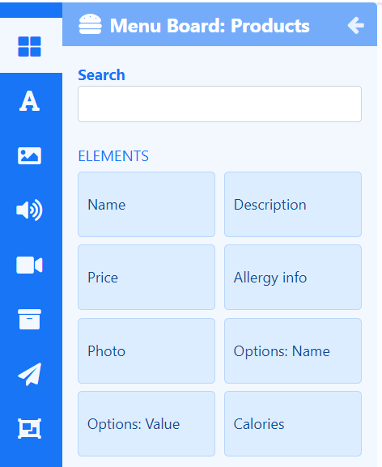

# メニュー ボード: 製品

**要素** を使用して、レイアウト上の任意の場所にメニュー ボードに保持されている製品のデータを表示します。

{feat}メニュー ボード: 製品|v4{/feat}

メニュー ボード: 製品ウィジェットは、主に、構成された要素にフィードするメニュー ボード ソースで構成されます。

{tip}
メニュー ボード: 製品ウィジェットをレイアウトに追加する前に、製品を追加して [メニュー ボード](media_menuboards.html) を作成する必要があります。
{/tip}

## 製品要素

[レイアウト](layouts_editor.html) にメニュー ボード: 製品ウィジェットを追加するときに [要素](layouts_editor#content-data-widgets-and-elements) を選択でき、ユーザーはメニュー ボード製品のどのコンポーネントを使用するか、どこに配置できるかをより細かく制御できます。

各要素には、プロパティ パネルに一連の構成オプションがあります。レイアウトで使用される各要素の [構成] タブから、データ ソースとして使用するメニュー ボードを選択する必要があります。追加された各要素に使用する [データ スロット](layouts_editor.html#content-data-slots) を指定して、アイテムの循環方法を制御します。データ要素は、[グローバル要素](layouts_editor.html#content-global-elements) を追加して図形やテキストを追加することでさらに補完でき、これらはすべて [要素グループ](layouts_editor.html#content-grouping-elements) にまとめられるため、構成や配置が簡単になります。

## 概要

- 基礎となる [メニュー ボード](media_menuboards.html#content-create-and-configure-categories) データを編集して、新しい製品データで要素を更新します。
- レイアウトにアクセスせずにメニュー ボード: 製品ウィジェット コンテンツを更新します。
- アイテムの並べ替え方法を選択します。
- 利用不可としてマークされた製品を表示するように選択します。
- 利用不可のアイテムは目立たないように「淡色表示」できます。
- アイテムごとに期間を設定できます。
- このメディアのコンテンツは、オフライン再生用にプレーヤーによってキャッシュされます。
- [メニュー ボード: カテゴリ](media_module_menuboards_category.html) ウィジェットと一緒に使用して、ディスプレイに表示される製品データのプレゼンテーションを補完するヘッダー情報を含めます。

#### 次へ...

[メニュー ボード: カテゴリ](media_module_menuboards_category.html)
