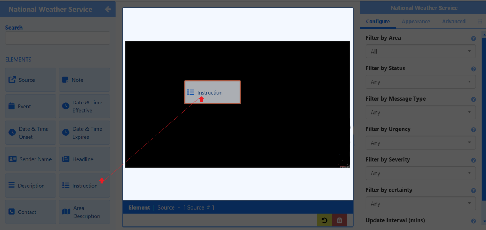

## National Weather Service

悪天候、水、気候イベントに関するリアルタイム データを含む天気予報を表示することで、米国民が異常気象イベントに備える手助けをします。[National Weather Service (NWS)](https://www.weather.gov/) のデータを使用して、[[PRODUCTNAME]] ディスプレイ ネットワーク全体で潜在的な危険に対する認識を高めます。

{version}
**注意:** 天気予報と警報は、米国、その領土、および隣接する海域と海洋地域を対象としています。このウィジェットを使用する場合は、**モジュール** セクションから **国立気象サービス** を有効にするよう管理者に依頼してください。

version}

## 機能の概要

- **国立気象サービス コネクタ** は、提供された NWS Atom URL フィードからのデータを使用します。

- デフォルトの **NWS Atom フィードの URL** で使用することも、カスタム Atom フィード形式の URL を提供することもできます。

- さまざまな **要素** から追加して、レイアウト エディターで視覚的な表現をカスタマイズし、最大限の効果を得ることができます。

- 業界標準のフィルターを使用して、返されたデータからメッセージをカスタマイズします。

- NWS Atom フィードからのデータ サイクルを使用して、複数の気象警報メッセージを表示します。

- **スケジュール** 時に **基準** を設定して、サポートされているプレーヤーのスケジュール ループに気象警報を含めるかどうかを決定します。

{tip}
{nonwhite}
**基準タイプ** を「緊急警報」に設定し、**カテゴリ** を「満たす」に設定すると、アクティブな **緊急警報** が発生するたびに、NWS 要素を含むレイアウトがスケジュール ループに自動的に追加されます。

{/nonwhite}
{/tip}

## プレーヤー機能のサポート

{feat}National Weather Service|v4{/feat}

## 詳細情報

[コネクタ管理](/media_modules_connectors)

[データ ウィジェット](/layouts_editor_data_widgets)

[レイアウト エディター](/layouts_editor)

{nonwhite}
[スケジュール基準](/developer/player-control/schedule-criteria)
{/nonwhite}

