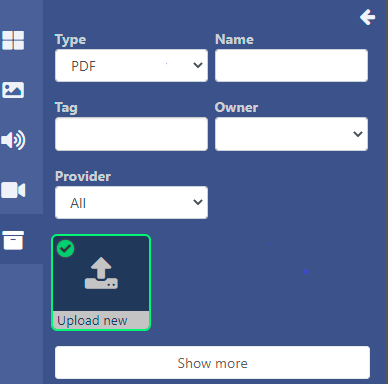
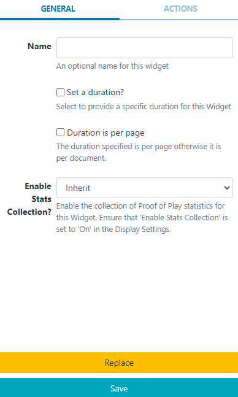

<!--toc=widgets-->

# PDF

PDFモジュールは、PDFファイルを[ライブラリ](media_library.html)にアップロードし、レイアウトで使用できるようにするものです。

## Add Widget

[ウィジェット](layouts_widgets.html)ツールバーの**PDF**をクリックし、クリックで追加、またはドラッグ＆ドロップで追加します。

{tip}
既にライブラリにアップロードされているPDFファイルを追加するには、[ライブラリ検索](layouts_library_search.html)機能を使用します。
{/tip}

ライブラリの**その他のメディア検索**で、**タイプ**で絞り込み、**新規アップロード**を選択してレイアウトに追加してください。

## メディアファイルをアップロード

PDFウィジェットを追加すると、ファイルアップローダーが起動します

[[PRODUCTNAME]]では、プレーヤーとレイアウトデザイナーでPDFを表示するために、`pdfjs`を使用しています。

- **ファイルを追加する**をクリックし、アップロードするファイルを選択します。

{tip}
ドラッグ＆ドロップでファイルを追加することも可能です
{/tip}

-  CMSで識別しやすいように**名前**を付け、オプションで**タグ**を付けてください。

{tip}
名前欄が空白の場合、アップロード時のファイル名と同じ名前になります。
{/tip}

PDFファイルを指定した**フォルダ**に直接アップロードすることも可能です。

{tip}
フォルダに保存されたPDFファイルは、ユーザー/ユーザーグループのアクセスのために保存先フォルダに適用された、表示、編集、削除、[共有](users_features_and_sharing.html)オプションを引き継ぎます。
{/tip}

- **フォルダ選択**ボタンをクリックして展開し、保存するフォルダを選択します。

- フォルダを右クリックすることで、その他のオプションにアクセスすることができます。

{tip}
利用可能なフォルダーオプションは、ユーザー/ユーザーグループの有効な[機能と共有](users_features_and_sharing.html)オプションに基づきます。
{/tip}

- ファイルをアップロードするフォルダをクリックし、**完了**をクリックします。
- **現在のフォルダ**には、選択したファイルのパスが表示されます。

{white}
フォルダアクセスとセットアップに関する詳細については、管理者にご相談ください。
{/white}

この特定のウィジェットにアップロードされたファイルの**有効期限**と時間を設定するオプションがあります。

{tip}
これは、後日表示されるPDFをあらかじめ読み込んでおく必要がある場合に特に便利です。
{/tip}

- **有効期限を設定**するにチェックを入れる。

  {tip}
  **注意**有効期限は、現在、Linuxプレーヤーではサポートされていません
  {/tip}

  

- **開始**と**終了**の日時を選択します。
- チェックボックスを使って、期限切れでプレイリストからメディアファイルを削除したり、ライブラリから削除したりすることができます。

- **アップロード開始**ボタンをクリックすると、追加されたすべてのファイルのアップロードが開始されます。フォルダ/有効期限が選択されており、追加されるファイルが複数ある場合、すべてのファイルは指定された場所にアップロードされ、有効期限も同じに設定されます。
- アップロードに成功したら、**完了**をクリックします。

ファイルを個別にアップロードし、異なるフォルダの場所や有効期限を指定することも可能です。
アップロード開始ボタンをクリックするのではなく、追加されたファイルの行の最後に表示されている**青いアップロード**ボタンをクリックしてください。

{tip}
タイムラインからウィジェットのアイコンをクリックすると、有効期限を確認・変更することができます。
{/tip}

## オプションの設定

**タイムライン**から追加された**PDFウィジェット**をクリックすると、プロパティパネルに設定項目が表示されます。

- M必要に応じてウィジェットの名前を編集します。

- **期間を設定**にチェックを入れると、PDF全体の期間を指定することができます。

  または

- 期間を指定し、チェックボックスを使用してPDFの**各ページ**に期間を適用します。

### アクション

このウィジェットにはアクションを付けることができます。詳しくは、[対話型アクション](layouts_interactive_actions.html)のページを参照してください。
