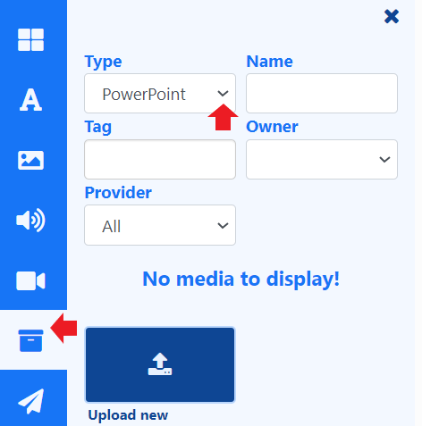

# PowerPoint

次のオプションのいずれかを選択して、PowerPoint プレゼンテーションを表示します:

## 1. ビデオの追加 (推奨)

Windows 以外のプレーヤー / PowerPoint のフル コピーをインストールしていないユーザーの場合、Office 2010 以降では、PowerPoint プレゼンテーションを **ビデオ** ファイルとしてエクスポートできます。PowerPoint アプリケーション内のファイル メニューのオプションを使用して、PowerPoint ファイルをエクスポートします。

{version}
**注意:** プレーヤーが Android または webOS デバイスの場合は、エクスポート形式が MP4 (PowerPoint 2013 以降) であることを確認するか、サード パーティ ツールを使用してビデオを MP4 に変換する必要があります。
{/version}

[ビデオ](media_module_video.html) をプレイリストとレイアウトに追加して続行します。

## 2. PDF を追加

Windows 以外のプレーヤーや PowerPoint のフル コピーをインストールしていないユーザーの場合は、PowerPoint を **PDF** ファイルとして保存できます。

[PDF](media_module_pdf.html) をプレイリストとレイアウトに追加して続行します。

## 3. 準備した PPT ファイルをアップロードします (Windows プレーヤーのみ)

PowerPoint は Microsoft 独自の形式であり、各 Windows プレーヤーに Microsoft PowerPoint のフル コピーがインストールされている Windows ベースのサイネージ プレーヤーでのみ表示できます。([Windows プレーヤーの準備](media_module_powerpoint.html#content-prepare-your-windows-players) セクションを参照してください)

{feat}PowerPoint|v4{/feat}

### PowerPoint プレゼンテーションを準備します。

PowerPoint では、アップロードする *前* に各 PowerPoint ファイルに対して次の操作を行わない限り、デフォルトでプレゼンテーションの横にスクロール バーが表示されます。

1. PowerPoint ドキュメントを開きます。
2. スライド ショー -> セットアップ ショーを選択します。
3. [ショーの種類] で [個人による参照 (ウィンドウ)] を選択し、[スクロール バーを表示] のチェックを外します。
4. [OK] をクリックします。
5. プレゼンテーションを保存します。
6. [[PRODUCTNAME]] ではプレゼンテーション内のスライドが進められないため、[スライド ショー -> タイミングのリハーサル] に移動して自動スライド タイミングを記録してから、プレゼンテーションを保存する必要があります。

### CMS にアップロードします。

[その他のメディア] 検索を使用して、[**タイプ**] ドロップダウンから [**PowerPoint**] を選択します。

- ツールバーの [ライブラリ検索](layouts_editor.html#content-library-search) を使用して、PPT ファイルをプレイリスト/レイアウトに直接アップロードします。

- プレイリストとレイアウトに直接アップロードされたファイルは、再利用できるように [ライブラリ](media_library.html) に自動的に保存されます。
- PowerPoint ファイルを事前にライブラリにアップロードすることもできます。
- プレイリストに直接アップロードされた PowerPoint ファイルの [開始時間と終了時間](media_playlists.html#content-widget-expiry-dates) を設定します。
- アップロード時に PowerPoint ファイルを [フォルダ](tour_folders.html#content-saving-to-folders) に保存して、ユーザーへのアクセスを簡単に制御します。



{tip}
PowerPoint ファイルのプレビューは CMS では使用できません。

{/tip}

## Windows プレーヤーを準備する

[[PRODUCTNAME]] プレーヤーと一緒に Windows PC に PowerPoint をインストールし、Windows レジストリに次の調整を行って、PowerPoint を開いたときに Windows プロンプトを無効にします。 **これらの変更を行う際は、必要な予防措置をすべて講じていることを確認してください**。

```registry
[HKEY_CLASSES_ROOT\PowerPoint.Show.12]
"BrowserFlags"=dword:00000002
"EditFlags"=dword:00010000

[HKEY_CLASSES_ROOT\PowerPoint.Show.8]
"BrowserFlags"=dword:00000002
"EditFlags"=dword:00010000

[H KEY_CLASSES_ROOT\PowerPoint.SlideShow.12]
"BrowserFlags"=dword:800000a0
"EditFlags"=dword:00010000

[HKEY_CLASSES_ROOT\PowerPoint.SlideShow.8]
"BrowserFlags"=dword:00000002
"EditFlags"=dword:00010000
```

レジストリを変更するのが面倒な場合は、[[PRODUCTNAME]] が最初の PowerPoint を開くまで待ってから、ポップアップ通知が表示されたらファイルを「開く」を選択し、再度プロンプトが表示されないようにボックスのチェックを外すことで、同じ結果を得ることができる場合があります。

### ディスプレイで PowerPoint を有効にする

PowerPoint を使用する予定のディスプレイで使用する Windows [ディスプレイ設定プロファイル](displays_settings) が最初に有効になっていることを確認する必要があります。

- メイン CMS メニューの [ディスプレイ] セクションの [ディスプレイ設定] をクリックします。
- Windows ディスプレイ プロファイルの行メニューを使用して [編集] を選択します。
- [全般] タブで [PowerPoint を有効にする] にチェックを入れます。
- [保存] をクリックします。

### 高度な手順

PowerPoint を表示する場合、[[PRODUCTNAME]] は Windows と PowerPoint を使用してコンテンツを表示します。つまり、エラーのキャプチャとレポートは [[PRODUCTNAME]] の制御外です。問題を軽減するには、Windows エラー通知を無効にすることをお勧めします。これは、[ここの手順](https://www.lifewire.com/how-do-i-disable-error-reporting-in-windows-2626074) に従って実行できます。

それでも問題が解決しない場合は、以下のレジストリ パッチをマージして、Office アプリケーション エラー報告を無効にすることもお勧めします。

```reg
[HKEY_CURRENT_USER\Software\Policies\Microsoft\Office\11.0\Common]
"DWNeverUpload"=dword:00000001

[HKEY_CURRENT_USER\Software\Policies\Microsoft\Office\10.0\Common]
"DWNeverUpload"=dword:00000001

[HKEY_CURRENT_USER\Software\Policies\Microsoft\Office\12.0\Common]
"DWNeverUpload"=dword:00000001
```

{version}
**注意:** Windows プレーヤーは、PowerPoint プレゼンテーションを Internet Explorer コンテナー内に表示します。 Internet Explorer は、ディレクトリ `C:\Users\<user>\AppData\Local\Microsoft\Windows\INetCache\Content.MSO` を使用して、インターネット セキュリティ ゾーンからであると識別された Microsoft Office 一時ファイルをキャッシュします。これにより、時間の経過とともにプレゼンテーションの複数のコピーがこのディレクトリに保存される可能性があります。Windows は、キャッシュされた重複ファイルをこのディレクトリから自動的に削除しないため、時間の経過とともにハード ドライブのストレージ領域が消費される可能性があります。このディレクトリにプレゼンテーションの複数のコピーがキャッシュされている場合は、削除しても問題ありません。

このディレクトリの内容を定期的に削除するスケジュールされたタスクまたはスクリプトを作成することをお勧めします。

{/version}

