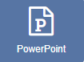
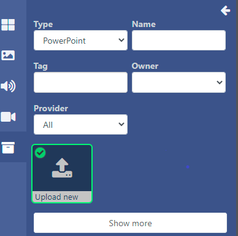

<!--toc=widgets-->

# PowerPoint

[[PRODUCTNAME]]には、PowerPointのPPTファイルを表示するための3つのオプションがあります。

**オプション 1** - Windows以外のプレーヤーのために、またはPowerPointのフルコピーを持っていない場合のため、ビデオとしてエクスポートします。(推奨オプション)

**オプション 2** - 非Windowsプレーヤーのため、またはインストールするPowerPointのフルコピーを持っていない場合は、PDFとして保存します。

**オプション 3** - **Windowsプレーヤー専用**にPowerPointのPPTファイルを作成し、アップロードしています。各WindowsプレーヤーにPowerPointのフルコピーをインストールする必要があります。

## オプション 1 - ビデオとして書き出す

Office 2010以降では、PowerPointのプレゼンテーションを**ビデオファイル**として書き出すことができ、これを[[製品名]]にアップロードして、動画ウィジェットを使って再生することができます。

### パワーポイントファイルの書き出し

- PowerPointアプリケーションの中から、ファイルメニューのオプションを使用してPowerPointをエクスポートします。
- アップロード時に選択する適当な名前を付けて保存します。

{tip}
プレーヤーがAndroidまたはwebOSデバイスの場合、書き出し形式がMP4（PowerPoint 2013以降）であることを確認するか、サードパーティのツールを使用してビデオをMP4に変換する必要があります。
{/tip}

### ビデオウィジェットを追加

[ビデオ](media_module_video.html)のページに記載されている手順に従って、ファイルを追加し、アップロードしてください。

## オプション 2 - PDFとして保存

- PowerPointをPDFで保存する。

### PDF ウィジェットを追加

[PDF](media_module_pdf.html)のページに記載されている手順に従って、ファイルの追加とアップロードを行ってください。

## オプション 3 - パワーポイントPPTファイルの準備とアップロード

PowerPointはマイクロソフト社の独自フォーマットであり、Microsoft PowerPointがインストールされているWindowsベースのサイネージプレーヤーでのみ表示可能です。

### PowerPointプレゼンテーションを準備する。

PowerPointは、アップロードする前に各PowerPointファイルに対して以下の操作を行わないと、デフォルトでプレゼンテーションの横にスクロールバーが表示されます。

1. PowerPointドキュメントを開く
2. スライドショー→セットアップショー
3. "表示タイプ "で "個別にブラウズ（ウィンドウ）"を選択し、"スクロールバーを表示する "のチェックを外す
4. OKをクリック
5. iプレゼンテーションを保存
6. [[製品名]]はプレゼンテーションのスライドを進めませんので、「スライドショー」→「タイミングのリハーサル」でスライドの自動タイミングを記録し、プレゼンテーションを保存する必要があります。

### ウィジェットを追加

[ウィジェット](layouts_widgets.html)ツールバーからPowerPointをクリックして追加、またはドラッグ＆ドロップします。

{tip}
既にライブラリにアップロードされているPowerPointファイルを追加するには、[ライブラリ検索](layouts_library_search.html)機能を使用します。
{/tip}

**ライブラリの他のメディア検索**で、**タイプ**でフィルタリングし、**新規アップロード**を選択してレイアウトに追加してください。




### メディアファイルのアップロード

PowerPointウィジェットを追加すると、ファイルアップローダーが起動します。


- **ファイルを追加**をクリックし、アップロードするファイルを選択します。

{tip}
ドラッグ＆ドロップでファイルを追加することも可能です
{/tip}

- CMSで識別しやすいように**名前**を付け、オプションで**タグ**を付けてください。

{tip}
名前欄が空白の場合、アップロード時のファイル名と同じ名前になります。
{/tip}

PowerPointのファイルは、指定した**フォルダ**に直接アップロードすることも可能です。

{tip}
フォルダに保存されたファイルは、ユーザー/ユーザーグループのアクセス用に保存先フォルダに適用された、表示、編集、削除、[共有](users_features_and_sharing.html) オプションを引き継ぎます!
{/tip}

- **フォルダ選択**ボタンをクリックして展開し、保存するフォルダを選択します。
- フォルダを右クリックすることで、その他のオプションにアクセスすることができます。


{tip}
利用可能なフォルダーオプションは、ユーザー/ユーザーグループの有効な[機能と共有](users_features_and_sharing.html)オプションに基づきます。
{/tip}

- ファイルをアップロードするフォルダをクリックし、**完了**をクリックします。
- **現在のフォルダ**には、選択したファイルのパスが表示されます。


{white}
フォルダアクセスとセットアップに関する詳細については、管理者にご相談ください。
{/white}

この特定のウィジェットにアップロードされたファイルの**有効期限**と時間を設定するオプションがあります。


{tip}
この機能は、後日表示するファイルをあらかじめロードしておく場合に特に便利です。
{/tip}

- **有効期限を設定**にチェックを入れます。

{tip}
**注意** 有効期限は、現在、Linuxプレーヤーではサポートされていません。
{/tip}


- **開始**と**終了**の日時を選択します。
- チェックボックスを使って、期限切れでプレイリストからメディアファイルを削除したり、ライブラリから削除したりすることができます。


- **アップロード開始**ボタンをクリックすると、追加されたすべてのファイルのアップロードが開始されます。フォルダ/有効期限が選択されており、追加されるファイルが複数ある場合、すべてのファイルは指定された場所にアップロードされ、有効期限も同じに設定されます。
- アップロードに成功したら、**完了**をクリックします。

ファイルを個別にアップロードし、異なるフォルダの場所や有効期限を指定することも可能です。
アップロード開始ボタンをクリックするのではなく、フォルダの場所と有効期限を変更して追加したファイルの行の最後に表示される**青いアップロード**ボタンをクリックして、個別にアップロードしてください。

{tip}
タイムラインからウィジェットのアイコンをクリックすると、有効期限を確認・変更することができます。
{/tip}

### 設定オプション

**タイムライン**から追加された**PowerPointウィジェット**をクリックすると、プロパティパネルに設定項目が表示されます。


- 必要に応じてウィジェットの名前を編集します。

- **期間を設定**にチェックを入れて、期間を指定してください。

{tip}
**注意** CMSはパワーポイントファイルのプレビューを表示しません!
{/tip}

### アクション

このウィジェットにはアクションを付けることができます。詳しくは、[対話型アクション](layouts_interactive_actions.html)のページを参照してください。

### Windowsプレイヤーの準備

Windows PCにPowerPointをインストールし、同時に[[PRODUCTNAME]]のプレイヤーもインストールしてください。Windowsレジストリを以下のように変更することで、PowerPointを開く際にWindowsプロンプトが表示されないようにします。**これらの変更を行う際には、必要なすべての予防措置を講じた上で行ってください**。

```registry
[HKEY_CLASSES_ROOT\PowerPoint.Show.12]
"BrowserFlags"=dword:00000002
"EditFlags"=dword:00010000

[HKEY_CLASSES_ROOT\PowerPoint.Show.8]
"BrowserFlags"=dword:00000002
"EditFlags"=dword:00010000

[HKEY_CLASSES_ROOT\PowerPoint.SlideShow.12]
"BrowserFlags"=dword:800000a0
"EditFlags"=dword:00010000

[HKEY_CLASSES_ROOT\PowerPoint.SlideShow.8]
"BrowserFlags"=dword:00000002
"EditFlags"=dword:00010000
```

レジストリを変更するのが面倒な場合は、最初のPowerPointを開くまで待ち、ポップアップ通知が表示されたら「ファイルを開く」を選択し、チェックを外して二度と表示されないようにすれば、同じ結果を得ることができるかもしれません。

### ディスプレイでPowerPointを有効にする

PowerPointを使用するディスプレイのWindowsディスプレイプロファイルが有効になっていることを確認する必要があります。

ndowsディスプレイプロファイルを見つけます。行メニューを使用してプロファイルを編集します。**全般** タブで、**PowerPointを有効** チェックボックスにチェックを入れ、**保存** します。


### 上級者向けステップ

PowerPoint を表示する場合、[[PRODUCTNAME]]は Windows と PowerPoint に依存してコンテンツを表示しています。このため、エラーの捕捉と報告は[[PRODUCTNAME]]のコントロール外となっています。問題を軽減するために、Windowsのエラー通知を無効にすることをお勧めします。これは、[こちらの手順](https://www.lifewire.com/how-do-i-disable-error-reporting-in-windows-2626074)に従って行うことができます。

それでも問題が発生する場合は、以下のレジストリパッチをマージして、Office Application Errorの報告を無効にすることも推奨される場合があります。

```reg
[HKEY_CURRENT_USER\Software\Policies\Microsoft\Office\11.0\Common]
"DWNeverUpload"=dword:00000001

[HKEY_CURRENT_USER\Software\Policies\Microsoft\Office\10.0\Common]
"DWNeverUpload"=dword:00000001

[HKEY_CURRENT_USER\Software\Policies\Microsoft\Office\12.0\Common]
"DWNeverUpload"=dword:00000001
```

{tip}**注意**:

Windowsプレーヤーは、Internet Explorerのコンテナ内にPowerPointプレゼンテーションを表示します。Internet Explorerは、以下のディレクトリを使用します。
C:\Users<user></user>AppData</Local>Microsoft</Windows>INetCache</Content.MSO` を使用して、インターネットのセキュリティゾーンからであると識別されるMicrosoft Office一時ファイルをキャッシュしています。これにより、時間の経過とともに、このディレクトリにプレゼンテーションの複数のコピーが保存されることがあります。Windowsは、そのディレクトリからキャッシュされた複製を自動的に削除しないので、時間とともにハードディスクのストレージスペースを消費する可能性があります。このディレクトリにキャッシュされたプレゼンテーションの複数のコピーを見つけた場合、それらを削除するのが安全です。

定期的にそのディレクトリの内容を削除するスケジュールタスクまたはスクリプトを作成することをお勧めします。
{/tip}


