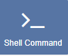
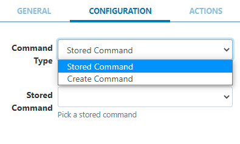

<!--toc=widgets-->

# シェルコマンド

シェルコマンドモジュールは、オペレーティングシステムのシェルを使用して、[[PRODUCTNAME]]環境の外部で**コマンド**を実行するようディスプレイに指示するために使用されます。

{tip}
本モジュールは、webOS、Tizen、Linuxプレーヤーには対応していません。
{/tip}

シェルコマンドウィジェットを含むレイアウトがスケジュールされた時刻に再生されると、コマンドが実行されます。

シェルコマンドは、シェルに直接渡される**作成された**コマンド文字列、または管理者によって事前に設定された**保存されたコマンド**とすることができます。

## ウィジェットを追加

[ウィジェット](layouts_widgets.html) ツールバーの **シェルコマンド** をクリックして追加するか、ドラッグ＆ドロップします。 

追加すると、設定オプションがプロパティパネルに表示されます。

- 識別しやすいように **名前** を記入してください。
- **期間を設定**にチェックを入れ、**期間**を指定すると、強制的に処理を停止することができます。コマンドを自然に終了させる場合は、チェックを入れずにそのままにしておきます。

{tip}
ほとんどの場合、レイアウトから実行されるコマンドは、画面のオン/オフやデバイスの再起動など、何かを引き起こすバックグラウンドコマンドになりがちです。そのような場合は、このボックスをオフにしたままにしてください。

コマンドを一定時間実行する必要がある場合、例えば、コマンドで画面に何かを表示したまま勝手に終了できない場合、[[PRODUCTNAME]]は、チェックを入れて期間を指定することで、起動したコマンドを終了させるように指示することが可能です。
{/tip}

### 設定

- ドロップダウンを使って、**コマンドタイプ**のオプションから選択します。
  - **保存されたコマンド** - ドロップダウンメニューから定義済みのコマンドを選択することができます。
  - **コマンドの作成** - コマンドビルダーを使用し、利用可能なオプションから選択してコマンドを作成します。

- **フリーテキスト**を選択してコマンド文字列を入力するか、ドロップダウンメニューを使用して、利用可能なコマンドから選択して設定します。
- グローバルコマンドを使用にチェックを入れ、コマンドライン互換のコマンドを入力すると、すべてのプレーヤータイプで動作します。

コマンドの作成を選択すると、［高度な設定］タブが表示され、Windowsのコマンドライン（cmd.exe）でコマンドを起動できるようになります。

{tip}
シェルコマンドウィジェットをレイアウトに追加することで、オーディオウィジェットを再生設定したレイアウトでは「ボリュームアップ」、レイアウト終了時には「ボリュームダウン」などの外部コマンドを実行することができます。

例えば、「再起動」、「開店／閉店時の電源オン／オフ」など、特定の日時に実行されるコマンドについては、本ユーザーマニュアルのスケジュール編[イベント](scheduling_events.html)およびディスプレイセクションの[コマンド送信](displays.html)をご覧ください。
{/tip}

{tip}
Android/Linuxプレーヤーでシェルコマンドを使用するには、**root権限**が必要です。
{/tip}

## アクション

このウィジェットにはアクションを付けることができます。詳しくは、[[対話型アクション](ayouts_interactive_actions.html)のページを参照してください。

