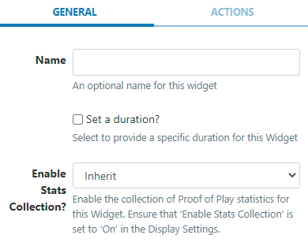

<!--toc=widgets-->

# スペーサ

スペーサーウィジェットをレイアウトに組み込むと、指定した時間だけ「空の」リージョンを作成することができます。

## ウィジェットを追加
[ウィジェット](layouts_widgets.html)ツールバーの**スペーサ**をクリックして追加、またはドラッグ＆ドロップします。

追加すると、設定オプションがプロパティパネルに表示されます。

- 識別しやすいように **名前** を記入してください。
- 必要であれば、デフォルトの**期間**をオーバーライドするよう選択します。

{tip}
レイアウト上のリージョンに遅延を設定し、リージョンの起動とメディアコンテンツの再生を異なる時間にするために使用します。
{/tip}

## アクション

このウィジェットにはアクションを付けることができます。詳しくは[対話型アクション](layouts_interactive_actions.html)のページを参照してください。

