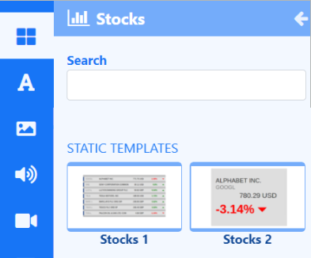

# 株式

**要素** を使用してレイアウト上の任意の場所に株式リストの取引価格情報を表示するか、**静的テンプレート** を選択してレイアウト/プレイリストに結果を表示します。

{feat}株式|v4{/feat}

株式ウィジェットは、構成された要素と静的テンプレートにフィードされる株式市場データを取得するために、[Alpha Vantage API](https://www.alphavantage.co/) に部分的に依存しています。 Alpha Vantage によって返される価格は、株式分割や配当支払いなどの企業イベントに合わせて調整される [株式市場標準](https://medium.com/@patrick.collins_58673/stock-api-landscape-5c6e054ee631) に従います。

{tip}
[Alpha Vantage](https://www.alphavantage.co/support/#api-key) にアクセスしてアカウントを作成し、Alpha Vantage [コネクタ](media_modules.html#content-connectors) に入力するための API キーを取得してください。
{/tip}

{nonwhite}
{cloud}
通貨モジュールは、サービスの一部として提供される API キーを使用して、**Xibo Cloud** でホストされる顧客向けに構成されています。
:::no-loc(shared): ...{/tip}

追加された各要素に使用する [データ スロット](layouts_editor.html#content-data-slots) を指定して、アイテムの循環方法を制御します。[グローバル要素](layouts_editor.html#content-global-elements) を追加して図形やテキストを追加することで、データ要素をさらに補完できます。これらはすべて [要素グループ](layouts_editor.html#content-grouping-elements) にまとめることができ、構成と配置が簡単になります。

## Stocks 静的テンプレート

[静的テンプレート](layouts_editor.html#content-static-templates) は、返される結果のレイアウトとスタイル設定方法を定義し、事前にスタイル設定されたテンプレートを使用してデータを表示する簡単な方法です。

プロパティ パネルのさまざまなオプションを使用して、テンプレートを構成してデザインの外観を変更できます。 **Stock Symbols** を入力すると、レイアウト/プレイリストに追加された各テンプレートの **Configure** タブから結果が返されます。

## 概要

- このメディアのコンテンツは、オフライン再生用にプレーヤーによってキャッシュされます。
- 期間はアイテムごとまたはページごとに適用されます。

