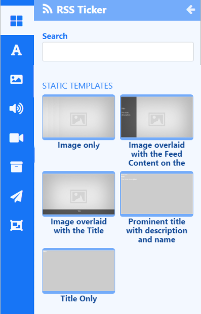

# RSS ティッカー

レイアウト上の任意の場所に要素を使用して動的なフィード コンテンツを表示するか、レイアウト/プレイリストに事前にスタイル設定されたデザインの静的テンプレートを含めます。

{feat}Ticker|v4{/feat}

ティッカー ウィジェットは主に、構成された要素と静的テンプレートにフィードするデータ ソースの場所で構成されます。

## ティッカー要素

[レイアウト](layouts_editor.html) に RSS ティッカー ウィジェットを追加するときに [要素](layouts_editor#content-data-widgets-and-elements) を選択でき、ユーザーはティッカー ウィジェットのどのコンポーネントを使用するか、どこに配置できるかをより細かく制御できます。

各要素には、プロパティ パネルに一連の構成オプションがあります。レイアウトで使用される各要素の [構成] タブから、データ ソースとして使用する URL を指定する必要があります。追加された各要素に使用する [データ スロット](layouts_editor.html#content-data-slots) を指定して、アイテムの循環方法を制御します。データ要素は、[グローバル要素](layouts_editor.html#content-global-elements) を追加して図形やテキストを追加することでさらに補完でき、これらはすべて [要素グループ](layouts_editor.html#content-grouping-elements) にまとめられるため、構成と配置が簡単になります。

## データセットの静的テンプレート

[静的テンプレート](layouts_editor.html#content-static-templates) は、返されるアイテムのレイアウトとスタイル設定方法を定義し、事前にスタイル設定されたテンプレートを使用してアイテムを表示する簡単な方法です。

テンプレートは、返される結果の動作に影響を与えるように構成できるほか、プロパティ パネルのさまざまなオプションを使用してデザインの外観を変更できます。レイアウト/プレイリストに追加された各テンプレートの [**構成**] タブから、データ ソースとして使用する URL を指定する必要があります。

## 概要

- フィードから表示するアイテムの数を定義します。
- アイテムごとに期間を設定できます。

{tip}
このオプションを使用すると、長時間実行されるメディア アイテムが作成される可能性があるため、注意して使用してください。制限するには、**アイテム数** と組み合わせて使用してください。
ヒント}

- リストの先頭または末尾のアイテムから開始するように選択します。

- フィード アイテムの逆順とランダム順を選択できます。

- フィードの最後に表示される著作権通知を含めます。

- 結果を並べて返します。

- 受信フィードから削除しない属性のリストを提供します。

- フィードから削除する HTML タグのリストを含めます。

- 特定のユーザー エージェントを設定します。

- フィードを解析する前に、フィード内の HTML エンティティをデコードします。

- 日付の並べ替えを無効にします。

- オフライン再生用にキャッシュします。

- 画像の更新間隔をオーバーライドします。

{ヒント}
[データセット](media_datasets.html) を使用して、このウィジェットで使用する独自の [RSS フィード](media_datasets.html#content-view-rss) を作成します。

ヒント}

