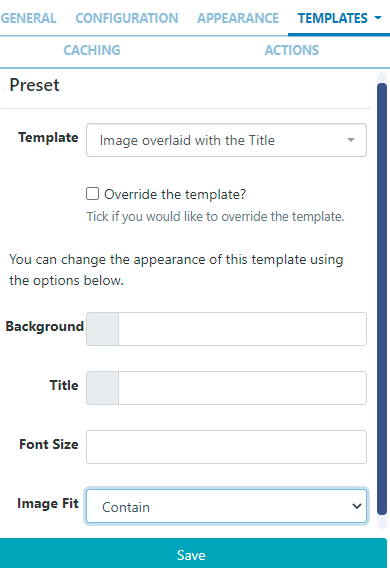

<!--toc=widgets-->
# ティッカー

ティッカーウィジェットは、**ダイナミックフィード**コンテンツをレイアウトに追加することができます。ティッカーモジュールは、主にデータ ソースの場所と、取得したデータに適用するテンプレートで構成されています。

## ウィジェットを追加

[ウィジェット](layouts_widgets.html)ツールバーの**ティッカーウィジェット**をクリックして追加、またはドラッグ＆ドロップします。 

追加すると、設定オプションがプロパティパネルに表示されます。

- 識別しやすいように **名前** を記入してください。
- 必要であれば、デフォルトの**期間**をオーバーライドするよう選択します。
- **持続時間はアイテムごと**か、フィードごとの持続時間を設定する場合は未入力にしておくかを選択します。

{tip}
最後のオプションは、長時間のメディアアイテムを作成することができるため、注意して使用してください。制限するには、**アイテム数**と組み合わせて使用します。
{/tip}

### 設定

- 使用する**フィードURL**を入力します。

- RSSの**項目**をいくつ表示させるかを選択します。

- リストの**開始または**終了の項目から開始することを選択します。

- チェックすると、**逆順**でフィードアイテムが選択されます。

- 項目を**ランダム**に表示する場合に選択します。

  {tip}
  ランダム化オプションはオフラインで動作します。フィード全体が解析され、レンダリングされてプレーヤーにダウンロードされ、その後ランダムな方法でソートされて表示されます。項目の順序をランダムにするために、ダーステンフェルド シャッフルを使用しています。ランダム化は、フィード全体、「アイテムの数」、「アイテムから取得」オプションで動作します。
  {/tip}

- フィードの最後に**著作権**を表示します。

- チェックすると、返された結果を **左右に並べて**表示します。

- 返されたすべての日付の結果に適用する**日付形式**を適用します。(詳細については、このページ下部の**補足情報**を参照してください)。

- 受信フィードから削除してはならない ** 属性** をカンマ区切りで列挙します。

- フィードから削除する **HTML タグ** をカンマ区切りで指定します。

- フィードをパースする前に、フィードのHTMLエンティティを**デコード**する場合にチェックを入れます。

- フィードの日付ソート**を無効にする場合に選択します。

### 外観

- オプションで背景色**を選択します。
- 項目間のトランジションに使用する**エフェクト**をドロップダウンメニューから選択します。
- 選択されているエフェクトの**速度**を設定します。
- 項目を分割するエフェクトを選択した場合、各ページに表示する項目数を入力してください。

### テンプレート

利用可能なテンプレートから選択します。

- **プリセット** - ドロップダウンを使って、プリセットテンプレートの1つを選択します。

また、選択したテンプレートの色やフォントサイズ、画像のフィット感を簡単に変更できるオプションも追加されました。

{tip}
必要であれば、選択したテンプレートを上書きするをクリックします。

詳しくは、下記の「プリセットテンプレートの編集」の項をご覧ください。
{/tip}

- **データなし** フィードからデータが返されない場合に表示するメッセージを指定します。

## プリセットテンプレートの編集

テンプレートは、ドロップダウンでテンプレートを選択し、**テンプレートを上書き**のチェックボックスをクリックすることで編集することができます。

{tip}
テンプレートは自動的に拡大縮小されるため、意図した出力解像度に合わせた設計が必要です。テンプレートを編集する際には、以下のガイドラインを考慮する必要があります。

- テンプレートは固定サイズで設計する必要があります
- フォント、マージン、幅、高さなど、すべての要素でpx単位の絶対サイズ指定が必要です。
- 位置決めを行う場合は、上、左から順に行う。
- テンプレートはbootstrapを使用することができます
- アスペクト比は[[PRODUCTNAME]]で固定され、リージョンに合わせたサイズに調整されます。
- テンプレートは静止画と同じ扱いになります
  {/tip}

オーバーライドを選択したら、**テンプレートタブ**に戻り、編集するテンプレートを選択します。

- **メイン テンプレート** - ビジュアルエディタをオンにすると、インラインエディタにアクセスしてテキストや書式を入力したり、提供されたボックスにテキスト/HTMLを入力したりすることができます。

- フィードから必要な情報を取り込むために、**スニペット**メニューからテキストマージフィールドを含めることができます。

{tip}
特別な表記として、[[PRODUCTNAME]]のフィード内の`Tag|Namespace`を指定してコンテンツを抽出することが可能です。
{/tip}

**オプションのスタイルシート** - 上記のテンプレートに適用するCSSです。

{tip}
このオプションのテンプレートは、CMSが生成する出力を「調整」する上級ユーザー向けのものです!
{/tip}

### キャッシュ

プレーヤーは、オフラインで再生したり、繰り返しダウンロードするのを防ぐために、このメディアのコンテンツを**キャッシュ**することができます。この数値はできるだけ大きくしてください。

{tip}
画像やデータの更新頻度を設定するオプションがあり、プレーヤーが更新をチェックする前に、ローカルに保存されたデータや画像をどれくらいの期間保持するかを決定することができます。
テンプレートは、ドロップダウンでテンプレートを選択し、**テンプレートを上書き**チェックボックスをクリックすることで編集することができます。
{/tip}

## アクション

このウィジェットにはアクションを付けることができます。詳しくは、[ 対話型アクション](layouts_interactive_actions.html)のページを参照してください。

## 補足情報

[[PRODUCTNAME]]は、正しいPHPの日付形式であるすべての日付形式を受け入れる必要があります。次の文字が認識され、使用できます。

| フォーマット文字 | 説明                                                  | 返される文字の例                 |
| ---------------- | :----------------------------------------------------------- | --------------------------------------- |
|                  | **日**                                                      |                                         |
| d                | ゼロから始まる２桁の日付              | 01 から 31                                |
| D                | 日を表すテキスト, ３文字            | Mon から Sun                         |
| j                | ゼロをつけない日付                       | 1 から 31                                 |
| l                | (小文字‘L’) 日を表す完全な文字列 | Sunday から Saturday                 |
| N                | ISO-8601で定義された曜日を表す数字(PHP 5.1.0で追加された) | 1 (月曜日) から 7 (日曜日)   |
| S                | 日にちに対する英語の序数サフィックス、2文字| st, nd, rd または thとともに使われる     |
| w                | 曜日の数字表現         | 0 (Sunday) から 6 (Saturday) |
| z                | 年初からの日（0から始まる)                        | 0 から 365                           |
|                  | **週**                                                     |                                         |
| W                | ISO-8601で規定する週の数字, 週は月曜日から始まる(PHP 4.1.0で追加) | 42 (一年の中の４２週目)          |
|                  | **月**                                                    |                                         |
| F                | 月のテキスト表現, January や March | January から December                |
| m                | ゼロで始まる月の数字表現        | 01 から 12                           |
| M                | 月の短いテキスト表現、３文字     | Jan から Dec                         |
| n                | 月の数字表現、先頭にゼロはつかない| 1 から 12                            |
| t                | 月の日数                            | 28 から 31                           |
|                  | **年**                                                     |                                         |
| L                | うるう年かどうか year                                     | 1 うるう年, 0 それ以外.    |
| o                | ISO-8601できていされた年. これはYと同じ値です。ただし、ISOの週番号（W）が前後の年に属している場合は、その年が代わりに 使用されます。(PHP 5.1.0で追加) | 1999 または 2003                            |
| Y                | 年の４桁数字表現            | 1999 または 2003                            |
| y                | 年の２桁数字表現                         | 99 or 0                                 |
|                  | **時間**                                                     |                                         |
| a                | 小文字アンティメリディアムとポストメリディアム                    | am または pm                                |
| A                | 大文字アンティメリディアムとポストメリディアム                    | AM または PM                                |
| B                | スウォッチインターネット時間                                         | 000 から 999                         |
| g                | 先行ゼロなしの時間の12時間形式              | 1 から 12                            |
| G                | 先行ゼロなしの時間の24時間形式              | 0 から 23                            |
| h                | 先行ゼロありの時間の12時間形式                 | 01 から 12                           |
| H                | 先行ゼロありの時間の２４時間形式                 | 00 から 23                           |
| i                | 先行ゼロ付き分                                   | 00 から 59                                |
| s                | 先行ゼロ付き秒                                  | 00 から 59                           |
| u                | マイクロ秒（PHP 5.2.2で追加） DateTimeがマイクロ秒で作成された場合、DateTime :: format（）はマイクロ秒をサポートする>のに対して、date（）は常に000000を生成します。 | 654321                                  |
|                  | **タイムゾーン**                                                 |                                         |
| e                | タイムゾーン識別子（PHP 5.1.0で追加）                     | UTC, GMT, Atlantic/Azores               |
| I                | （大文字のi）日付が夏時間であるかどうか| 夏時間の場合は1、それ以外の場合は0です。 |
| O                | グリニッジ時間（GMT）との時差                  | +0200                                   |
| P                | グリニッジ標準時（GMT）と時間と分の間の差（PHP 5.1.3で追加） | +02:00                                  |
| T                | タイムゾーンの略語                                        | EST, MDT …                              |
| Z                | 秒単位のタイムゾーンオフセット。 UTCより西のタイムゾーンのオフセットは常に負で、UTCより東のタイムゾーンのオフセットは常に正です。 | -43200 through 50400                    |
|                  | **フル日付/時刻**                                           |                                         |
| c                | ISO 8601 日付（PHP 5で追加）                               | 2004-02-12T15:19:21+00:00               |
| r                | » RFC 2822 フォーマット日付                                    | Thu, 21 Dec 2000 16:01:07 +0200         |

