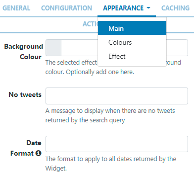

<!--toc=widgets-->

# Twitterメトロ

tterメトロモジュールは、[Twitter検索API](https://dev.twitter.com/rest/public/search)へのアクセスを提供します。Twitterメトロウィジェットをレイアウトに追加することで、Twitterフィードのメトロタイルを表示することができます。

{tip}
許可されたアクセスは、**データの読み取り**のみです。
{/tip}

## インストール

Twitter APIへのアクセスは保護されているため、ユーザーは**APIキー**を登録し、それを[[PRODUCTNAME]]CMSのTwitterメトロモジュールに入力する必要があります。

### Twitterへの接続

- Twitter](https://apps.twitter.com)から**APIキー**と**APIシークレット**を取得し、Twitterアカウントにログインしてください。

**注意：**まだ承認されていない場合は、上記のTwitterのリンクから**Twitterデベロッパーアカウント**を申請する必要があります。

- 必要事項を入力し、利用規約に同意する。
- CAPTCHAを解き、フォームを送信します。
- 生成されたコンシューマーキー（APIキー）とコンシューマーシークレット（APIシークレット）を控えておく。

### Twitterメトロモジュールをインストール

- 管理セクションの**モジュール**ページを選択し、Twitterメトロモジュールをインストールします。
- インストールが完了したら、Twitterメトロモジュールの行メニューをクリックし、**編集**をクリックします。
- 生成された**APIキー**と**APIシークレット**を入力します。
- オプションで **キャッシュ期間** を調整し、各Twitter検索の結果セットをキャッシュする期間を決定します。

{tip}
低い値を設定すると、リクエストが多すぎるため、Twitter APIへのアクセスが無効になることがあります。
{/tip}

## ウィジェットを追加

[ウィジェット](layouts_widgets.html)ツールバーから**Twitter メトロ**をクリックし、クリックで追加またはドラッグ＆ドロップで追加します。 

{tip}
Twitterメトロウィジェットは、追加されたリージョンのサイズに基づいて、自動的に縦長/横長のサイズになります。すべてのディスプレイ解像度で一貫性を保つために、画像と同じようにリサイズされます。
{/tip}

追加すると、設定オプションがプロパティパネルに表示されます。

- 識別しやすいように **名前** を記入します。
- 必要であれば、デフォルトの**期間**を上書きすることを選択します。

### 設定

- 検索条件**を指定すると、該当するツイートが表示されます。

{tip}
twitter.comの検索ボックスで入力する前に、検索語が有効であることを確認してください。
{/tip}

{tip}
アカウントの@ハンドル名を含むすべてのツイートではなく、特定のアカウントからのツイートを返すには、**検索語**フィールドのアカウント名の前に`from:`を使用します。
{/tip}

- 使用する**言語**を選択してください。
- 人気順、最新順、混合順など、返されるツイートの**種類**をドロップダウンで選択します。
- あなたの場所からツイートが返される**距離**をマイルで選択してください。0だと制限がありません。
- 返信するツイートの数を入力します。空欄の場合、デフォルトは60件です。
- 返したいTweetのコンテンツタイプをプルダウンメニューで選択します。すべてのツイート／テキストのみのツイート／テキストと画像を含むツイートから選択します。
- 返されるツイートのテキストから**メンション**（@someone）を削除する場合は、チェックボックスを使用します。
- ハッシュタグ** (#something) を削除する場合は、チェックボックスを使用します。
- 返されたツイートのテキストから**URL**を削除するには、チェックボックスを使用します。

{tip}
ほとんどのURLはデジタルサイネージを褒めるものではありません。
{/tip}

### 外観

**外観**タブで**メイン**のテンプレートを編集し、**カラー**を適用し、ツイート間の遷移に使用する**エフェクト**を選択することができます。

#### メイン

- オプションで背景色**を追加することができます。
- 検索クエリに基づいて、返すべきツイートがないときに表示する **Tweetなし** メッセージを指定します。
- 返される結果に使用する**日付形式**を適用します（ページ下部の「追加情報」を参照）。

#### 色

- ドロップダウンメニューを使用して、適用するカラーパレットを選択します。
- 代替カラーリングを定義するには、「テンプレートを上書き」ボックスを選択します。

- カラーバー内をクリックすると、カラーピッカーで再選択することができます。
- 選択範囲を完全に削除するには `-` を、追加するには `+` をクリックします。
- 変更した内容を **保存** してください。

#### エフェクト

- ツイート間の遷移に使用する**エフェクト**と**速度**を、各タイルに適用するためにオプションで選択します。

### キャッシュ

更新間隔には適切な時間を分単位で指定し、できるだけ高い値を維持します。これは、モジュールがフィードにデータを要求する頻度を決定します。

## アクション

このウィジェットにはアクションを付けることができます。詳しくは、[対話型アクション]( layouts_interactive_actions.html ])のページをご覧ください。

## 補足情報

[[PRODUCTNAME]]は、正しいPHPの日付形式であるすべての日付形式を受け入れる必要があります。次の文字が認識され、使用できます。

| フォーマット文字 | 説明                                                  | 返される文字の例                 |
| ---------------- | :----------------------------------------------------------- | --------------------------------------- |
|                  | **日**                                                      |                                         |
| d                | ゼロから始まる２桁の日付              | 01 から 31                                |
| D                | 日を表すテキスト, ３文字            | Mon から Sun                         |
| j                | ゼロをつけない日付                       | 1 から 31                                 |
| l                | (小文字‘L’) 日を表す完全な文字列 | Sunday から Saturday                 |
| N                | ISO-8601で定義された曜日を表す数字(PHP 5.1.0で追加された) | 1 (月曜日) から 7 (日曜日)   |
| S                | 日にちに対する英語の序数サフィックス、2文字| st, nd, rd または thとともに使われる     |
| w                | 曜日の数字表現         | 0 (Sunday) から 6 (Saturday) |
| z                | 年初からの日（0から始まる)                        | 0 から 365                           |
|                  | **週**                                                     |                                         |
| W                | ISO-8601で規定する週の数字, 週は月曜日から始まる(PHP 4.1.0で追加) | 42 (一年の中の４２週目)          |
|                  | **月**                                                    |                                         |
| F                | 月のテキスト表現, January や March | January から December                |
| m                | ゼロで始まる月の数字表現        | 01 から 12                           |
| M                | 月の短いテキスト表現、３文字     | Jan から Dec                         |
| n                | 月の数字表現、先頭にゼロはつかない| 1 から 12                            |
| t                | 月の日数                            | 28 から 31                           |
|                  | **年**                                                     |                                         |
| L                | うるう年かどうか year                                     | 1 うるう年, 0 それ以外.    |
| o                | ISO-8601できていされた年. これはYと同じ値です。ただし、ISOの週番号（W）が前後の年に属している場合は、その年が代わりに 使用されます。(PHP 5.1.0で追加) | 1999 または 2003                            |
| Y                | 年の４桁数字表現            | 1999 または 2003                            |
| y                | 年の２桁数字表現                         | 99 or 0                                 |
|                  | **時間**                                                     |                                         |
| a                | 小文字アンティメリディアムとポストメリディアム                    | am または pm                                |
| A                | 大文字アンティメリディアムとポストメリディアム                    | AM または PM                                |
| B                | スウォッチインターネット時間                                         | 000 から 999                         |
| g                | 先行ゼロなしの時間の12時間形式              | 1 から 12                            |
| G                | 先行ゼロなしの時間の24時間形式              | 0 から 23                            |
| h                | 先行ゼロありの時間の12時間形式                 | 01 から 12                           |
| H                | 先行ゼロありの時間の２４時間形式                 | 00 から 23                           |
| i                | 先行ゼロ付き分                                   | 00 から 59                                |
| s                | 先行ゼロ付き秒                                  | 00 から 59                           |
| u                | マイクロ秒（PHP 5.2.2で追加） DateTimeがマイクロ秒で作成された場合、DateTime :: format（）はマイクロ秒をサポートする>のに対して、date（）は常に000000を生成します。 | 654321                                  |
|                  | **タイムゾーン**                                                 |                                         |
| e                | タイムゾーン識別子（PHP 5.1.0で追加）                     | UTC, GMT, Atlantic/Azores               |
| I                | （大文字のi）日付が夏時間であるかどうか| 夏時間の場合は1、それ以外の場合は0です。 |
| O                | グリニッジ時間（GMT）との時差                  | +0200                                   |
| P                | グリニッジ標準時（GMT）と時間と分の間の差（PHP 5.1.3で追加） | +02:00                                  |
| T                | タイムゾーンの略語                                        | EST, MDT …                              |
| Z                | 秒単位のタイムゾーンオフセット。 UTCより西のタイムゾーンのオフセットは常に負で、UTCより東のタイムゾーンのオフセットは常に正です。 | -43200 through 50400                    |
|                  | **フル日付/時刻**                                           |                                         |
| c                | ISO 8601 日付（PHP 5で追加）                               | 2004-02-12T15:19:21+00:00               |
| r                | » RFC 2822 フォーマット日付                                    | Thu, 21 Dec 2000 16:01:07 +0200         |

