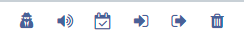

<!--toc=widgets-->

# ビデオ

アップロードされたビデオファイルはオフラインで再生できるようにキャッシュされ、レイアウトにビデオファイルを追加することができます。

ビデオファイルは、[ライブラリ](media_library.html) にアップロードするか、レイアウト デザイナーのツールバーからビデオ [ライブラリ検索] (layouts_library_search.html) 機能を使用してレイアウトに直接アップロードすることができます。

## オプションを設定

レイアウトに追加した後、タイムラインまたはビューワでビデオファイルをクリックすると、プロパティパネルに設定オプションが表示されます。

- 必要であれば、オプションの **名前** を記入します。
- ここでは、動画の再生時間を確認することができます。**再生時間を設定**にチェックを入れると、再生時間を指定することができます。

{tip}
表示されている時間より短く設定すると、映像が短く切り取られ、長く設定するとループ機能が使えます
{/tip}

- **設定**タブで、映像の**スケールタイプ**を選択します。

{tip}
**注意** スケーリングは現在、Android、webOS、Tizenプレーヤー（v2 R200以降）およびWindowsプレーヤー（v2 R253以降）でサポートされています。
{/tip} 

- 動画に音声がある場合は、ボックスにチェックを入れてミュートすることができます。
- **全画面表示**にチェックを入れると、再生中は動画が全画面表示されます。タイムラインの次の項目が表示されると、リージョンのサイズに戻されます。

{tip}

このウィジェットにオプションを適用するには、**コンテキストメニュー**を使用します。詳しくは、[レイアウトデザイナー](layouts_designer.html)のページを参照してください。
{/tip}

### アクション

このウィジェットにはアクションを付けることができます。詳しくは、[対話型アクション](layouts_interactive_actions.html)のページを参照してください。

**[PRODUCTNAME]]は、お客様のディスプレイに掲載されるコンテンツを管理する手段を持たないため、お客様が権利を所有していない場合、使用される動画が適切に帰属していることを確認するのはお客様の責任となります。
