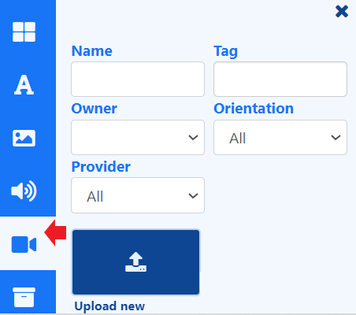

# ビデオ

[ライブラリ検索](layouts_editor.html#content-toolbar) から、レイアウトとプレイリストで再生するビデオ ファイルを追加します。

{feat}ビデオ|v4{/feat}

## 概要

- [ライブラリ検索](layouts_editor.html#content-library-search) から、新しいビデオ ファイルをプレイリスト/レイアウトに直接 [アップロード](media_library.html#content-add-media-upload) します。
- プレイリストとレイアウトに直接アップロードされたファイルは、再利用できるように [ライブラリ](media_library.html) に自動的に保存されます。
- ビデオ ファイルを事前にライブラリにアップロードすることもできます。

{tip}
H264 MP4 ファイル形式をお勧めします。

ビデオ ファイルをアップロードする際、スクロール バーを使用して、CMS でサムネイルとして使用するフレームを選択し、識別しやすくすることができます。

{/tip}

- プレイリストに直接アップロードされたビデオ ファイルの [開始時間と終了時間](media_playlists.html#content-widget-expiry-dates) を設定します。

- アップロード時にビデオ ファイルを [フォルダー](tour_folders.html#content-saving-to-folders) に保存して、ユーザーへのアクセスを簡単に制御します。

- アップロードされたビデオ ファイルは、オフライン再生用にキャッシュされます。

- ビデオ ファイルの継続時間を制御します。

- 元のファイルを短くするには、継続時間を短く設定します。

- 継続時間を長く設定し、ループ機能を使用して最初に戻って「ループ」し、より長い継続時間を実現します。

- アスペクト比とストレッチのスケーリング オプション。

- 既存のコンテンツの上部を拡大して、ビデオを全画面で表示します。

- 音声付きの動画をミュートします。

- CMS を離れることなく、Pixabay から使用する動画を選択します。

{version}
**注:**
スケーリングは現在、Android、webOS、Tizen プレーヤー (v2 R200 以降)、および Windows プレーヤー (v2 R253 以降) でサポートされています。
ビデオ ウィジェットを使用する場合、Tizen プレーヤーではトランジションはサポートされません。
{/version}

**[[PRODUCTNAME]] ではディスプレイに表示されるコンテンツを制御する手段がないため、権利を所有していない場合は、使用する動画の帰属表示を適切に行う責任はお客様にあります。**