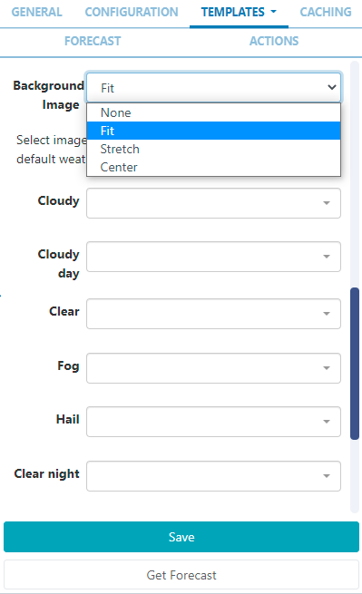

<!--toc=widgets-->

# 天気

天気ウィジェットでは、気象データの提供元として[Open Weather Map](https://openweathermap.org/)というサービスを利用し、世界各地の現在の天気予報を提供しています。

## インストール

気象データは、[CC-BY-SA](https://creativecommons.org/licenses/by-sa/4.0/) および [ODbL](https://opendatacommons.org/licenses/odbl/) の下で提供されている [OpenWeather](https://openweathermap.org/) によって提供されています。

APIキーの取得は[Open Weather Map](https://openweathermap.org/api)にアクセスし、アカウントを作成してください。

(1日1000コールを超える場合は、課金情報の入力も必要です)。

天気モジュールは、メニューの管理セクションにあるモジュールページよりインストールします。モジュールのインストール**」ボタンをクリックし、インストールするモジュールを選択します。

インストール後、グリッドからモジュールを選択し、行メニューで **編集** を選択します。

フォームフィールドに、**APIキー**を入力します。CMSでは、地理的な場所ごとに要求の間に遅延を作成するキャッシュ期間を指定することができます。

Open Weather Mapは、1日に1000件の予報をリクエストすることができ、それ以降のリクエストには少額の料金が課金されます。

{tip}
**有料プラン**では、16日分の予報をはじめ、データの取得方法を最適化することができます。
{/tip}

## ウィジェットを追加

[Open Weather Mapの利用条件]( https://openweathermap.org/terms)を読み、理解した上で、このウィジェットを使用する必要があります。

[ウィジェット](layouts_widgets.html)ツールバーの**天気**をクリックし、追加またはドラッグ＆ドロップします。

追加時に、設定オプションがプロパティパネルに表示されます。

- 識別しやすいように **名前** を指定します。
- 必要であれば、デフォルトの**期間**を上書きすることを選択します。

### 設定

- **表示位置**を使用する場合はチェックし、このウィジェットで使用する**緯度**と**経度**を手動で入力する場合はチェックを外してください。
- ドロップダウンメニューを使用して、測定の**単位**を選択するか、地理的位置に基づく自動選択(最初の項目)を選択します。
- 使用する**言語**を選択します。
- チェックボックスを使用して、**日中の天気だけを表示**するようにします。
- **水平方向**および**垂直方向**の配置オプションを使用して、ウィジェットをリーション内に配置します。

### テンプレート

[[PRODUCTNAME]]では、使いやすいように**プリセット**テンプレートを用意しています。

**プリセット**を選択すると、**タイプ**と**方向**を選択し、ドロップダウンを使って入力した条件に一致する利用可能な**テンプレート**を選択します。

**テンプレート**を選択すると、カラーピッカーを使用してテンプレートの色を変更したり、既知の場合は色のHexコード入力をしたりするオプションが利用可能になります。

背景画像を選択した場合、デフォルトで提供される画像の代わりに、ライブラリにアップロードされた画像を使用することができます。

## プリセットテンプレートの編集（上級者向け）

プリセットされたテンプレートは、**テンプレートを上書き**のチェックボックスをクリックすることで編集できます。

{tip}
テンプレートは自動的に拡大縮小されるため、意図した出力解像度に合わせた設計が必要です。テンプレートを編集する際には、以下のガイドラインを考慮する必要があります。

- テンプレートは固定サイズでデザインすること
- フォント、マージン、幅、高さなど、すべての要素には絶対サイズ（px）を使用する必要があります。
- 位置決めを行う場合は、top,left で行う。
- テンプレートはブートストラップを使用することができます
- 縦横比は[[PRODUCTNAME]]で固定され、リージョンに合わせたサイズになります。
- テンプレートは静止画像と同じように扱われる
{/tip}

オーバーライドテンプレートを選択した状態で、テキスト、HTML、CSSを入力することができます。

オーバーライドを選択した後、**テンプレートタブ**に戻り、編集するテンプレートを選択します。

### 現在の天気テンプレート

メインテンプレートとも呼ばれ、現在の気象条件や、繰り返し表示される日別予報テンプレートのベースとして使用されます。

ビジュアルエディタをオンにすると、インラインエディタにアクセスし、テキストやフォーマットを入力したり、テキスト/HTMLをボックスに入力したりすることができます。

ドロップダウンを使用して、**スニペット**を入力します。

{tip}
**天気予報を取得**をクリックすると、使用可能なデータ項目が表示されます。
{/tip}

### 日別天気予報テンプレート

これは7日間予報のために提供される**繰り返しテンプレート**です。これは毎日繰り返され、特別な `[dailyForecast]` タグに代入されます（メインの天気予報テンプレートに代入する必要があります）。

`[dailyForecast]`タグには2つのオプション設定があり、`|`を含めることでタグに追加することができます。これらは `[dailyForecast|Number of days|Start day]`で、デフォルトは明日（2日目）から始まる7日間です。もし次の3日間を見たい場合は `[dailyForecast|3]` を使い、明後日からの3日間の予報を見たい場合は `[dailyForecast|3|3]` を使うことができます。

{tip}
よくある例として、"現在の天気テンプレート "を無視して、日別天気予報テンプレートを使って7日間の予報を作成することができます - これは `[dailyForecast|7|1]` で実現できます。
{/tip}

### スタイルシート

上記のテンプレートに適用するCSSです。

{tip}
このオプションのテンプレートは、CMSが生成する出力を「微調整」する上級ユーザー向けのものです!
{/tip}

### Attribution

天気予報ウィジェットを使用するすべてのレイアウトは、`[Attribution]`タグを使用することで利用に関する帰属表示を表示する必要があります。すべてのプリセットテンプレートは、デフォルトでこのタグを含んでいます。デフォルトのテンプレートを編集または上書きする場合は、このタグが含まれていることを確認してください。

### キャッシュ

適用する「更新間隔」を分単位で入力し、なるべく高くしておきます。

{tip}
データが1時間に1回しか変更されない場合、更新間隔を60に設定することができます。
{/tip}

### 天気予報を取得

いつでも**天気予報を取得**して、どのような予報データが返されるかを確認することが可能です。どのようなフィールドでも、角括弧の間にフィールド名を入力することで、テンプレート内の変数として利用できます。
例えば、`[nearestStormDistance]`のように。

## アクション

このウィジェットにはアクションを追加することができます。詳しくは[ 対話型アクション ](layouts_interactive_actions.html) ページを参照してください。

## 補足情報

[[PRODUCTNAME]]は、正しいPHPの日付形式であるすべての日付形式を受け入れる必要があります。次の文字が認識され、使用できます。

| フォーマット文字 | 説明                                                  | 返される文字の例                 |
| ---------------- | :----------------------------------------------------------- | --------------------------------------- |
|                  | **日**                                                      |                                         |
| d                | ゼロから始まる２桁の日付              | 01 から 31                                |
| D                | 日を表すテキスト, ３文字            | Mon から Sun                         |
| j                | ゼロをつけない日付                       | 1 から 31                                 |
| l                | (小文字‘L’) 日を表す完全な文字列 | Sunday から Saturday                 |
| N                | ISO-8601で定義された曜日を表す数字(PHP 5.1.0で追加された) | 1 (月曜日) から 7 (日曜日)   |
| S                | 日にちに対する英語の序数サフィックス、2文字| st, nd, rd または thとともに使われる     |
| w                | 曜日の数字表現         | 0 (Sunday) から 6 (Saturday) |
| z                | 年初からの日（0から始まる)                        | 0 から 365                           |
|                  | **週**                                                     |                                         |
| W                | ISO-8601で規定する週の数字, 週は月曜日から始まる(PHP 4.1.0で追加) | 42 (一年の中の４２週目)          |
|                  | **月**                                                    |                                         |
| F                | 月のテキスト表現, January や March | January から December                |
| m                | ゼロで始まる月の数字表現        | 01 から 12                           |
| M                | 月の短いテキスト表現、３文字     | Jan から Dec                         |
| n                | 月の数字表現、先頭にゼロはつかない| 1 から 12                            |
| t                | 月の日数                            | 28 から 31                           |
|                  | **年**                                                     |                                         |
| L                | うるう年かどうか year                                     | 1 うるう年, 0 それ以外.    |
| o                | ISO-8601できていされた年. これはYと同じ値です。ただし、ISOの週番号（W）が前後の年に属している場合は、その年が代わりに 使用されます。(PHP 5.1.0で追加) | 1999 または 2003                            |
| Y                | 年の４桁数字表現            | 1999 または 2003                            |
| y                | 年の２桁数字表現                         | 99 or 0                                 |
|                  | **時間**                                                     |                                         |
| a                | 小文字アンティメリディアムとポストメリディアム                    | am または pm                                |
| A                | 大文字アンティメリディアムとポストメリディアム                    | AM または PM                                |
| B                | スウォッチインターネット時間                                         | 000 から 999                         |
| g                | 先行ゼロなしの時間の12時間形式              | 1 から 12                            |
| G                | 先行ゼロなしの時間の24時間形式              | 0 から 23                            |
| h                | 先行ゼロありの時間の12時間形式                 | 01 から 12                           |
| H                | 先行ゼロありの時間の２４時間形式                 | 00 から 23                           |
| i                | 先行ゼロ付き分                                   | 00 から 59                                |
| s                | 先行ゼロ付き秒                                  | 00 から 59                           |
| u                | マイクロ秒（PHP 5.2.2で追加） DateTimeがマイクロ秒で作成された場合、DateTime :: format（）はマイクロ秒をサポートする>のに対して、date（）は常に000000を生成します。 | 654321                                  |
|                  | **タイムゾーン**                                                 |                                         |
| e                | タイムゾーン識別子（PHP 5.1.0で追加）                     | UTC, GMT, Atlantic/Azores               |
| I                | （大文字のi）日付が夏時間であるかどうか| 夏時間の場合は1、それ以外の場合は0です。 |
| O                | グリニッジ時間（GMT）との時差                  | +0200                                   |
| P                | グリニッジ標準時（GMT）と時間と分の間の差（PHP 5.1.3で追加） | +02:00                                  |
| T                | タイムゾーンの略語                                        | EST, MDT …                              |
| Z                | 秒単位のタイムゾーンオフセット。 UTCより西のタイムゾーンのオフセットは常に負で、UTCより東のタイムゾーンのオフセットは常に正です。 | -43200 through 50400                    |
|                  | **フル日付/時刻**                                           |                                         |
| c                | ISO 8601 日付（PHP 5で追加）                               | 2004-02-12T15:19:21+00:00               |
| r                | » RFC 2822 フォーマット日付                                    | Thu, 21 Dec 2000 16:01:07 +0200         |

