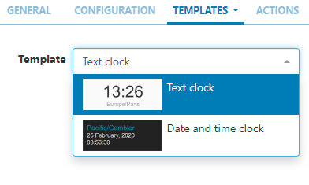
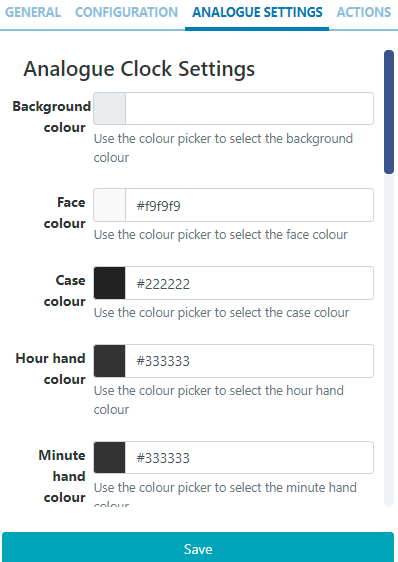
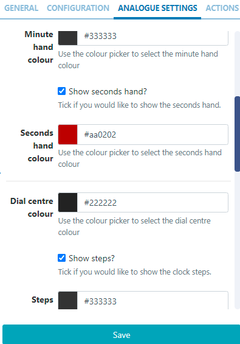

<!--toc=widgets-->

# 世界時計

世界時計ウィジェットは、レイアウト上に1つまたは複数のタイムゾーンを表示する時計として使用することができます。

## ウィジェットを追加
[ウィジェット](layouts_widgets.html)ツールバーの**世界時計**をクリックし、追加またはドラッグ＆ドロップします。

追加すると、世界時計の編集フォームに設定オプションが表示されます。

- 識別しやすいように **名前** を指定します。
- 必要であれば、デフォルトの **期間** をオーバーライドすることを選択します。

## 設定

- ドロップダウンを使用して、**タイムゾーン**を選択します。

- 選択したタイムゾーンと一緒に表示される**ラベル**を入力します。

- オプションとして、**ハイライト**を選択します。

- 必要に応じて複数のタイムゾーンの時計を追加するには、`+`ボタンをクリックします。

- ドロップダウンを使って、クロックのタイプを**デジタル**または**アナログ**から選択します。

- 複数のタイムゾーンの時計を選択した状態で、表示する**時計列**と**時計行**の数を設定します。

{tip}
このウィジェットの**水平**と**垂直**のアライメントオプションを設定することができます。
{/tip}

- **保存**

選択された**時計の種類**に応じて、さらなるオプションが利用可能になります。

## テンプレート - デジタルクロック

時計の表示方法は、プリセットテンプレートの中からドロップダウンで選択することができます。

{tip}
必要であれば、選択したテンプレートを上書きするをクリックします。
詳しくは、以下の「プリセットテンプレートの編集」の項をご覧ください。
{/tip}

## プリセットテンプレートの編集

プリセットされたテンプレートは、**テンプレートを上書き**のチェックボックスをクリックすることで編集できます。

{tip}
テンプレートは自動的にスケーリングされるので、意図した出力解像度に合うように設計する必要があります。テンプレートを編集する際には、以下のガイドラインを考慮する必要があります。

- テンプレートは固定サイズで設計する必要があります。
- フォント、マージン、幅、高さなど、すべての要素で絶対サイズ（px）を使用する必要があります。
- 位置決めを行う場合は、top,left で行う。
- テンプレートはbootstrapを使用することができます
- 縦横比は[[PRODUCTNAME]]で固定され、リージョンに合わせたサイズになります。
- テンプレートは静止画像と同じように扱われます
{/tip}

オーバーライドを選択したら、**テンプレートタブ**に戻り、編集するテンプレートを選択します。

**メイン** - テキスト/HTMLを入力してください。

**オプションのスタイルシート** - テンプレート構造に適用するCSSです。

{tip}
このオプションのテンプレートは、CMSが生成する出力を「調整」する上級ユーザー向けのものです!
{/tip}

## アナログ設定 - アナログ時計

アナログ時計を選択すると、追加タブが利用可能になり、時計の要素に色を設定することができるようになります。

- 各フィールドのカラーピッカーを使用して定義します。

- をクリックして、さらに設定を有効にして色を定義します。

  

- **保存**

## アクション

このウィジェットにはアクションを付けることができます。詳しくは、[対話型アクション](layouts_interactive_actions.html)のページを参照してください。

## 補足情報

[[PRODUCTNAME]]は、正しいPHPの日付形式であるすべての日付形式を受け入れる必要があります。次の文字が認識され、使用できます。

| フォーマット文字 | 説明                                                  | 返される文字の例                 |
| ---------------- | :----------------------------------------------------------- | --------------------------------------- |
|                  | **日**                                                      |                                         |
| d                | ゼロから始まる２桁の日付              | 01 から 31                                |
| D                | 日を表すテキスト, ３文字            | Mon から Sun                         |
| j                | ゼロをつけない日付                       | 1 から 31                                 |
| l                | (小文字‘L’) 日を表す完全な文字列 | Sunday から Saturday                 |
| N                | ISO-8601で定義された曜日を表す数字(PHP 5.1.0で追加された) | 1 (月曜日) から 7 (日曜日)   |
| S                | 日にちに対する英語の序数サフィックス、2文字| st, nd, rd または thとともに使われる     |
| w                | 曜日の数字表現         | 0 (Sunday) から 6 (Saturday) |
| z                | 年初からの日（0から始まる)                        | 0 から 365                           |
|                  | **週**                                                     |                                         |
| W                | ISO-8601で規定する週の数字, 週は月曜日から始まる(PHP 4.1.0で追加) | 42 (一年の中の４２週目)          |
|                  | **月**                                                    |                                         |
| F                | 月のテキスト表現, January や March | January から December                |
| m                | ゼロで始まる月の数字表現        | 01 から 12                           |
| M                | 月の短いテキスト表現、３文字     | Jan から Dec                         |
| n                | 月の数字表現、先頭にゼロはつかない| 1 から 12                            |
| t                | 月の日数                            | 28 から 31                           |
|                  | **年**                                                     |                                         |
| L                | うるう年かどうか year                                     | 1 うるう年, 0 それ以外.    |
| o                | ISO-8601できていされた年. これはYと同じ値です。ただし、ISOの週番号（W）が前後の年に属している場合は、その年が代わりに使用されます。(PHP 5.1.0で追加) | 1999 または 2003                            |
| Y                | 年の４桁数字表現            | 1999 または 2003                            |
| y                | 年の２桁数字表現                         | 99 or 0                                 |
|                  | **時間**                                                     |                                         |
| a                | 小文字アンティメリディアムとポストメリディアム                    | am または pm                                |
| A                | 大文字アンティメリディアムとポストメリディアム                    | AM または PM                                |
| B                | スウォッチインターネット時間                                         | 000 から 999                         |
| g                | 先行ゼロなしの時間の12時間形式              | 1 から 12                            |
| G                | 先行ゼロなしの時間の24時間形式              | 0 から 23                            |
| h                | 先行ゼロありの時間の12時間形式                 | 01 から 12                           |
| H                | 先行ゼロありの時間の２４時間形式                 | 00 から 23                           |
| i                | 先行ゼロ付き分                                   | 00 から 59                                |
| s                | 先行ゼロ付き秒                                  | 00 から 59                           |
| u                | マイクロ秒（PHP 5.2.2で追加） DateTimeがマイクロ秒で作成された場合、DateTime :: format（）はマイクロ秒をサポートするのに対して、date（）は常に000000を生成します。 | 654321                                  |
|                  | **タイムゾーン**                                                 |                                         |
| e                | タイムゾーン識別子（PHP 5.1.0で追加）                     | UTC, GMT, Atlantic/Azores               |
| I                | （大文字のi）日付が夏時間であるかどうか| 夏時間の場合は1、それ以外の場合は0です。 |
| O                | グリニッジ時間（GMT）との時差                  | +0200                                   |
| P                | グリニッジ標準時（GMT）と時間と分の間の差（PHP 5.1.3で追加） | +02:00                                  |
| T                | タイムゾーンの略語                                        | EST, MDT …                              |
| Z                | 秒単位のタイムゾーンオフセット。 UTCより西のタイムゾーンのオフセットは常に負で、UTCより東のタイムゾーンのオフセットは常に正です。 | -43200 through 50400                    |
|                  | **フル日付/時刻**                                           |                                         |
| c                | ISO 8601 日付（PHP 5で追加）                               | 2004-02-12T15:19:21+00:00               |
| r                | » RFC 2822 フォーマット日付                                    | Thu, 21 Dec 2000 16:01:07 +0200         |

