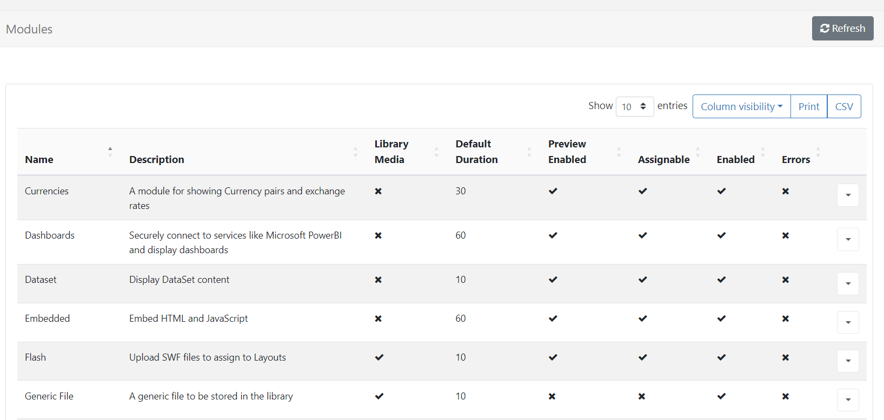

# モジュール管理

[[PRODUCTNAME]] に表示されるすべてのコンテンツは、メイン CMS メニューの **管理** セクションの **モジュール** ページから管理される **メディア モジュール** によって提供されます:

- 行メニューを使用して **構成** をクリックし、ユーザーが使用できるかどうかを制御します。

{tip}
特定のライブラリ ファイル ベースのモジュール (画像、ビデオ、Flash など) で許可された拡張子を追加または削除する必要がある場合があります。一般的な使用例は、その特定の種類のファイルをサポートしていないプレーヤーが使用されている場合です。

フォントは、メイン CMS メニューの **管理** セクションの [フォント](tour_cms_settings.html#content-fonts) ページから追加および管理できます。
{/tip}

## キャッシュと外部アクセス

コア モジュールは、アクティブな接続や必要な外部リソースへの直接アクセスなしで再生できるように、データがキャッシュされて CMS から提供されるように設計されています。CMS は、サードパーティのデータを要求するときに _善良な市民_ になるためにもこのメカニズムを使用します。
{tip}
たとえば、アドレスが `http://anexternal.com/feed` のティッカー ウィジェットは、CMS によってのみアクセスされ、`updateInterval` ごとに 1 回のみアクセスされます。レイアウトを表示するプレーヤーは、そのアドレスに直接アクセスする必要はありません。

{/tip}

すべてのコア モジュールがこのアプローチを採用していますが、例外については以下を参照してください:

- **Web ページ モジュール** は CMS からキャッシュせず、常にプレーヤーのブラウザーを使用して指定された Web ページ アドレスを開こうとします。つまり、プレーヤーは常に Web アドレスにネットワーク アクセスできる必要があります。

- **埋め込みモジュール** はライブラリ参照を使用してキャッシュできますが、モジュールを作成するユーザーは、必要に応じて外部リソースを自由に指定できます。

- **ローカル ビデオ モジュール** はプレーヤーのビデオ デコーダーによってレンダリングされ、外部ストリームを参照できます。

- **Flash** ファイルには外部ファイルを参照する機能があり、プレーヤーで実行されます。

## 汎用ファイル

汎用ファイル モジュールは、**追加ファイル** をプレーヤーに送信するために使用されます。このファイルは、他の目的で使用できます。

{tip}
これは、相対パスとして使用される補足ファイル (株価データの結果に基づいて埋め込み HTML に動的に表示される上下の矢印など) を提供する場合に役立ちます。
{/tip}

