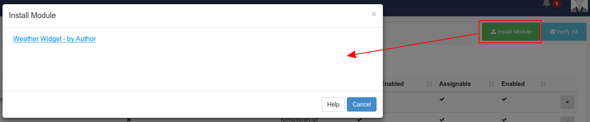

<!--toc=widgets-->
# モジュール

[[PRODUCTNAME]]に表示されるすべてのコンテンツは、**メディアモジュール**によって追加/編集され、提供されています。[[PRODUCTNAME]]には様々なモジュールがあり、新しいリリースとともにさらに多くのモジュールが導入されます。

モジュールは、メニューの**管理**セクションにある**モジュール**のページで有効/無効を切り替えることができます。

モジュールの有効/無効は、選択したモジュールの行メニューで行います。**編集**を選択すると、**有効**チェックボックスにチェックを入れたり外したりすることができるフォームが表示されます。各モジュールには、モジュールに依存する利用可能な設定範囲があり、調整することができます。

### ライブラリーモジュール

時には、特定のファイルベースのモジュールで許可された拡張子を追加または削除する必要がある場合があります。

{tip}
典型的な使用例としては、その特定のタイプのファイルをサポートしていないプレーヤーを使用している場合です。
{/tip}

## 一般的なファイル

一般的なファイルモジュールは、他の用途に使用できる*＊追加ファイル**をプレーヤーに送信するために使用されます。

{tip}
以下のような場合にに役立つかもしれません。

- 組み込みHTML - 相対パスとして使用するための補助的なファイルを提供することができる（例：ストックデータの結果に基づいて埋め込みHTMLに動的に表示される上下の矢印）。
{/tip}

## キャッシュと外部アクセス

コアモジュールは、データをキャッシュし、CMSから提供されるように設計されているため、アクティブな接続や外部リソースへの直接アクセスがなくても再生することができます。

CMSもまた、第三者のデータを要求する際に、このメカニズムを利用して「善良な市民」であることを表明しています。
{tip}
例えば、アドレス `http://anexternal.com/feed` を持つ ティッカーウィジェットは CMS によってのみアクセスされ、`更新間隔`ごとに一度だけアクセスされます。レイアウトを表示しているプレイヤーは、そのアドレスに直接アクセスする必要はありません。
{/tip}

以下に示す例外を除き、すべてのコアモジュールがこのアプローチを採用しています。

### 特筆すべき例外事項

- **ウェブページモジュール**は、CMSからのキャッシュを行わず、常にプレーヤー上のブラウザを使用して指定されたウェブページアドレスを開くことを試みます。このため、プレーヤーは常にそのウェブアドレスにネットワークアクセスできる必要があります。
- **組み込みモジュール**は、ライブラリ参照を用いてキャッシュすることができますが、モジュールを作成するユーザーは、外部リソースを必要とする場合、自由に指定することができます。
- **ローカルビデオモジュール**は、プレーヤー上のビデオデコーダによってレンダリングされ、外部ストリームを参照することができます。
- **Flash**ファイルは、外部ファイルを参照する機能を持ち、プレーヤー上で実行されます。

## 新しいモジュールのインストール

新しいモジュールは、手動でCMSにアップロードし、モジュール管理画面からインストールする必要があります。インストールされていないモジュールは自動的に検出され、**モジュールのインストール**フォームにインストールオプションとして提示されます。

インストールする**モジュール**名をクリックし、ページを更新してください。
