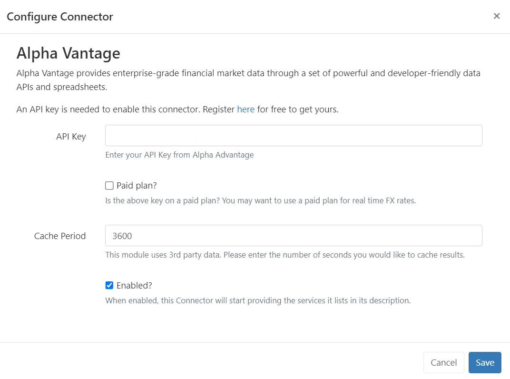

# コネクタ管理

たとえば [Stocks](media_module_stocks.html) など、サードパーティのサービスにデータを利用するモジュールでは、API キーなどを使用した追加の構成が必要です。

モジュールが有効になり、必要な API キーを取得したら、次の操作を行います。

- メイン CMS メニューの [**管理**] セクションの [**アプリケーション**] ページに移動します。
- ページの [**コネクタ**] セクションまで下にスクロールします。

ここでは、構成可能なすべてのサードパーティ サービスを確認できます:

- コネクタの [**構成**] ボタンをクリックして構成します:

- 提供された **API キー** を入力し、[**有効**] ボックスにチェックマークを付けて、コネクタが関連するモジュールにサービスを提供するように指示します。

