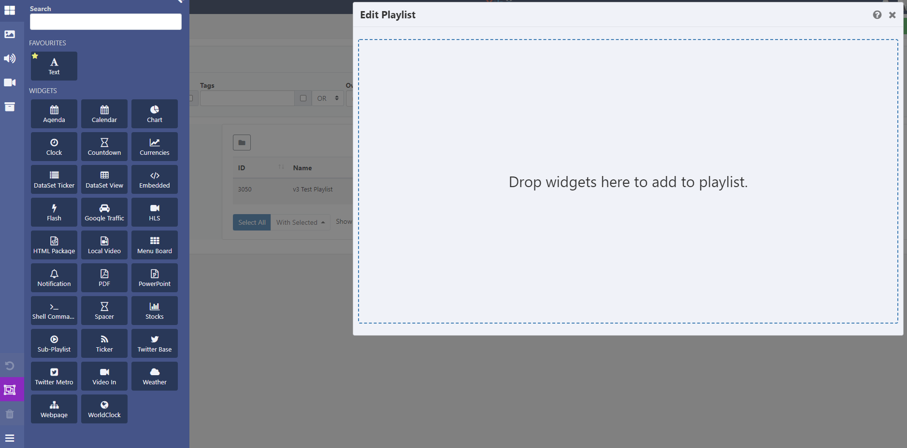

<!--toc=media-->

# プレイリスト

プレイリストは、レイアウトと独立して作成・管理される「再利用可能なプレイリスト」の作成を可能にします。一度作成したプレイリストは、複数のリージョンやレイアウトで簡単に再利用することができます。

プレイリストは、2つのプロセスで構成されていると考えてください。

1. **プレイリスト**（表示するメディアの内容や構成を含む）
2. **サブプレイリストウィジェット**（レイアウトに追加することで、プレイリストを選択し、指定した順番で再生するように設定することができます。）

プレイリストは、メインメニューの**ライブラリ**にある**プレイリスト**をクリックすることで管理されます。

デフォルトでは、**フォルダ**ツリーが開きます。

- フォルダ/サブフォルダをクリックすると、その内容が検索され、グリッドに適用された任意のフィルタに基づいて結果が返されます。

または

- **全フォルダ**にチェックを入れると、ルートフォルダでの検索を含み、グリッドに適用されたフィルターに基づいた結果を返します。

{tip}
フォルダのアイコンをクリックすると、表示/非表示を切り替えることができます。 フォルダーを非表示にすると、選択したフォルダーのファイルパスが表示されます。
{/tip}

プレイリスト[グリッド](tour_grids.html)では、既存の編集と新規作成が可能です

### 新規プレイリストを作成

- **プレイリストを追加**ボタンをクリックし、該当するフォームの項目を入力します。

- プレイリストは、オプションで**フォルダ**に保存することができます。

{tip}
フォルダに保存されたプレイリストは、ユーザー/ユーザーグループのアクセス用に保存先フォルダに適用された表示、編集、削除 **共有** オプションを継承します!

プレイリストのコンテンツにもアクセスできるようにする場合は、同じフォルダーに保存するようにしてください。
{/tip}

- **フォルダを選択**ボタンをクリックして展開し、保存するフォルダを選択します。

- フォルダを右クリックして、保存するフォルダを新規に作成したり、その他のオプションにアクセスすることも可能です。

- 選択されたフォルダのファイルパスが、フォームの「フォルダ」フィールドの横に表示されます。

  {tip}
  利用可能なオプションは、ユーザー/ユーザーグループの有効な[機能と共有](users_features_and_sharing.html)オプションに基づきます。
  {/tip}

{white}
フォルダアクセスとセットアップに関する詳細については、管理者にご相談ください。
{/white}

- CMS内で簡単に識別できるように、**名前**を記入してください。

- オプションのタグを含めると整理され、検索しやすくなります。

フォームのタグフィールドにテキストを入力すると、オートコンプリートヘルパーが一致する候補を表示し、ユーザーが簡単に選択できるようにします。

定義済みの値は、**タグ値**のドロップダウンを使用して表示されます。値が既に知られている場合は、次のフォーマットを使用してフィールドに直接入力することができます。'色|赤`と入力します。
管理者によって値が「必須」に設定されている場合、フォームを保存するために値を入力する必要があります。
{/tip}

ユーザーは、**タグ値**フィールドを使用して、定義済みの値をまだ持っていないタグに関連する値を追加することができます。タグの値が必要ない場合は、このフィールドを空白にすることができます。

{tip}
レイアウトグリッドの下部にある [個別選択](https://xibo.org.uk/manual/en/tour_grids.html#複数選択-個別選択による) オプションを使用して、複数のレイアウトにタグを割り当てることも可能です。
{/tip}

使用する**タグ**と**タグ値**の詳細については、管理者にご相談ください。

### メディアの自動割り当て

- このプレイリストのメディア割り当てを自動的に管理したい場合は、**動的** チェックボックスを使用します。
- 選択後、**フィルタ**タブをクリックして、ライブラリメディアの追加とプレイリストの自動管理に使用する基準を設定します。

{tip}
追加するメディアを選択する際は、**タグフィルター**のドロップダウンを使用して、And/Orの条件を使用します
{/tip}

- プレイリストに動的に割り当てることができるメディアアイテムの**最大**数を入力します。

{tip}
動的チェックボックスをオフにしたまま、[フィルタ] タブと基準を使用してメディアを 1 回だけ割り当て、ライブラリからプレイリストにメディアを事前入力することもできます。
{/tip}

### メディアを手動で追加する

- フォームの各項目を入力し、**保存**ボタンをクリックしてください。

- ツールバーで、[ウィジェット](layouts_widgets.html)や[ライブラリメディア](layouts_library_search.html)を使って、プレイリストにコンテンツを追加することができます。
- クリック、またはドラッグ＆ドロップでキャンバスに追加します。

- 追加したら、利用可能なオプションを使用して設定します。

{tip}
利用可能なオプションの詳細については、選択した[Widget](media_modules.html)の関連マニュアルページを参照してください。
{/tip}

タイムラインのウィジェットをクリックしてドラッグすると、プレイリストに追加されたメディアアイテムの順番を変更することができます。変更は自動保存されますので、必要であればツールバーの元に戻すボタンで元に戻してください。

すべてのウィジェット/ライブラリメディアは、**共有**アクセスや**トランジション**など、適用可能なオプションが設定された**コンテキストメニュー**にアクセスできます。選択したウィジェット/メディアを右クリックすると、アクセスできます。コンテキストメニューの詳細については、マニュアルの[レイアウト デザイナー](layout_designer.html)のページに記載されています。

{tip}
タイムライン上の複数のウィジェットを削除する場合は、ツールバー下部の**複数のウィジェットを選択**ボタンをクリックし、ハイライトするウィジェットをクリックします。選択した後、クリックすると1回で削除されます。
{/tip}

### プレイリストを編集

プレイリストはレイアウトとは独立して編集されるため、プレイリストが追加されたレイアウトにアクセスしたり編集したりする必要はありません。

- プレイリストの内容を編集するには、プレイリストグリッドの行メニューからタイムラインを選択し、プレイリストエディタを起動します

{tip}
レイアウトの編集は必要なく、変更内容はすぐにシステムで確認でき、プレーヤーが次のコレクションで利用できるようになります。
{/tip}

### 行メニュー

選択したプレイリストのその他の操作やショートカットにアクセスするには、**行メニュー**を使用します。

### 共有

プレイリストの作成者（オーナー）またはスーパー管理者は、他のユーザー/ユーザーグループに対して閲覧/編集/削除のアクセス権を割り当てることができます。

詳しくは、[機能と共有](users_features_and_sharing.html)をご覧ください。

### レイアウトにプレイリストを追加する

レイアウトにプレイリストを追加するための「サブプレイリストウィジェット」（media_module_subplaylist.html）を組み込みます。

