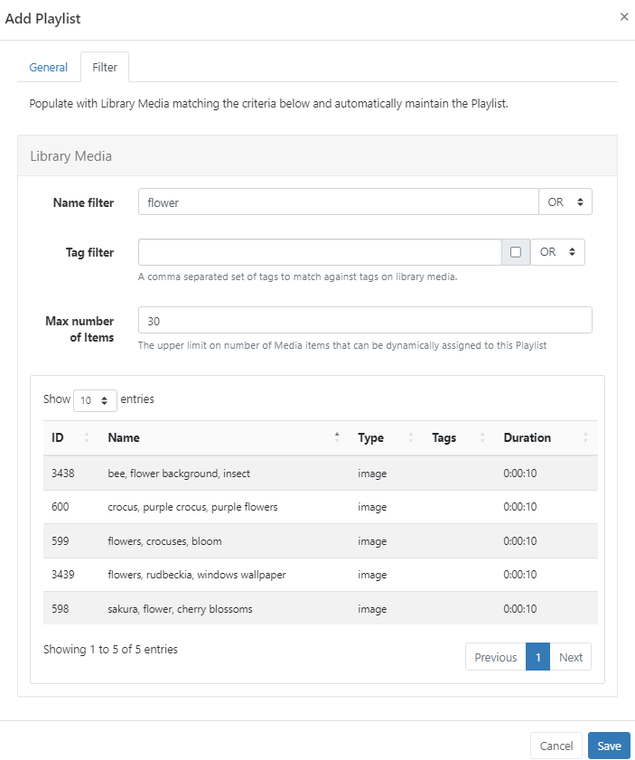
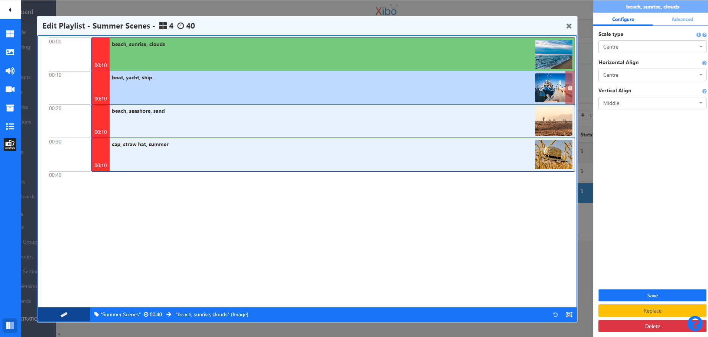
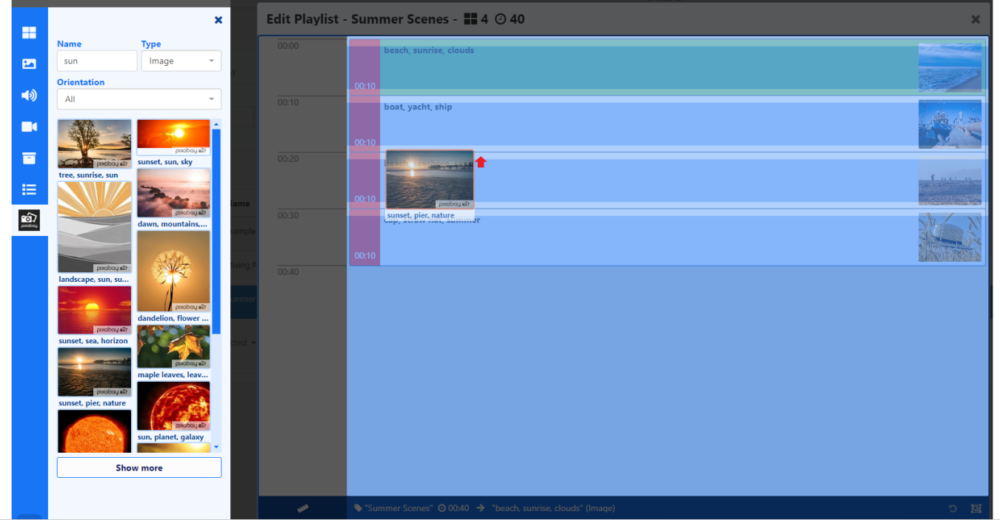
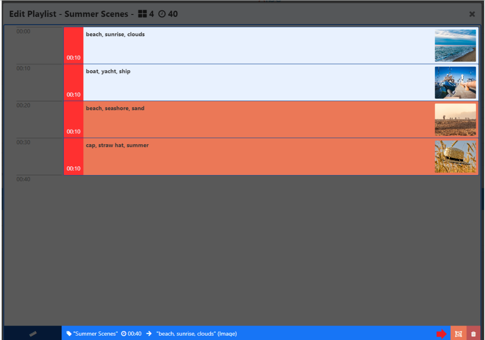
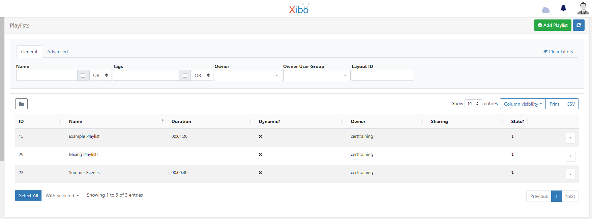

# プレイリスト

プレイリストは、メディア アイテムのシーケンス (画像スライドショーなど) を表示するために使用されます。プレイリストを作成するには、次の 2 つの方法があります:

- レイアウトとは独立して [プレイリスト](media_playlists) を作成します。グローバル プレイリストは、レイアウトを作成せずにディスプレイにスケジュールできます。レイアウト エディタの外部で作成されたプレイリストは、レイアウト エディタの [プレイリストの追加] 機能から選択できるように表示されます。
- レイアウト エディタからレイアウトに [プレイリストを追加](layouts_editor_playlists.html#content-add-playlists) します。ローカル プレイリストは、グローバル プレイリストとして再利用できるように保存するように変換できます。保存されたプレイリストは、レイアウト エディタに表示され、レイアウトに追加されます。

## 機能の概要:

- レイアウトとは独立して作成および構成します。
- コンテンツを [動的に](media_playlists.html#content-dynamically-adding-media) 追加および維持します。
- レイアウトにアクセスせずにプレイリスト コンテンツを更新します。
- レイアウトに追加することなく、プレイリスト グリッドから直接スケジュールします。
- さまざまなプレイリストからコンテンツを組み合わせて表示します。
- プレイリストから表示するアイテムの最大数を設定します。 - プレイリストの各アイテムが次のアイテムに移るまでの表示時間を制御します。
- プレイリストに追加されたメディア アイテムの有効期限を設定します。

## プレイリストの作成

ディスプレイに表示される複数のコンテンツ アイテムを保持するプレイリストを作成することで、リソースを合理化し、時間を節約できます。特定の要件、場所、主題カテゴリなどに合わせてコンテンツをターゲットにして照合するプレイリストを作成します。

レイアウトとは独立して作成されるプレイリストで、プレイリストにコンテンツを追加または管理するために、レイアウトまたはレイアウト エディターへの追加のユーザー アクセスは必要ありません。プレイリストに加えられた変更は、そのプレイリストがすでに含まれているすべてのレイアウト/スケジュールで更新されます。

- メイン CMS メニューの [**ライブラリ**] セクションで [**プレイリスト**] を選択します。

- [**プレイリストを追加**] ボタンをクリックし、フォーム フィールドに入力します:

[フォルダー](https://test.xibo.org.uk/manual/en/tour_folders.html) は、ユーザー オブジェクトを整理、検索し、他のユーザー/ユーザー グループと簡単に [共有](https://test.xibo.org.uk/manual/en/users_features_and_sharing.html#content-share) するために使用されます。フォルダーに保存されたプレイリストは、そのフォルダーに適用されたアクセス オプションを継承します。

{tip}
ユーザーがプレイリストのコンテンツ (画像/ビデオ メディア ファイルなど) にもアクセスできるようにする場合は、これらも同じフォルダーに保存されていることを確認してください。
ヒント}

- CMS で簡単に識別できるように、プレイリストに **名前** を付け、オプションで [タグ](tour_tags.html) を含めます。

[メディア](media_library) コンテンツをプレイリストに追加するには、次の 2 つのオプションがあります。

- [動的](media_playlists.html#content-dynamically-adding-media) オプションを使用して、基準に基づいてライブラリ ベースのメディアを自動的に割り当てます。

- フォームを保存すると開く [プレイリスト エディター](media_playlists.html#content-media-playlists) を使用して、メディアを手動で割り当てます。

## メディアを動的に追加する

- チェックしたら、[**フィルター**] タブをクリックし、一致するライブラリ メディアを入力するために必要な基準を設定します。

- 自動的に割り当てられるライブラリ メディア ファイルの **最大数** を指定して、自動的に割り当てられる数を制限します。

設定された条件に一致する CMS ライブラリにすでに存在するメディアが表示されます:

今後ライブラリに追加されるメディア ファイルで、このプレイリストに設定された条件を満たすものはすべて、このリストに自動的に追加されます。

{tip}
ライブラリ メディアは、条件を設定して [動的] オプションのチェックを外しておくことで、プレイリストへの 1 回限りの割り当てとして事前入力することもできます。

{/tip}

- **保存** をクリックします。

{tip}
動的プレイリストは、最初にレイアウトに追加しなくても、ディスプレイのフル スクリーンに表示されるようにスケジュールできることをご存知ですか? プレイリストの行メニューを使用して [スケジュール] を選択します。

{/tip}

## プレイリスト エディター

- ツールボックスから、プレイリストに追加するコンテンツを選択します。

- 構成オプションがプロパティ パネルに読み込まれます。

{tip}
**プレイリスト エディター** には、テキスト、HTML、または JavaScript を提供する **リッチ テキスト エディター** と、プレイリスト内に空の「スロット」を作成する **スペーサー** の 2 つの追加ウィジェットが含まれています。
{/tip}

プレイリスト タイムラインにアイテムが追加されると、継続時間が更新され、分/秒が表示されます。

- ドラッグ アンド ドロップでシーケンスを並べ替えます。

- ルーラー アイコンをクリックして、**スケール モードを変更** します:

スケール オプションを使用してズームインおよびズームアウトし、表示される時間範囲を縮小/拡大します。

アイテムはリスト内の特定のポイントに追加できます。ドラッグまたはクリックして、プレイリスト内の位置マーカーにコンテンツを追加します。

{tip}
変更を元に戻すには、ツールバーの下部にある [元に戻す] ボタンを使用します。

{/tip}

[ウィジェットの有効期限](media_playlists.html#content-widget-expiry-dates) と [プレイリストのトランジション](tour_transitions.html#content-playlist-transitions) の設定を含む追加の [コンテキスト メニュー](layouts_editor.html#content-context-menu) オプションには、項目を右クリックすることでアクセスできます。

{tip}
トランジションがデフォルトでウィジェットに適用されている場合、プロパティ パネルは空白になります。フォームには手動で入力されたトランジションのみが表示されます。
ヒント}

プレイリスト エディターの下部にある [複数のウィジェットを選択] ボタンを使用すると、1 回のクリックで複数の選択を削除できます。

{ヒント}
「グローバル」プレイリストは、最初にレイアウトに追加しなくても、ディスプレイのフル スクリーンで表示されるようにスケジュール設定できることをご存知ですか? プレイリストの行メニューを使用して、[スケジュール] を選択します。

ヒント}

## ウィジェットの有効期限

プレイリストに追加されたアイテムには、開始時間と終了時間を設定する追加オプションがあります。

{feat}ウィジェットの有効期限|v4{/feat}

- プレイリスト内のアイテムを右クリックして、**有効期限を編集** するか、[メディアをアップロード](media_library.html#content-add-media-upload) するときに設定できます。

[ライブラリ検索](layouts_editor.html#content-library-search) からアップロードする場合は、**有効期限の設定** オプションが追加されます:

複数のメディア ファイルをアップロードする場合、[アップロードの開始] ボタンをクリックすると、すべてのファイルが同じ日時とフォルダの場所が設定された状態でアップロードされます。

{tip}
ファイルの行末にある **青いアップロード** ボタンを使用してアイテムを個別にアップロードすることもできます。これにより、アップロードするファイルごとに異なる有効期限とフォルダの場所が設定されます。
ヒント}

**有効期限** が設定されているプレイリストのアイテムにはアイコンが表示され、マウスオーバーすると詳細情報が表示されます:

{ヒント}
終了日を過ぎると、アイテムはプレイリストから削除されます。期限切れ時に削除するように設定されていない期限切れアイテムは、必要に応じて開始時間と終了時間を再調整できるように、プレイリスト エディターにのみ表示されます。

ヒント}

- アイコンをクリックして開き、アイテムを変更したり削除したりできます。

## プレイリストの埋め込み

プレイリストを他のプレイリスト タイムラインに追加して、表示するコンテンツの量や期間を定義したり、再生順序を決定したりできます。

- プレイリスト エディターで、新しいプレイリストを追加するか、ツールボックスから使用可能な「グローバル」プレイリストのリストから選択します。
- 設定のオプションはプロパティ パネルに表示されます:

- ドロップダウン メニューを使用して **プレイリスト** を選択し、必要に応じて `+` ボタンを使用して複数のプレイリストを追加および設定します。

- **スポット** オプションは、プレイリストから表示するコンテンツの量と時間を定義するために使用されます。

スポットには、プレイリストのコンテンツをフィラーとしてのみ使用し、このプレイリストからコンテンツを追加して、選択した他のプレイリストを **埋める** または **埋め込む** ためのオプションもあります:

- このプレイリストは、リストに追加された **最初の** プレイリストである必要があります。
- **スポット** フィールドに **0** を入力すると、プレイリスト全体が無視され、再生順序から除外されます。**スポット埋め** オプションを使用して、このプレイリストからのコンテンツを他のプレイリストとどのように分配するかを選択します。

{version}
**注:** **開始日**をウィジェットに設定すると、指定された合計数よりも少ないスポットが表示される可能性があることに注意してください。

{/version}

**スポット埋め**フィールドのドロップダウンメニューを使用して、選択したプレイリストに指定された再生スポットを満たすのに十分なウィジェットがない場合に、残りのスポットを埋める方法を選択します。

{tip}
**スポット**、**スポットの長さ**、および**スポット埋め**はすべてオプションであり、この機能が不要な場合は空白のままにすることができます。

{/tip}

**プレイリストの順序**のドロップダウンを使用して、すべてのプレイリストを再生する順序を選択します。

{tip}
**自動**は、各リストのアイテムの合計数を使用し、それを最小のリストで割って、各プレイリストから均等に再生されるように、各リストからアイテムを取得する頻度を決定します。
ヒント}

プレイリストの最後に順序付けされていないコンテンツを処理するには、[残りのウィジェット] オプションを選択します。

{ヒント}
レイアウト上の **新しいプレイリスト** にプレイリストを追加すると、**ランダム ウィジェット** 機能を含む [サイクル ベースの再生](layouts_editor_playlists.html#content-cycle-based-playback) オプションが追加されます。

グローバル プレイリストにプレイリストを追加する場合、サイクル ベースの再生はサポートされません。
ヒント}

## プレイリスト グリッド

保存されたプレイリストは、メイン CMS メニューの **ライブラリ** セクションの **プレイリスト** から表示できます。

各プレイリストには、アクション/ショートカットのメニューにアクセスするための行メニューがあります。主な設定を以下に示します。

- **タイムライン** - プレイリスト エディターを開いて、タイムライン上のコンテンツを変更します。
- **編集** - 動的プレイリストのフィルター タブを使用して、動的に割り当てられたメディアのリストを表示し、条件を変更します。
- **使用状況レポート** - プレイリストが表示される場所と、プレイリストが含まれているレイアウトを表示します。
- **スケジュール** - ディスプレイで全画面表示されるようにプレイリストを直接スケジュールします。

{ヒント}
スケジュールされたプレイリストに加えられた変更は、変更が行われると自動的にプレーヤーにプッシュされます。
{/ヒント}

