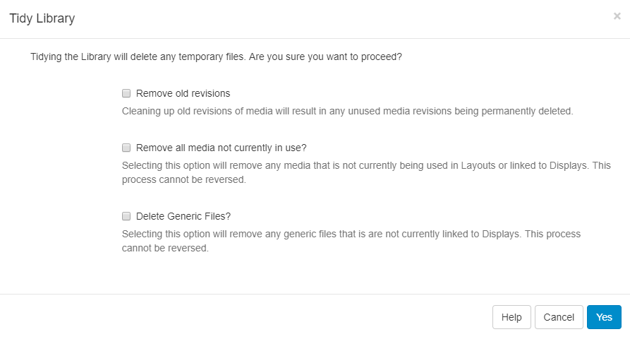

<!--toc=media-->
# 整理ライブラリ

{nonwhite}
{cloud}
**Xibo Cloud Hosting** のお客様の場合、整理ライブラリ機能はデフォルトでオフになっています。オプションを完全に理解していないと、潜在的に破壊的になる可能性があるためです。必要に応じて、以下の手順に従って有効にすることができます。

{/cloud}
{/nonwhite}

CMS が使用され、レイアウト/メディアが追加されると、時間の経過とともに、使用されなくなった古いコンテンツでライブラリが乱雑になる可能性があります。

ライブラリは、ユーザーまたはスーパー管理者によって *整理* され、クリーンかつ小さな状態に保つことができます。

**アクションを元に戻すことはできないため、注意して使用する必要があります。**

{tip}
これは、クォータのある Web サーバーに CMS がインストールされている場合、またはユーザーに独自のクォータが割り当てられている場合に特に重要です。
ヒント}

ライブラリを整理できる場所は 2 つあります:

1. **設定** ページ - すべてのスーパー管理者が利用可能
2. **ライブラリ** ページ - CMS のすべてのユーザーが有効

## 設定からの整理

スーパー管理者は、メニューの [管理] セクションの [設定] ページに移動して、システム全体のライブラリ整理操作を開始できます。[全般] タブをクリックし、[ライブラリの整理] ボタンをクリックします。

この機能はシステム全体に適用され、**すべての** ユーザー ファイルに対して実行されるため、使用されていないリビジョンや古いリビジョンを削除するには確認が必要です。

このオプションはより包括的で、次のものを削除します:

- 一時ファイル
- 孤立ファイル
- サムネイル
- どこでも使用されていないメディア リビジョン
- どこでも使用されていないメディア (レイアウト / 表示グループ / 表示)
- CMS にアップロードされた汎用ファイル

### 孤立ファイル

孤立ファイルはまれに発生するもので、メディア アイテムがライブラリから削除されたときに、ライブラリ フォルダ内のディスクに保存されているファイルが削除されません。つまり、ファイルは存在しますが、CMS はそれについて何も認識していません。

## ライブラリからの整理

メイン メニューの [管理] セクションの [**設定**] で機能を有効にすることで、**すべての** ユーザーがライブラリ ページからライブラリの整理を開始できるようにします。

- [全般] タブをクリックし、[**ライブラリ整理を有効にする**] のチェックボックスをオンにします。

有効にすると、ユーザーはライブラリ ページの上部にある [**ライブラリの整理**] ボタンをクリックできます。

フォームには、削除されるファイルの数と、それらのファイルが占めるスペースが表示されます。

{tip}
これにより、ログインしているユーザーが所有し、レイアウトで使用されなくなったファイル、またはディスプレイ グループ/ディスプレイに割り当てられていないファイルのみが削除されます。
{/tip}