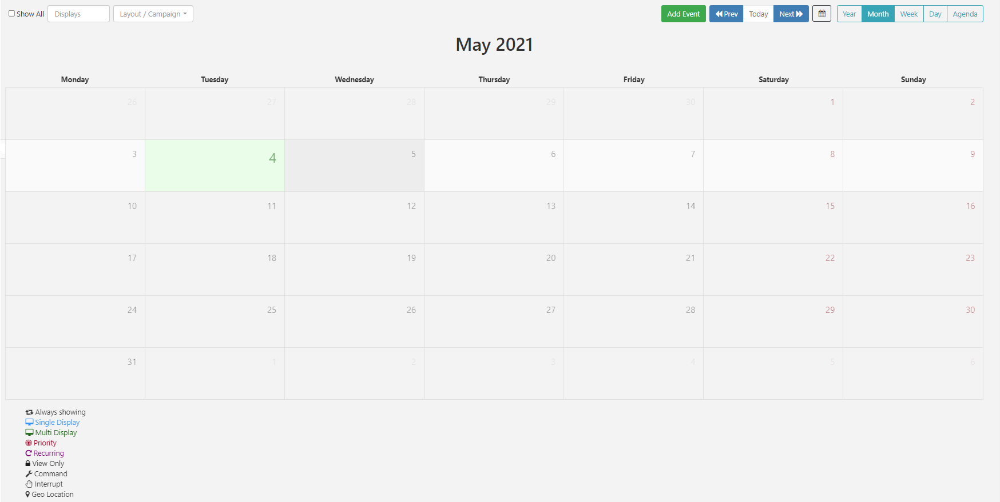

<!--toc=scheduling-->

# スケジューリング

[[PRODUCTNAME]]には、ディスプレイ/ディスプレイグループ間の **イベント** の複雑なスケジュールを簡単に作成できる高度なスケジューリングシステムが搭載されています。

## イベント

イベントはメニューの**スケジュール**セクションから管理し、カレンダーのインターフェースから管理することができます。

CMSは、以下のイベントタイプのスケジューリングに対応しています。

1. #### レイアウトイベント

   ディスプレイへスケジュールする公開レイアウトを選択します。

2. #### キャンペーン

   ディスプレイにスケジュールするキャンペーンを選択します。

3. #### オーバーレイレイアウトイベント

   特別に作成された[オーバーレイレイレイアウト](layouts_overlay.html)は、既存のレイアウトと同時にスケジュールされ、表示するコンテンツを**オーバーレイ**させることができます。

4. #### 割り込みレイアウトイベント

   [割り込みレイアウト](layouts_interrupt.html)としてスケジュールされたレイアウトは、通常のスケジュールに割り込んで、他のスケジュールされたレイアウトに合わせ、設定された**音声共有**の割合で再生します。

5. #### コマンドイベント

   スケジュールされたコマンドはプレーヤーによって特定の時間に実行されるため、このタイプのイベントには `toDt` は必要ありません。

スケジュールに使用できるコマンドは、管理者によってあらかじめ設定されています。利用可能なコマンドは、**スケジュールイベント**フォームの**コマンド**ドロップダウン メニューを使用して選択できます。追加のコマンドが必要な場合は、管理者に連絡してください。

{tip}
表示順と優先順位は、コマンドを実行する際には関係ありませんが、組織的な目的のためにCMSで設定することができます。
{/tip}

6. #### アクションイベント

**注意** 現在、Windowsの、v3 R303からサポートされています。

**アクション**は、レイアウトに依存しないウェブフックをリッスンすることができます。ユーザーは、Actionイベントをスケジュールして、**レイアウトに移動**や**コマンド**を実行することができます。

## イベントをスケジュール

イベントは、**配信時間帯**にスケジュールされます。イベントを設定する際に、2つのオプションから選択します。

- ### カスタム

開始/終了の日時を自由に設定できます。

- ### 常時

イベントを常時実行させる場合は選択します。

{tip}
スケジューリングを容易にするために、独自の[配信時間帯](scheduling_dayparting.html)を作成することができます。一度作成すると、配信時間帯のドロップダウンメニューに表示され、選択することができます。
{/tip}

## 優先度

イベントの優先順位を使って、そのイベントをプレイヤーのスケジュールに含めるかどうかを決定します。'優先するイベント'は数字で決められ、0が最も低い優先度となります。

{tip}
プレーヤーが優先度0のイベントを含むスケジュールを持っている場合、すべてのイベントが一緒にローテーションで表示されます。

優先順位が1のイベントは、その1つだけが表示されます。

優先度0、優先度1、優先度2のイベントがある場合、優先度2のイベントだけが、そのスケジュール期間のローテーションで（最も高い優先度として）表示されます。

{/tip}

{tip}

例えば、日中は通常のローテーションで、ランチタイムにプライオリティイベントを行い、特定の「ランチ」情報（カフェのメニューのランチタイムスペシャルなど）を表示するなど、特定の時間にスケジュールを変更する方法が良い例でしょう。

{/tip}
