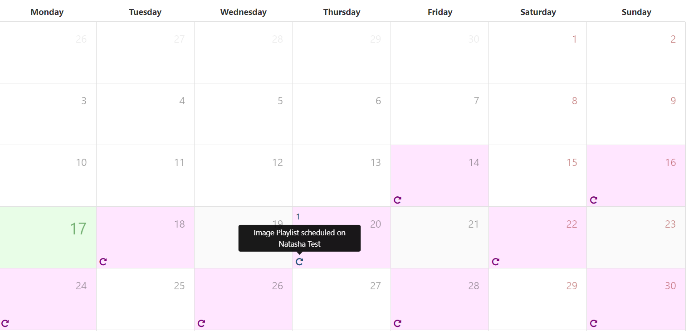

# スケジュール

[[PRODUCTNAME]] には、1 つ以上の [Displays](displays.html)/[Display](displays_groups.html) グループにわたる複雑なスケジュールを簡単に作成できる高度なシステムがあります。

## スケジュールの作成

スケジュールは、メインの CMS メニューの [スケジュール] ページから作成されます。

ユーザーは、次のいずれかを作成できます。

- [イベントの追加](scheduling_events.html#content-add-event) ボタンを使用してイベントをスケジュールする
- [同期イベントの追加](scheduling_events.html#content-synchronised-events) ボタンを使用して同期イベントをスケジュールする

## イベントの追加

- スケジュール グリッドの上部にある **イベントの追加** ボタンをクリックして **イベントのスケジュール** フォームを開き、スケジュールする **イベント タイプ** を選択して開始します。

{tip}
スケジュールは、オブジェクトの **行メニュー** を使用して **スケジュール** を選択することでも簡単に作成できます (割り込みレイアウト、コマンド、アクション イベント タイプを除く)。
{/tip}

CMS では、次のタイプのスケジュール設定がサポートされています:

### レイアウト

公開済みの [レイアウト](layouts.html) を選択します

### コマンド

特定の時点でプレーヤーによって実行される [コマンド](displays_command_ functionality.html) を選択します。

{tip}
コマンド イベントには `toDt` は必要ありません。

[表示順序](scheduling_events.html#content-display-order) と [優先度](scheduling_events.html#content-priority) は、コマンドの実行には関係ありませんが、整理のために CMS で設定できます。

{/tip}

### オーバーレイ レイアウト

[オーバーレイ レイアウト](layouts_overlay.html) として設計されたレイアウトは、既存のレイアウトと同時にスケジュール設定され、表示時にコンテンツのオーバーレイが作成されます。

### 割り込みレイアウト

割り込みレイアウトは、選択した [レイアウト](layouts.html) を「通常のスケジュール」内の他のレイアウトの **合間に** 再生するようにスケジュールします。

[[PRODUCTNAME]] は、**1 時間あたりの秒数** またはスケジュールに入力された **パーセンテージ** を使用して、いつ再生するかを計算します。

{feat}割り込みレイアウト|v4{/feat}

{tip}
これは、通常のスケジュール内で特定の時間表示する必要があるアナウンスがある場合に役立ちます。

{/tip}

- [イベント](scheduling_events.html) を追加するときに、ドロップダウン メニューからイベント タイプとして **割り込みレイアウト** を選択します。

- フォーム フィールドに入力してスケジュールを作成します。

#### シェア オブ ボイス

レイアウトが表示される時間を、1 時間あたりの秒数、または **割り込みレイアウト** が通常のスケジュールを占めるイベント期間 (開始日と終了日の差) のパーセンテージ (0 - 100%) で入力します。

{tip}
**注意:** 「メイン」レイアウトの期間が長い場合、入力した SoV 基準を満たすために、割り込みレイアウトがブロック内に表示されることがあります。

{/tip}

### キャンペーン

**レイアウト リスト** [キャンペーン](layouts_campaigns) を選択します

### アクション

**スケジュールされたアクション** は、レイアウトに移動するかコマンドを実行するために、Webhook でトリガー コードをリッスンします。

{feat}スケジュールされたアクション イベント|v4{/feat}

- **レイアウトに移動** - トリガーされたときにプレーヤーが移動するレイアウトのコード識別子を入力します。このコードは、新しいレイアウトを追加するとき、またはレイアウト グリッドから既存のレイアウトを編集するときに作成されます。
- **コマンド** - 実行するコマンドを選択します。

### メディアのスケジュール設定

[ライブラリ](media_library.html) または [プレイリスト](media_playlists.html) に保存されたビデオ ファイルと画像ファイルは、最初にレイアウトに追加しなくても、フル スクリーンで表示されるようにスケジュールできます。

- フォーム フィールドに入力してスケジュールを作成します。

**メディア/プレイリスト** フィールドから [選択] をクリックすると、ポップアップが表示されます:

ドロップダウン メニューを使用して、使用する **メディア** ファイルまたは **プレイリスト** を選択します。

**保存** 時に、さらにオプションが表示されます:

- **ビデオ/画像ファイル** のみ: **ループ内の期間** を指定して、ライブラリで設定されたメディア期間を上書きします。

- 使用する特定の **解像度** を選択します。

- アイテムが画面全体を埋めない場合に、ギャップを埋めるために **背景色** を設定します。

{tip}
[ライブラリ](media_library.html) および [プレイリスト](media_playlists.html) から画像とビデオを直接スケジュールします。行メニューを使用して [スケジュール] をクリックします。

{/tip}

## 同期イベント

{feat}同期イベント|v4{/feat}

{tip}
同期イベントは [同期グループ](displays_sync_groups.html) と組み合わせて使用され、2 つ以上のディスプレイにミラーリングまたはビデオ ウォール構成を表示します。

スケジュールする前に、**同期グループ** を作成して構成していることを確認してください。
{/tip}

スケジュール グリッドの上部にある [同期イベントの追加] ボタンをクリックして、[同期イベントの追加] フォームを開きます。

ドロップダウン メニューから [同期グループ](displays_sync_groups.html) を選択します。

- [レイアウト] ドロップダウンを使用して、グループ内の各ディスプレイに表示するコンテンツを選択します。

{tip}
ディスプレイの壁構成で表示するコンテンツを選択する場合、合計時間はリード ディスプレイのコンテンツによって適用されます。

リード ディスプレイは、割り当てられたコンテンツに基づいてシーケンスを変更する指示を発行します。グループ内の他のディスプレイのコンテンツのデザインが似ていない場合 (アイテム数、期間などが同じ)、同期が失われる可能性があることに注意してください。

{/{/tip}

- [ミラー] を選択すると、グループ内の各ディスプレイに同じアイテムが自動的に設定されます。

{tip}
**コンテンツ同期キー** を使用して、異なるレイアウトの [プレイリスト](media_module_playlist.html) を同期します。
{/tip}

### デイパート

- イベントは **デイパート** 情報を使用してスケジュールされます:
- 独自の開始時間と終了時間を入力するには、**カスタム** を選択します。スケジュールされたイベントを作成するときに、**相対時間** チェックボックスを使用して時間と分を入力します (同期イベントでは使用できません)。
- 選択したディスプレイでコンテンツを常にスケジュールするには、**常に** を選択します。

{tip}
独自の定義済み [デイパート](scheduling_dayparting.html) を作成して選択すると、さらに簡単にスケジュールできます。

{/tip}

- ドロップダウンを使用して、リストからスケジュールする必要があるものを選択します。

### 表示順序

- **表示順序** を使用して、他のイベントと同時にスケジュールされた場合に、イベントが他のコンテンツと交互に再生される順序を決定します。順序付けは、単純な数値ソートで、最小から最大までの番号です (1 でマークされたイベントは、2 でマークされたイベントより先に再生されます)。

{tip}
レイアウトの再生順序を確実にするために、レイアウトを [キャンペーン](layouts_campaigns.html) に含めることをお勧めします。その後、表示順序を使用して、キャンペーン全体の再生順序を決定できます。キャンペーンの表示順序が同じであるか、何も設定されていない場合、キャンペーンは、個々のキャンペーンに定義されている再生リスト順序 (**インターリーブ** または **ブロック**) に従って再生されます。

{/tip}

### 優先度

- イベントの **優先度** を設定します。0 は最低優先度と見なされます。

同じイベント タイプのイベントで、最も高い番号のイベントは、より低い番号のイベントよりも優先して再生されます。

{tip}
レイアウト/キャンペーン/画像/ビデオおよび再生リストは、優先度を考慮する際に同じイベント タイプとして扱われます。
{/tip}

優先度を使用する良い例としては、特定の時間にレイアウトのループのスケジュールを変更する方法があります。たとえば、日中の通常のレイアウトのローテーションで、ランチタイムに特定の「ランチ」情報 (カフェ メニューのランチタイム スペシャルなど) を表示する優先度イベントがあります。

プレーヤーのスケジュールに、優先度がすべて 0 である同じイベント タイプのイベントが含まれている場合、すべてのイベントが一緒にローテーションで表示されます。

これらのイベントの 1 つに優先度 1 がある場合、表示されるイベントはこれのみになります。

優先度 0 のイベント、優先度 1 のイベント、優先度 2 のイベントがある場合、優先度 2 のイベントのみが、そのスケジュール期間のローテーションで表示されます (最高の優先度として)

### 1 時間あたりの最大再生回数

{feat}1 時間あたりの最大再生回数|v4{/feat}

- ディスプレイでこのイベントが 1 時間あたりに表示される回数を制限する数値を設定します。

無制限に再生するには、デフォルトの 0 のままにしておきます。

### CMS 時間で実行

- ローカル ディスプレイ時間ではなく、**CMS** によって決定された時間にイベントを再生するには、このオプションを選択します。

{tip}
**シナリオ**

- CMS 時間 = GMT
- ディスプレイ 1 = GMT
- ディスプレイ 2 = GMT -4

11:00 にスケジュールされたイベントで、CMS 時間で実行が **選択解除** されている場合、**ディスプレイ 1** には 11:00 に、**ディスプレイ 2** には 11:00 に表示されます。ディスプレイ 2 は 4 時間遅れているため、これら 2 つのディスプレイでは同じコンテンツが同時に表示されません。

CMS 時間で実行が **選択** されている場合、**ディスプレイ 1** は以前と同じように 11:00 に表示されますが、**ディスプレイ 2** は 07:00 に実行されます。
{/tip}

## 繰り返し

コンテンツが表示されるように多数のスケジュールを作成する代わりに、イベントを 1 分ごと、1 時間ごと、毎日、毎週、毎月、または毎年繰り返すように設定できます。

- **繰り返し** タブで、ドロップダウンを使用して繰り返しの種類を選択します。
- ここで数値を入力して繰り返しの頻度を決定します。

{tip}

たとえば、**毎週の繰り返し** では、イベントを繰り返す曜日として水曜日と金曜日を選択し、それらの曜日に 2 を入力して隔週で繰り返すことができます。

**毎月の繰り返し** は、イベントの日付またはイベントが開催される月の日によって設定できます。たとえば、2023 年 7 月 15 日土曜日にスケジュールされているイベントは、毎月第 3 土曜日に繰り返すように設定できます。

{/{/tip}

- **終了時** は、繰り返しが終了するタイミングを制御します。

{tip}
ここで選択した時間は、定義したイベントの最後の繰り返しの後になるようにしてください。そうしないと、コンテンツの再生が途中で切れてしまいます。

{/tip}

**繰り返しイベント** は、スケジュールからすべてまたは個々の繰り返しごとに削除できます。

- スケジュール フォームの下部にある [**削除**] を選択すると、繰り返しイベントのすべてのインスタンスが完全に削除されます。
- [カレンダー] ビューで、日付別に [**繰り返しイベント**] をクリックします。

インスタンスの詳細は、フォームの下部に明確に表示されます。

- [**スケジュールから削除**] をクリックすると、このインスタンスのみがスケジュールから削除されます。その他のインスタンスはスケジュールされたままです。

{tip}
個々のインスタンスを削除した後に定期スケジュールを修正する場合は注意が必要です。以前に削除したインスタンスは、既存の定期スケジュールを編集することで再作成できます。

{/tip}

## リマインダー

[通知センター](users_notifications.html#content-notification-drawer) に送信したり、メールで送信したりする一連の **リマインダー** を作成します。

{tip}
管理者が [CMS 設定](tour_cms_settings.html#content-network) に **送信メール アドレス** を入力していることを確認してください。

{/tip}

- [**リマインダー**] タブから、フォーム フィールドを使用してリマインダーを定義します。必要に応じて、`+` アイコンを使用して行を追加します。

- チェックボックスをオンにすると、[ユーザー プロファイル](tour_user_access.html#content-edit-profile) に設定されたアドレスにメールが送信されます。

## 地理的位置

このイベントの場所を認識させるには、チェックボックスを使用します。詳細については、[地理的スケジュール](scheduling_geolocation.html) を参照してください。

## 編集 / 削除

スケジュール グリッドまたはカレンダー ビューからイベントを変更します。詳細については、[スケジュール管理](scheduling_management.html) を参照してください。

## 複製

スケジュール フォームの下部にある [複製] ボタンを使用すると、イベントの詳細を簡単に複製して、新しいイベントを作成するように構成できます。

{tip}
[複製] をクリックすると、同じ詳細を含む新しいフォームが読み込まれたことを確認するポップアップが表示されます。新しく読み込まれたフォームには [複製] ボタンはありません。
{/tip}

{version}
**注意:** 実行するスケジュールがない場合、ディスプレイに割り当てられた [デフォルト レイアウト](displays.html#content-default-layout) が表示されます。
{/version}

