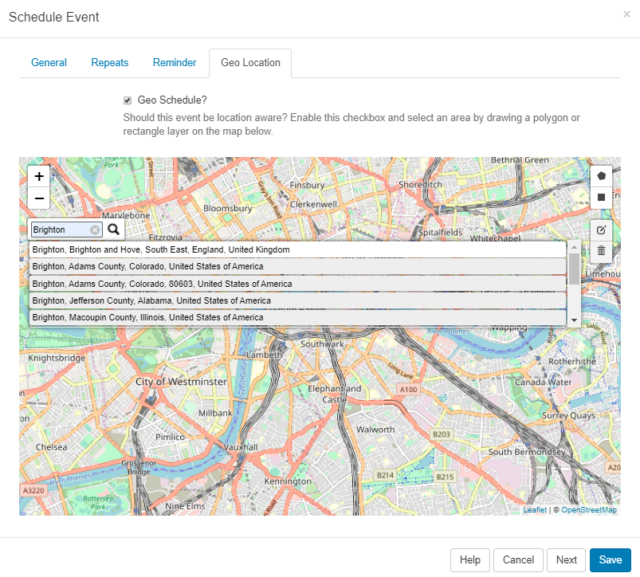
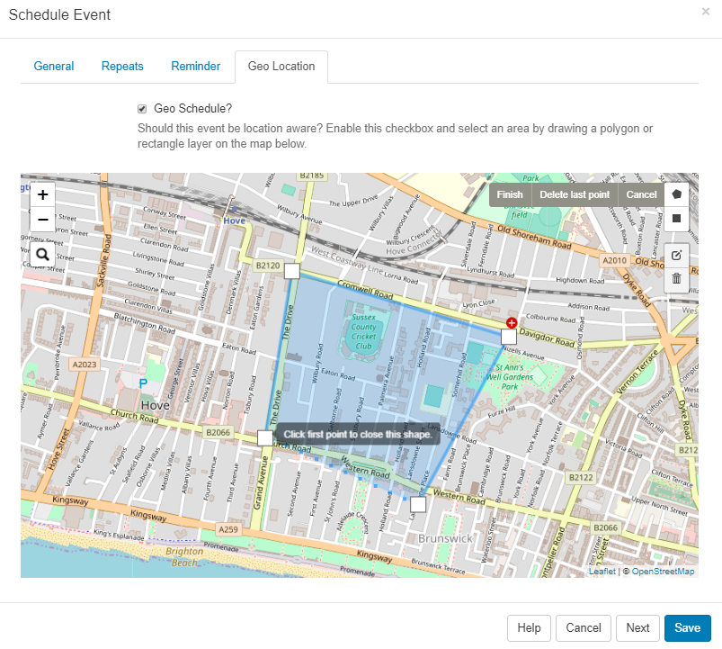

<!--toc=scheduling-->

# ジオスケジューリング

**イベント**は、場所を意識したスケジュール設定が可能です。

**イベントをスケジュール**フォームの**ジオロケーション**タブをクリックします。

**ジオスケジュール**ボックスにチェックを入れて、有効にして場所を定義します。

{tip}
マップを開くと、**設定**の**ディスプレイ**タブでデフォルトの緯度とデフォルトの経度に入力された地図がデフォルトで表示されます。
{/tip}

地図の左上にあるボタンで拡大・縮小ができます。検索アイコンをクリックすると、特定のエリアについて詳細を入力できます。

地図上に多角形または矩形のレイヤーを描き、エリアを定義します。

領域を定義したら、編集アイコンをクリックして、マーカーをドラッグして既存のレイヤーを調整します。ここにあるグレーの保存ボタンをクリックすると、編集内容が保存されます。

領域を削除するには、ビンのアイコンを使用して、削除する領域内でクリックし、灰色の保存ボタンをクリックして、レイヤーの削除を保存します

スケジュールされると、スケジューラーはマップマーカーアイコンを表示して、このイベントが地理的な位置情報を認識していることを示します。

アイコンをクリックすると、**イベントを編集する**フォームが表示され、予定されているイベントに必要な変更を加えることができます。

