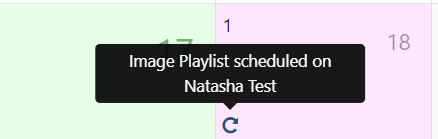
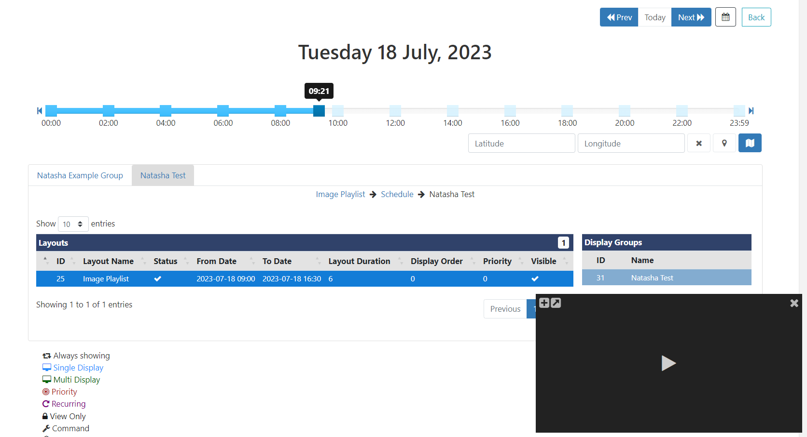

# Schedule Management

All Schedules are managed from the **Schedule** page where you **Add**/ **Edit** and **View** all scheduled in a [Grid](tour_cms_navigation.html#content-grids) or **Calendar** view.

Use the filter fields to restrict criteria for returned results to view in a simple list format or use the key to see Events on a Calendar.

{tip}
Leave fields blank to include all Displays/Display Groups and Layouts/Campaigns to view all Schedules.
{/tip} 

## Grid View

- Easily view full schedule information for all Displays/Display Groups or use the filters to view specific Display scheduling.
- Use the row menu to **Edit/Delete** an existing Schedule.

{tip}
If too many columns have been selected to view in the grid from the Column Visibility menu, to fit your screen size, additional rows will be hidden. Click on the `+` icon at the beginning of a row in the grid to view this information.
{/tip}

## Calendar View

The Calendar will show associated schedules for selected Display/Display Groups represented by Event Icons with a key to explain each one, located below the calendar.

{tip}
Ensure you select at least one Display/Display Group to view schedules on the Calendar view!
{/tip}

- Mouse over an **Event Icon** to view the basic scheduling information:

-  Click it to open the form to see the full details and to make edits to the existing schedule.

#### Today/ Select Range

This range shows all Events occurring within the specified dates.

#### Week Range

This range gives a week overview of scheduled Events.

{tip}
 Double click on a date to open the Day View!
{/tip}

#### Month Range

This range includes Icons to represent the Events that have been scheduled for that Month. Click on a particular day square to see an expanded view for that day. Double click on a day square to open the Day View for that date.

{tip}
Hover over each Icon to view the Event information!
{/tip}

#### Year Range

This is intended as an overview of the Events scheduled throughout the year and provides a total number of Events scheduled per month. Click in a month to view the Event details.

{tip}
Double-click to open the Month View for that particular month!
{/tip}

### Agenda

Events can span multiple days/weeks/months so it is highly useful to be able to see a precise representation of Layouts/Campaigns that will be shown on a selected Display at a point in time.

- Select **Agenda** from the **Range** filter:

{tip}
At least one **Display/Display Group** must be selected in order to view the Agenda. If multiple Displays/Display Groups are selected, these will be presented in separate **tabs** under the slider!
{/tip}

- Use the slider, to pinpoint the exact time of day to view. Change the date using the **Prev/Today/Next** buttons or by selecting a date using the calendar icon.

- Click on a Layout to highlight the associated information (associations will turn blue) and view the breadcrumb, to show further Campaign and Display Group information. If nested Display Groups have been configured, these will show in the breadcrumb.
- Click the map icon to see Display locations as determined by the coordinates entered.

{tip}
Scheduled Layouts/Campaigns will be shown in tabular format in the order they will cycle on the Display.

Use the Preview window to Play a selected Layout and use the buttons to minimise/maximise the viewing window or go to full screen to Play.
Click on the breadcrumb to view the selected Layout in the Layout Editor and to make necessary edits to the existing schedule!
{/tip}

- Click the **Back** button to exit the Agenda view.
