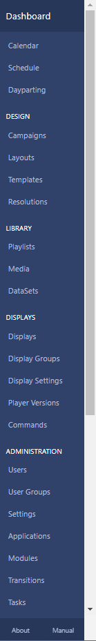
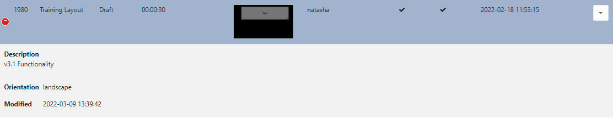

# CMS の操作

CMS 内のすべてのページはセクションに分類され、すべてのユーザーが **CMS メイン メニュー** からアクセスできます。

メニューには、ログインしたユーザーがアクセスできるように [機能](users_features_and_sharing.html) が有効になっているセクション/ページのみが表示されます。

{tip}
[ユーザー設定](tour_user_access.html#content-preferences) 設定から、このメニューを配置する場所 (CMS の左側に垂直に配置するか、上部に水平に配置するか) を選択します。

{/tip}

[ユーザー ダッシュボード](users_dashboards.html) ホームページに戻るには、[ダッシュボード] をクリックします。

## グリッド

CMS では、**レイアウト**、**メディア**、**ディスプレイ** などの多くのエンティティが、**グリッド** 内の表形式のデータとして表示されます。これらのグリッドには、読みやすく理解しやすい柔軟な管理ツールを作成するために組み合わせられる多数の要素があります。

次のスクリーンショットは、**レイアウト グリッド** を例として示しており、各要素が注釈として付けられています。

- #### アクション ボタン

**レイアウトの追加** などの各ページの一般的なアクション ボタンは、CMS 全体から簡単にアクセスできるようにグリッドの右上にあります。

- #### タブ

タブには、アイテムを簡単に見つけられるようにフィルター オプションが用意されています。**詳細** タブを使用して、さらにフィルター オプションにアクセスします。

- #### フィルター

複数の **フィルター** フィールドを使用して、返される結果の条件を制限します。たとえば、特定の **所有者** に属するすべてのレイアウトを、グリッドに表示される結果のみにすることができます。

{tip}
チェックボックスを使用して、正規表現を使用して名前の高度なフィルタリング オプションを適用します。カンマ区切りの用語を使用して AND/OR 条件を指定します。

{/tip}

- #### フォルダー

[フォルダー](tour_folders.html) は、ユーザー オブジェクトを整理、検索し、他のユーザー/ユーザー グループと簡単に [共有](users_features_and_sharing.html) するために使用されます。

- フォルダー/サブフォルダーをクリックすると、選択したフォルダーの内容のみが検索され、適用されたフィルターに基づいて結果が返されます。

または

- **すべてのフォルダー** にチェックマークを付けると、ルート フォルダーも検索され、適用されたフィルターに基づいて結果が返されます。

{tip}
[フォルダー] メニューをクリックして、ビューのオン/オフを切り替えます。フォルダー ツリーがビューから非表示になっている場合は、選択したフォルダーのファイル パスが表示されます。

{/tip}

- #### 結果

返された結果は列に表示されます。

{tip}
ほとんどの列はデフォルトで並べ替えることができます。列に上矢印または下矢印がある場合は、**Shift** キーを使用して列を複数並べ替えることができます。
{/tip}

**列の表示** ボタンを使用して、使用可能な列を表示します。

- データ テーブルに表示する列を選択/選択解除します:

画面サイズに収まらないほど多くの列が選択されている場合は、追加の行が非表示になります。これらは、行の先頭にある + アイコンをクリックすると表示されます:

- #### 行メニュー

項目を選択し、行メニューを使用してショートカットとアクションのリストにアクセスします:

{tip}
項目の行メニューの内容は、選択したページによって異なります!
ヒント}

### 複数選択 - 選択済み

選択したグリッドの下部にある **選択済み** オプションを使用すると、行を複数選択して一括操作を簡単に実行できます。

- #### タグの編集

この機能を使用すると、新しい [タグ](tour_tags.html) を一括で追加できます。また、複数の選択から既存のタグを削除することもできます。

- #### 共有

選択したアイテムの複数の [共有](users_features_and_sharing.html) オプションを編集するために使用します。

不確定ステータス `-` で表示される要素は、すでに設定されているオプションの違いの結果です。ここで行った変更は、選択したすべての要素に適用されます。

{tip}

**シナリオ例**:

2 つのレイアウトが選択されており、すでに次の共有オプションが適用されています:

レイアウト 1 - 表示 1、編集 0、削除 0

レイアウト 2 - 表示 1、編集 1、削除 0

複数選択すると、次のように表示されます:

表示 1、編集 `-`、削除 0

ユーザーが変更を加えて切り替えます:

表示 0、編集 `-`、削除 1 (編集は現在の状態のまま)

2 つのレイアウトに次の共有オプションが設定されます:

レイアウト 1 - 表示 0、編集 0、削除 0

レイアウト 2 - 表示 0、編集 1、削除 1

{/tip}

{tip}
使用可能な複数選択オプションは、選択したページによって異なります!
ヒント}

## フォーム

CMS は、ほとんどのトランザクション (何らかの方法で **追加**/**編集** または **削除** するアクション) を **フォーム** を使用して表示します。

以下のスクリーンショットは、**レイアウト編集** フォームを使用したフォームの表示例を示しています:

- #### タブ

フォームには、ユーザーに詳細情報とオプションを提供するタブが 1 つだけある場合もあれば、複数ある場合もあります。

#### フォルダー

[フォルダー](tour_folders.html) は、ユーザー オブジェクトを整理、検索し、他のユーザー/ユーザー グループと簡単に [共有](users_features_and_sharing.html) するために使用されます。

[フォルダーの選択] をクリックし、アイテムを保存する宛先フォルダーを選択/作成します。

{tip}
フォルダ/サブフォルダを右クリックすると、**フォルダ メニュー** でさらにオプションが表示されます。

フォルダに保存されたアイテムは、ユーザー/ユーザー グループ アクセス用に宛先フォルダに適用された表示、編集、削除、**共有** オプションを継承します。

{/tip}

#### フォーム フィールド

各フォームには、入力が必要なフィールドとオプション フィールドがあります。

各フィールドには、フィールドの意味を説明するタイトルと、追加のガイダンスとなるヘルプ テキストがあります。

#### チェック ボックス

有効/無効にできるオプションは、チェック ボックスで表示されます。

{tip}
行メニューからアクセスされるフォームには、['自動送信機能'](tour_cms_navigation.html#content-automatic-submission-of-forms) が含まれている場合があります。これを選択すると、フォームが自動的に送信されます。
ヒント}

#### ボタン

すべてのフォームの下部には、追加/編集を確定またはキャンセルするためのボタン バーがあります。

{ヒント}

ほとんどのフォームには、**ヘルプ** ボタンも含まれており、この **ユーザー マニュアル** のセクションへのリンクが提供され、追加のガイダンスを参照できます。

ヒント}

### フォームの自動送信

レイアウト グリッドの **チェックアウト**、**ディスプレイ** グリッドの **ライセンスの確認** と **承認**、**モジュール** グリッドの **キャッシュのクリア** などの選択されたアクションにより、行メニューからアクションをクリックするだけで **フォーム** が自動的に送信されます。

「自動送信」機能を持つアクションには、フォーム上で有効にするチェックボックス オプションが明確に表示されます:

保存すると、この特定のアクションは次回選択されたときに自動的に送信されます。

{tip}
「自動送信」を有効にしたフォームは、[ユーザー プロファイル](tour_user_access.html#content-user-profile) 設定からリセットできます。
{/tip}

