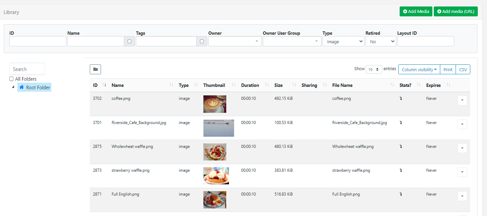
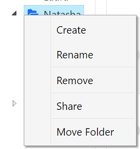
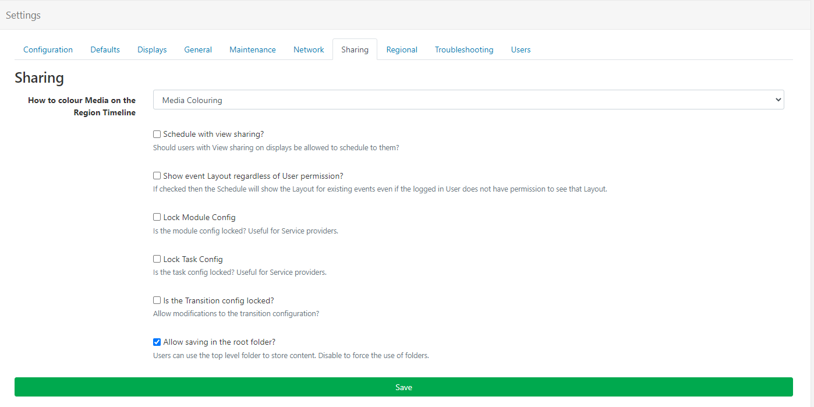

# Folders

**Folders** can be used throughout the CMS to easily control User/User Group [Share](users_features_and_sharing.html) options for all items held within a specific Folder. Folders also provides an additional way to organise and locate user objects within the CMS.

## Feature Overview

- Easily control and maintain View/Edit/Delete access for all user objects saved to a Folder.
- Used throughout the CMS.
- Assign Folders to new Users from the on-boarding wizard.
- Set a Home Folder for Users.
- Force saving into a selected Folder.
- Control User access to Folder options.
- Dedicated Folders page for easier management.

### Folder Search

Available from multiple grids throughout the CMS, the Folder tree will first open by default and can be toggled off from view  by clicking on the folder icon:

When a Folder has been selected, the grid will update to show only objects inside the Folder.

{tip}
Use the **All Folders** tick box to include searching in the Root Folder!
{/tip}

Users can have a set [Home Folder](/manual/en/tour_folders.html#content-home-folder) (indicated by a House icon) which will allow full access to their own Media, Layouts, Schedules etc. and access to all other 'shared' Folder content. 

{tip} 
When Folders are toggled off from view, the file path for a selected folder will be shown so you always know where you are looking!
{/tip}

### Saving to Folders

Items can be saved to folders from **Add**/**Edit** forms and from an items row menu using **Select Folder** to open the Folder tree.

{tip}
If you already have a folder selected, user objects added via the Add form (Layouts, Campaigns, Media files etc) will be saved into that selected folder!
{/tip}

### Move and Merge Folders

Folders can be moved to another Folder location to be added as a Sub-Folder:

- Select the **Folder**
- Right click and select **Move**
- Highlight the Folder destination to move to
- **Save**

The Folder and any contained sub-folders will now be moved as a new sub-folder within the new Folder location maintaining the original Folder structure.

You can also select the **Merge** option to add the original Folder contents to the main Folder location, with the original Folder being deleted from the Folder tree.

{version}
**NOTE:** If you move a Folder that does not have any Share options set, it will inherit the applied Share options of the destination Folder!
{/version}

## Folder Management

A **Folders** page is located under the **Administration** section of the main CMS menu to allow Super Admins to manage all aspects of Folders  (right click a Folder to access the context menu) as well as see detailed information about Folders such as who it has been shared with and a breakdown of its contents!

### Creating Folders

Create Folders to hold **Library Media**, **DataSets**, **Playlists**, **Layouts**, **Campaigns**, **Templates**, **Displays** and **Display Groups** which are then accessed from multiple [Grids](tour_cms_navigation.html#content-grids) by clicking the **Folder** icon to open the Folder Tree:

- Right click the **Root Folder** and select **Create** to add a new Folder to the tree.

{tip}
Only Super Administrator users can create Folders under the Root Folder. Users can be granted [Feature](/manual/en/users_features_and_sharing.html) access to create sub-folders under parent Folders they have been given access to.
{/tip}

-  Further menu options are available to **Create** a sub-folder, **Rename**, **Remove** **Share** and [Move Folders](/manual/en/tour_folders.html#content-move-and-merge-folders):

{tip}
Only empty folders can be removed! 
{/tip}

### Home Folder

Admins are encouraged to assign User Groups to their Users, and then use Folder Sharing to give these Users appropriate access to each other's content (View/Edit/Delete options can be configured).

{tip}
A Home Folder can be assigned when [Onboarding new Users](/manual/en/users_administration.html#content-adding-users-to-the-cms)!
{/tip}

Users can always select their Home Folder and the Root Folder from the Folder Tree. 

{tip}
Users can view/edit and delete objects they own by selecting **All Folders**, even if they are in a Folder they cannot view.
Conversely, users cannot view/edit or delete other Users objects unless shared with them by Direct/Folder sharing.
{/tip}

A Users Home Folder is shown to them in the Folder Tree with a house icon. If a Folder is not selected, or the Folders Feature has been disabled, new content will automatically save into the Home Folder.

{tip}
If you require Group Admins to set a Home Folder for Users, ensure that they have the appropriate [Feature](/manual/en/users_features_and_sharing.html) enabled!
{/tip}

#### Assign Home Folders for Users (Admins / Group Admins)

For an existing User:

- Go to **Users** under the **Administration** section of the main CMS menu. 
- Use the row menu for the User and select **Edit**.
- Click on the **Home Folder** tab:

- Select a Folder to use, or right click the Root Folder to create a new Folder.

{tip}
If a new Folder is created, ensure that the correct View/Edit/Delete Share options are applied from the [Folders](tour_folders.html#content-folder-management) page!
{/tip}

Users with a Home Folder assigned will have full access to their own Media, Layouts, Schedules etc, and access to all other Folder contents as per the Share options set for their Home Folder.

{tip}
Users can have a Home Folder assigned and Folders disabled as a [Feature](/manual/en/users_features_and_sharing.html), Users would then automatically save to their default Home Folder location without the need to view or interact with Folders in the CMS.
{/tip}

### Force Saving to a Folder

Super Admins can prevent Users from saving into the Root Folder which forces them to select a Folder before saving.
First disable the use of the Root Folder as a default:

- Navigate to **Settings** under the **Administration** section of the main CMS menu.
- Click on the **Sharing** tab:

- Untick **Allow saving in the root folder** option.
- Click the **Save** button at the bottom.

### Sharing Options

For Users to see other Users content, it must be shared with them (Direct Sharing - individual items must be shared). Users can also see other Users content if the Folder has been shared with them (Folder Sharing - multiple items inherit the shared options).

Each folder can have [Share options](users_features_and_sharing.html#content-set-share-options-on-objects) set for Users/User Groups by clicking on **Share** from the menu.

{tip}
**Share** options for folders can only be set by Super Administrator users!
{/tip}

- Select from the list of Users and User Groups (User Groups are shown in **bold**) and assign **View**, **Edit** and **Delete** options as required for the selected folder.

Once Share options have been set for a folder, all objects contained or moved to that folder will inherit the View, Edit, Delete options that  have been enabled for Users/User Groups.

{tip} 
New Users can have **Folders** assigned from the start by following the onboarding wizard to [Add Users](users_administration.html#content-onboarding-wizard)!
{/tip}

**Please Note:** Sub-Folders added to a Main Folder will inherit any applied Share options from the Main Folder. When viewing Sub-Folders only the directly assigned Share options will be shown, inherited options are not shown.

As shown above:

- The Main Folder is shared with `Auser`.
- Sub 1 will inherit from the Main Folder so is also shared with `Auser`.
- `Not Shared` is shown as Sub 1 has no directly applied Share options.

### Folder Menu Options
Control the required access of the Folder Menu for other Users/User Groups using [Features and Share](users_features_and_sharing.html) options:

**For Users that need access to Create on the Folders menu:**

1. Enable **Allow users to create Sub-Folders....** from the Content tab of the Folders Feature set.
1. Enable **View** from the **Share options** for the parent folders(s) that can have sub-folders created under them by the User/User Group. 

{tip}
Only Super-Admin users can create Folders under the Root Folder!
{/tip}

 **For Users that need access to Rename on the Folders menu:**
1. Enable **Rename and Delete existing folders** from the Content tab on the Folders Feature set.
2. Enable **Edit** from the **Share options** for the folder(s) that can be renamed by the User/User Group.

**For Users that need access to Delete on the Folders menu:**
1. Enable **Rename and Delete existing Folders** from the Content tab on the Folders Feature set.
2. Enable **Delete** from the **Share options** for the folder(s) that can be removed by the User/User Group.
