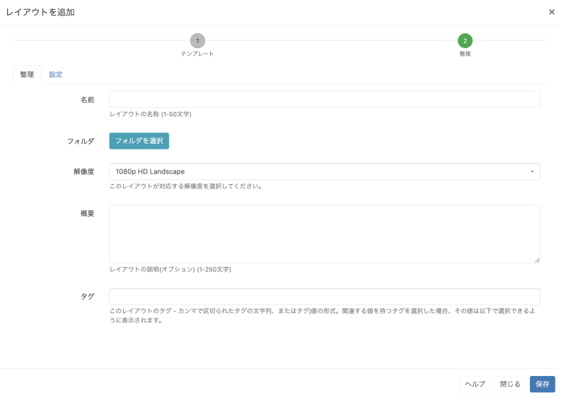
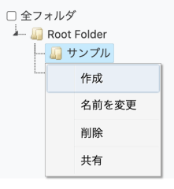

<!--toc=tour-->

# フォーム

CMSは、ほとんどのトランザクション（何らかの方法で**追加**/**編集**または**削除**するアクション）を**フォーム**で表示します。

以下のスクリーンショットは、**レイアウトを追加** フォームを使用したフォームの外観の例です。

## タブ

フォームには1つまたは複数のタブがあり、必要に応じて詳細やオプションを記入することができます。

## フォルダ

フォルダを使用すると、**フォルダを選択**をクリックして、リストから目的のフォルダを選択することで、簡単にアイテムを整理することができます。

{tip}
フォルダに保存されたアイテムは、ユーザー/ユーザーグループのアクセス用に保存先フォルダに格納され、表示、編集、削除 の**共有** オプションを継承します!
{/tip}

選択されたフォルダファイルパスは、フォームの**フォルダ**フィールドの横に表示されます。

また、フォルダを右クリックすることで、保存先のフォルダを新規に作成したり、その他のオプションにアクセスすることも可能です。

{tip}
ユーザー/ユーザーグループの[機能と共有](users_features_and_sharing.html)のオプションが有効な場合に選択可能です。
{/tip}

フォルダアクセスとセットアップに関する詳細については、管理者にご相談ください。

## フォームフィールド

各フォームには、入力が必要なフィールドがあります。各フィールドには、そのフィールドが何を表しているかを説明するタイトルと、追加のガイダンスとなるヘルプテキストがあります。

## チェックボックス

有効／無効を選択できるオプションは、チェックボックスで表示されます。

{tip}
行メニューからアクセスするフォームには「自動送信機能」があり、これを選択すると、フォームを自動的に送信することができます。詳しくは、[グリッド](tour_grids.html)のページを参照してください。
{/tip}

## ボタン

すべてのフォームの下部には、ユーザーが追加・編集をコミットまたはキャンセルするためのボタンバーがあります。

{tip}
また、ほとんどのフォームには**ヘルプ**ボタンがあり、この**ユーザーマニュアル**の各セクションにリンクされているので、さらに詳しい情報を得ることができます。
{/tip}

