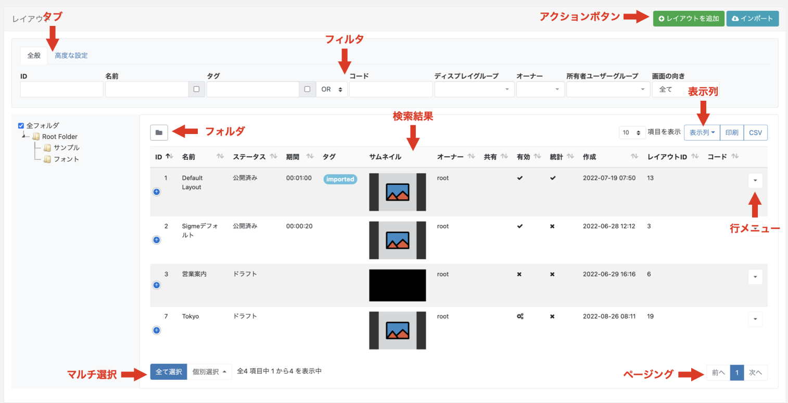
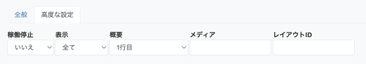
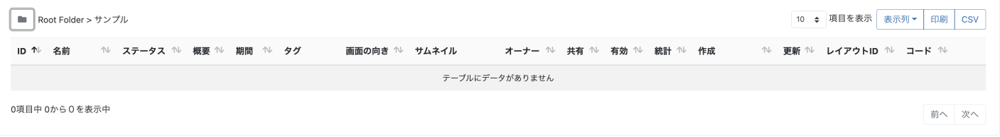
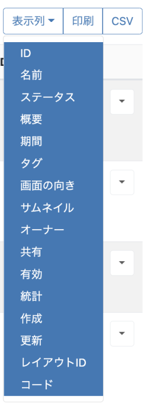
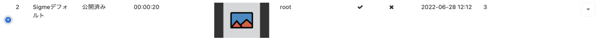
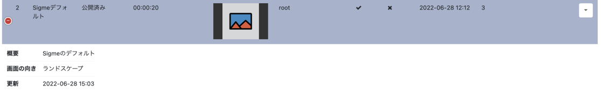
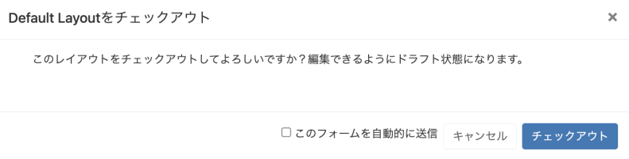
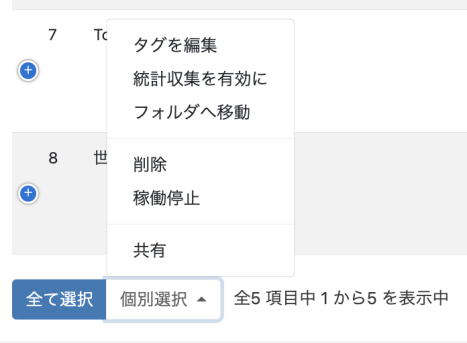
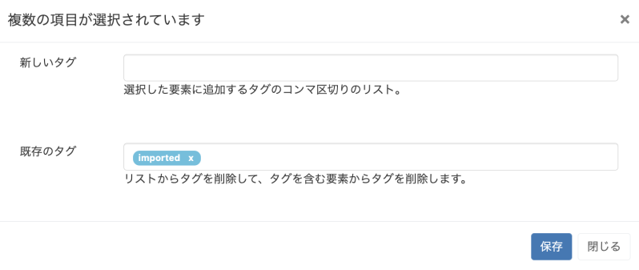

<!--toc=tour-->

# グリッド 

CMSは、例えば**レイアウト**、*メディア**、*ディスプレイ**といった多くのエンティティを、**グリッド**と呼ばれる表形式のデータとして表示します。各グリッドには、読みやすく理解しやすい、柔軟な管理ツールを利用するために設計された、いくつかの要素があります。

以下のスクリーンショットは、**レイアウトグリッド**の各要素を注釈したものです。

## アクションボタン

**レイアウトを追加**など、各ページの共通アクションは右上に配置され、アクセスしやすくなっています。

## タブ

[高度な設定]タブでは、さらに詳細なフィルタリングオプションを利用することができます。

## フィルタ

グリッドには複数の**フィルタ**フィールドがあり、返される結果の条件を絞り込むことができます。
例えば、特定の**オーナー**に属するすべてのレイアウトを、グリッドに表示することができます。

{tip}
正規表現を使用して名前に高度なフィルタリングオプションを適用するには、チェックボックスを使用します。
{/tip}

{tip}
[ライブラリ](media_library.html)にある画像とメディアファイルの**画面の向き**をフィルターに適用できます。
{/tip}

## フォルダ

フォルダを使えば、オブジェクトの整理、検索、共有が簡単にできます。

- フォルダ/サブフォルダをクリックすると、その内容が検索され、グリッドに適用されたフィルタに基づいた結果が返されます。
または
- **全フォルダ** にチェックを入れると、ルートフォルダでの検索を含み、グリッドに適用されたフィルタに基づいた結果を返します。

{tip}
フォルダメニューをクリックすると、表示/非表示が切り替わります。 フォルダを非表示にすると、選択したフォルダのファイルパスが表示されます

{/tip}

フォルダを右クリックすると、フォルダ操作のオプションにアクセスできます。

{tip}
フォルダツリーとメニューのオプションは、ユーザー/ユーザーグループに設定された有効な[機能と共有](users_features_and_sharing.html)オプションに基づいています。
{/tip}

項目の追加・編集時、または項目の行メニューの**フォルダを選択**で、フォルダに保存することができます。

{tip}
フォルダに共有オプションが設定されている場合、そのフォルダに含まれる、または移動されたすべてのオブジェクトは、ユーザー/ユーザーグループに適用される表示、編集、削除オプションを引き継ぎます!
{/tip}

フォルダアクセスとセットアップに関する詳細については、管理者にご相談ください。

## 結果 

返された結果は、利用可能な列に表示されます。

{tip}
ほとんどのカラムは、デフォルトでソートすることができます。カラムに上下の矢印がある場合、**シフト**キーでマルチソートが可能です。
{/tip}

**表示列**ボタンで、データテーブルに表示する列を選択/解除します。

青色の<i class="fa-solid fa-circle-plus" style="color:blue"></i>アイコン

{tip}
画面サイズに入り切れない多くの列を選択した場合、追加の列が非表示になります。これらの列は、行の先頭にある<i class="fa-solid fa-circle-plus" style="color:blue"></i>アイコンをクリックすることで表示することができます。
表示を戻すには<i class="fa-solid fa-circle-minus" style="color:red"></i>をクリックします。

{/tip}

## 行メニュー

各行には、それぞれアクションとショートカットの行メニューがあります。

{tip}
メニューは選択したページによって異なります。
{/tip}

## フォームの自動送信
選択したアクションは、行メニューからアクションをクリックするだけで、[フォーム](tour_forms.html)が自動的に送信されるようになります。例えば、**ディスプレイ**ページの**承認**や、**レイアウト**の**チェックアウト**、または**モジュール**ページの**キャッシュをクリア**のようにです。

自動送信機能を持つアクションは、フォームに有効化するオプションが表示されます。

一度選択し保存すると、次回この操作を行ったときに自動的にフォームが送信されます。

{tip}
[ユーザープロファイル](tour_user_profile.html)から自動フォーム送信の設定を変更することができます。
{/tip}

## 複数選択-個別選択による

グリッドには、行を複数選択して一括してアクションを実行する機能があります。複数選択可能なアクションは、ページ下部の **個別選択** ボタンをクリックすることで表示されます。

- #### タグの編集

  新しいタグを追加し、既存のタグを複数選択から削除することができます。

  

- #### 共有

  複数の[共有](users_features_and_sharing.html)オプションを同時に編集することができます。

  不確定な状態 `-` で表示されている要素は、すでに設定されているオプションとの違いの結果です。ここで変更された内容は、選択されているすべての要素に適用されます。

  {tip}
  **シナリオの例**:

  すでに以下の共有オプションが適用されている2つのレイアウトが選択されているとします。

  レイアウト 1 - 表示 1, 編集 0, 削除 0

  レイアウト 2 - 表示 1, 編集 1, 削除 0

  マルチセレクトすると、以下のように表示される。

  表示 1, 編集`-`, 削除 0

  ユーザーが変更し、以下のように切り替える。

  表示 0, 編集 `-`, 削除 1 (エディットは現状のまま)

  ２つのレイアウトには、以下の共有オプションが設定されます。

  レイアウト 1 - 表示 0, 編集 0, 削除 0

  レイアウト 2 - 表示 0, 編集 1, 削除 0
  {/tip}

{tip}
選択したページによって、利用できるアクションが異なります。
{/tip}

## ページング

利用可能な場合は、ユーザーが結果のページを切り替えることができるページング制御オプションが表示されます。

