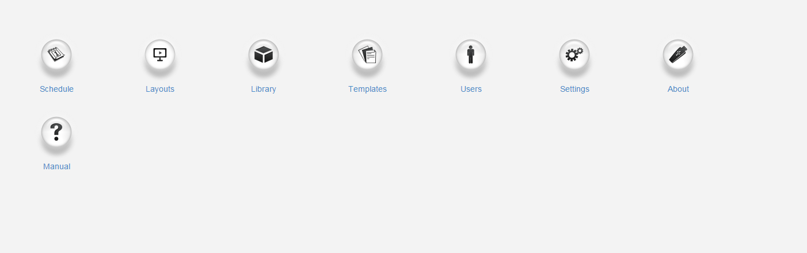
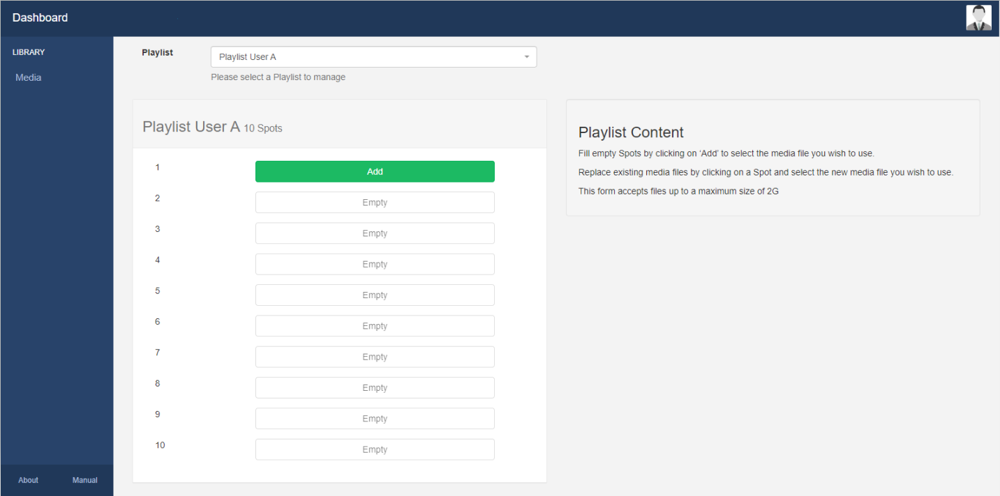

<!--toc=tour-->

# CMSダッシュボード

[ユーザー](users_administration.html)の追加・編集時にダッシュボードを**ホームページ**として割り当て、そのユーザーに対してCMSの許可された領域にアクセスできるようにすることが可能です。

CMSには4つの**ダッシュボードビュー**があり、ログイン後に**ユーザー**が最初に表示される画面として割り当てることが可能です。

## ステータスダッシュボード

CMS **ステータスダッシュボード** は、**スーパー管理者** のデフォルトのダッシュボードで、管理者のためのシステムのハイレベルなビューとして設計されています。接続されているディスプレイの数、追加されたユーザーの数、ライブラリや帯域幅の使用状況、接続されているディスプレイのアクティビティに関する情報などの概要が表示されます。

下にスクロールすると、「表示状態」と「表示コンテンツ状態」を示すグラフが表示されます。

これらのチャートをクリックすると、さらに詳細な内訳が表示されます。

上のスクリーンショットは、オンラインディスプレイグループのステータスと、その下のグリッドには詳細なディスプレイの情報を示しています。

{tip}
ディスプレイのページに直接移動するには、ディスプレイのページのリンクを使用してください！
{/tip}

## アイコンダッシュボード 

CMSの**アイコンダッシュボード**は、新しく割り当てられたすべての**ユーザー**が使用するデフォルトのダッシュボードで、CMSの他のエリアへの**ランチャー**として設計されています。ダッシュボード内のアイコンは、ユーザーの[機能](users_features_and_sharing.html) アクセスによって表示/非表示が切り替わります。

## メディア管理ダッシュボード

CMSの**メディア管理ダッシュボード**は、アクセス権が与えられている**メディア**のみを編集する**ユーザー**のために選択することができます。メディア管理ダッシュボードでは、ユーザーが [共有] (users_features_and_sharing.html) オプションを有効にした各項目を一覧表示するグリッドスタイルのインターフェースで、CMSのアクセス制限ビューが表示されます。ウィジェットのドロップダウンメニューを使用して、**下書き**または**プレイリスト**から**ウィジェット**を選択し、利用可能なフィルタを使用することができます。

## プレイリストダッシュボード

**プレイリストダッシュボード**は、**プレイリストダッシュボードユーザー**のユーザーグループに属するユーザーに割り当てることができ、ユーザーは[共有](users_features_ and_sharing.html) オプションを有効にした**プレイリスト**内のメディアのアップロード/置換にのみアクセスすることが可能です。

プレイリストダッシュボードでは、CMSの非常に限定されたビューが表示され、ユーザーはドロップダウンメニューを使用して管理する特定のプレイリストを選択することのみが可能です。

**スポット**は、[Sub-Playlistウェジット](media_module_subplaylist.html) を使って設定され、ユーザーがアップロードできるメディアファイルの数が決定されます。

{tip}
**注意：**管理者は、ユーザーがプレイリストダッシュボードを使用してメディアを追加/交換する前に、**サブプレイリストウィジェット**がレイアウトに追加され、定義されたスポットを持つユーザーのプレイリストを表示するように設定されていることを確認する必要があります。
{/tip}

