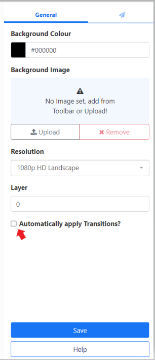

# Transition Management

{feat}Transitions|v4{/feat}

{version}

**Note:** Transitions are not supported by Tizen Players for the following Widgets:

- [Video](media_module_video.html)
- [Video In](media_module_video_in.html)
- [Local Video](media_module_localvideo.html)

{/version}

Transitions are managed from the **Transitions** page under the **Administration** section of the main CMS menu. Configure which Transitions should be available to Users for assignment to Media items:

- **Fade In** - Increase Opacity from 0 to 100.
- **Fade Out** - Decrease Opacity from 100 to 0.
- **Fly** - Fly in or out on a compass point. 

## Transition Defaults

{version}
Global default settings can be set for Transitions by Administrators from the [CMS Settings](tour_cms_settings.html#content-defaults) page.
{/version}

Default Transitions can be easily enabled for all Widgets added to a Layout by ticking the **Automatically apply Transitions?** box from the Layout property panel:

{version}

**NOTE:** When Transition Defaults have been applied, the Widget Transition fields will show as blank entries:

This is because only **manually** entered Transitions for a Widget will be shown in the form fields.
{/version}

## Playlist Transitions

These are the Transitions between **Media items** on a [Playlist](media_playlists.html) and are set as **In** and **Out** transitions.

{tip}
The Transition form adapts depending on the Transition selected and the options available for that transition. In most cases it is necessary to select a duration for the Transition in Milliseconds and in the case of Fly, a direction must also be selected.
{/tip}

## Playlist Exit Transition

A Playlist Exit Transition happens when the last Media Item to be displayed on a [Playlist](media_playlists.html) is shown and allows for a different Exit Transition to be set. 