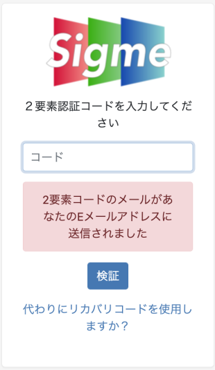
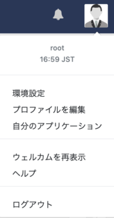
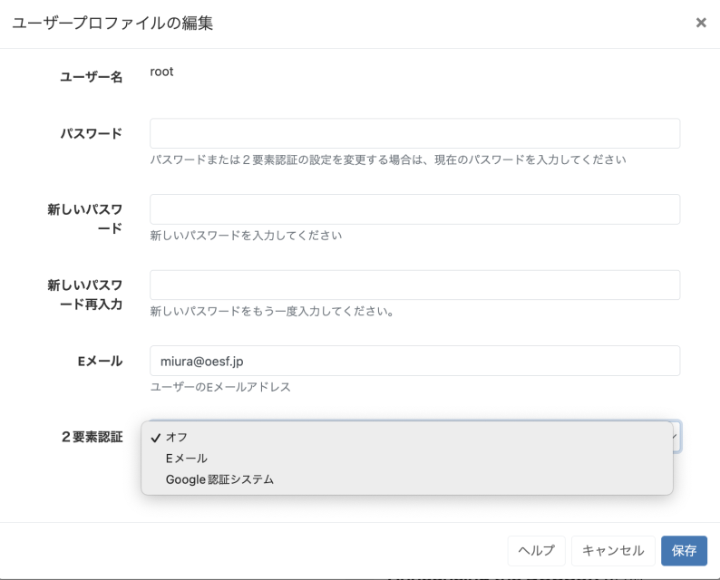
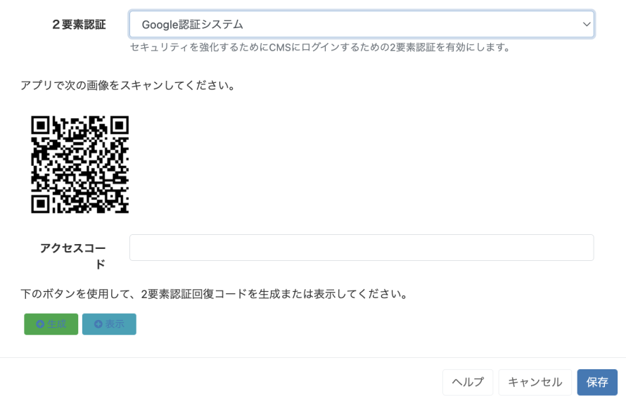

<!--toc=tour-->

# ２要素認証

セキュリティ強化のため、ユーザーは**Eメール**または**Google認証システム**の**二要素認証**オプションを設定し、CMSにログインする際にコードを入力し、本人確認を行うことができます。

{tip}
二要素認証を設定する前に、管理者がCMSの**設定**ページ、**ネットワーク**タブで**送信メール**アドレスを入力していることを確認してください
{/tip}

CMSの右上にある[ユーザープロファイル](tour_user_profile.html)に移動して、**プロファイルを編集**をクリックしてください。

**２要素認証**のドロップダウンメニューを使用して、2つのオプションのうち1つを選択します。

## Eメール

ユーザーがログインするために**ユーザー名**と**パスワード**を入力するたびに、6桁の**コード**を含む**メール**が、指定したアドレスに送信されます。

このフォームのユーザーのメールアドレスが登録されていることを確認し、**保存**を押してください。

## Google認証システム

ユーザーが**ユーザー名**と**パスワード**を入力してログインするたびに、**Google認証システ**にアクセスし、表示される6桁の**コード**を入力する必要があります。

[Google認証システムアプリ](https://play.google.com/store/apps/details?id=com.google.android.apps.authenticator2)をモバイル端末にインストールする。

ユーザープロファイル編集フォームに表示されたQRコードを読み取り、表示されたコードをアクセスコード欄に入力し、保存すると設定完了です。

{tip}
お使いの携帯電話とサーバーの時刻と日付が正しいことを確認し、エラーを回避してください。
{/tip} 

{tip}
２要素認証のオプションに加えられた変更を確認するために、パスワードの入力が必要です。
{/tip}

## リカバリーコードの生成

**メール**または**Google認証システ**のいずれかをオプションとして保存したら、**プロファイルアイコン**に戻り、**プロファイルを編集**を選択してリカバリーコードを**生成**してください。生成されたリカバリーコードをコピーし、パスワードマネージャーなどの安全な場所に保管してください。**保存**をクリックし、コードを有効にします。

いつでも**表示**をクリックすると、生成されたリカバリーコードを確認できます。

{tip}
**生成**をクリックすると、既存のコードはすべて無効となります。
{/tip}

{tip}
設定したメールアドレスやアプリにアクセスできなくなり、ユーザーがリカバリーコードを取得できなくなった場合、[ユーザー編集フォーム](users_administration.html#editing_users)からリセットすることができます。一度チェックを入れると、ユーザーはユーザープロファイルから以前と同じようにオプションを再設定することができます。
{/tip}
