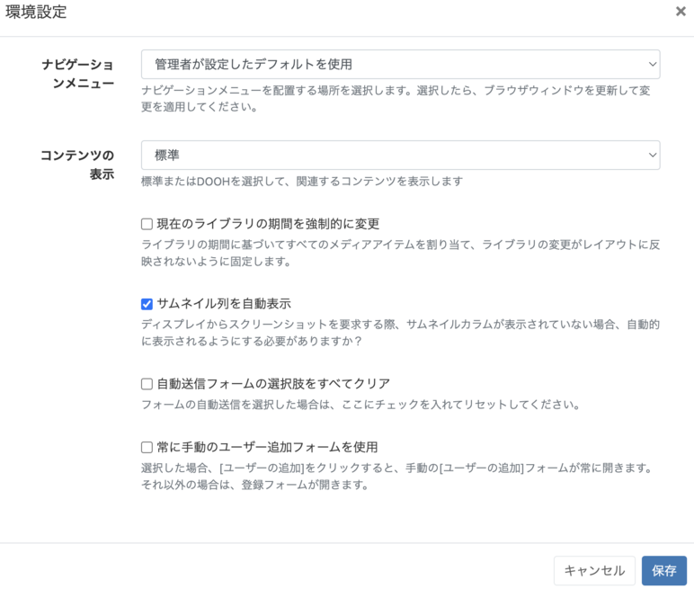
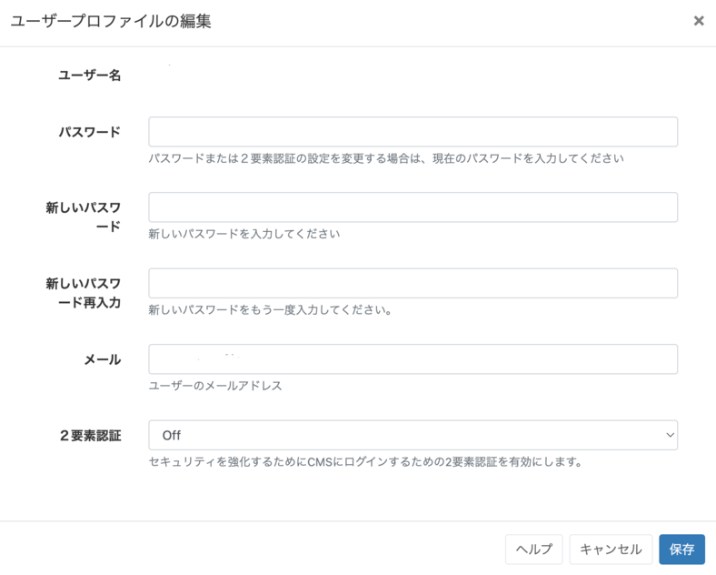

<!--toc=tour-->

# ユーザープロファイル

**ユーザープロファイル**は、ログインしているユーザーの環境設定、プロファイルの編集、その他のオプションの管理を行うために使用します。

CMS画面の右上のアイコンをクリックするとメニューが表示されます。

{tip}
**地域**で設定したCMSの時刻とタイムゾーンがここに表示されます!
{/tip}

## 環境設定

 

- ドロップダウンメニューで、CMSの**ナビゲーションメニュー**の配置を変更します。
  {tip}
  選択し保存したら、ブラウザを更新して変更が適用されていることを確認してください。
  {/tip}

- ドロップダウンメニューで、**標準**のCMSコンテンツまたは**DOOH**コンテンツを表示することが選択できます。
  {tip}
  DOOHコンテンツは、DOOHアプリケーションを許可したユーザが[マイアプリケーション](users_administration.html#マイアプリケーション)で見ることができるように、別のビューにすることができます。
  {/tip}

- ライブラリのメディアアイテムに加えられた変更がレイアウトに反映されないように、**現在のライブラリ期間を強制的に変更**します。

- このオプションを使用すると、ディスプレイからスクリーンショットを要求したときに、自動的にサムネイル列が表示されます。

- このオプションを使用すると、自動的に送信するように選択されたすべてのフォームをリセットすることができます。

- このオプションを選択すると、新しいユーザーをシステムに追加する際に、常に手動で「ユーザーを追加」フォームが表示されます。無効にすると、オンボーディングウィザードが代わりに使用されます。

## プロファイルを編集

ユーザープロファイルの編集フォームでは、ログインしたユーザーが以下のことを行うことができます。

- **パスワード**の変更
- ユーザーの**Eメール**アドレスの変更
- [２要素認証](tour_two_factor_authentication.html)を有効にする。

## ようこそを再表示

CMSのナビゲーションと機能を理解するための、CMSのショートツアーを実行します。

## ヘルプ

CMSの特徴や機能を理解するためのガイダンスとして、このユーザーマニュアルを表示します。

## ログアウト

各ユーザーのセッション終了後、CMSインスタンスから安全にログアウトする場合はクリックします。

{tip}
初めてCMSにログインされる方は、ユーザープロファイルのメニューからパスワードを変更することを強くお勧めします。
{/tip}
