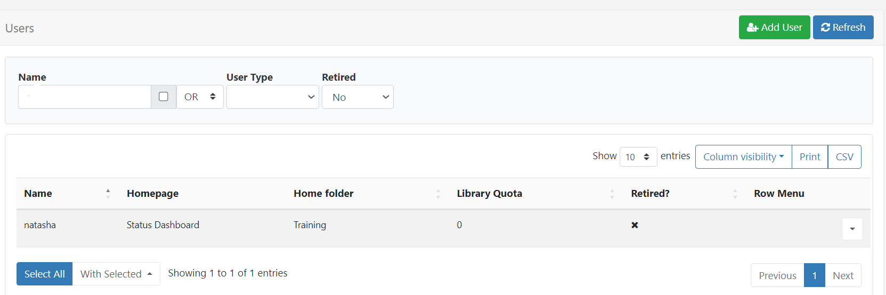

# ユーザー管理

[[PRODUCTNAME]] では、**ユーザー名** と **パスワード** が指定された複数のユーザーが CMS に個別にアクセスできます。

ユーザーはスーパー管理者によって CMS に追加され、割り当てられた [ユーザー タイプ](users_administration.html#content-user-types) と [ユーザー グループ](users_groups.html) から CMS 内でのアクセス権が付与され、適用された [機能と共有](users_features_and_sharing.html) が継承されます。

{tip}
ユーザーは 1 つまたは複数のユーザー グループに割り当てることができます。
{/tip}

### ユーザーの所有権

個々のユーザーが CMS で作成したすべてのアイテムは、そのユーザーが所有します。アイテム (レイアウト、メディア ファイル、スケジュールされたイベントなど) の所有権により、そのユーザーには他のユーザーと共有する機能を含む完全な編集権限が与えられます。

## ユーザー タイプ

すべてのユーザーには、使用可能な 3 つのユーザー タイプのいずれかを割り当てる必要があります。

### スーパー管理者ユーザー

スーパー管理者ユーザーは、割り当てられたユーザー グループに設定されている継承された機能と共有オプションに関係なく、CMS のすべての部分にアクセスできます。これには、システムの他のユーザーが追加したすべてのメディア、レイアウト、スケジュールへのフル アクセスも含まれます。

{tip}
インストール プロセス中にスーパー管理者ユーザーが作成され、CMS をセットアップするために CMS へのフル アクセス権限が与えられます。CMS システムの最後の連絡窓口として、少なくとも 1 人のスーパー管理者ユーザーを用意することをお勧めします。
{/tip}

### グループ管理者ユーザー

グループ管理者ユーザーは、自分が属するユーザー グループに割り当てられた CMS の部分のみにアクセスできます。さらに、そのユーザー グループに割り当てられた他のすべてのユーザーのすべてのメディア、レイアウト、スケジュール、および自分のメディア、レイアウト、スケジュールにアクセスできます。

### ユーザー

ユーザーは、自分が属するユーザー グループに割り当てられた CMS の部分のみにアクセスできるほか、自分のメディア、レイアウト、スケジュールにもアクセスできます。

{version}
ユーザー タイプは事前に設定されており、変更できません。
}

## CMS へのユーザーの追加

CMS のメイン メニューの [**管理**] セクションの [**ユーザー**] をクリックすると、CMS でユーザーが管理されます。ユーザー グリッドが開き、ユーザーの追加と管理ができます。



{nonwhite}
{cloud}
Xibo Cloud Hosting のお客様は、ホスティング サービスの一部としてヘルプデスクにアクセスできます。必要に応じてヘルプデスク エージェントが CMS のサポートを提供できるように、デフォルトのユーザー アカウント `xibo_admin` が変更または削除されていないことを確認してください。

cloud}
{/nonwhite}

{white}
{cloud}
必要に応じて CMS のサポートを提供できるように、デフォルトのユーザー アカウント `cms_admin` が変更または削除されていないことを確認してください。

cloud}
{/white}

- 新しいユーザーを追加するには、[**ユーザーの追加**] ボタンをクリックします。

ユーザーを追加するには、オンボーディング ウィザードを使用して事前設定されたユーザー グループを使用するか、手動で追加するかの 2 つの方法があります。

{tip}
オンボーディング ウィザードと事前設定されたグループは、新しい v4 インストールと、以前のバージョンでユーザー グループを使用したことのない v4 にアップグレードするユーザーに使用できます。

{/tip}


事前設定された **ユーザー グループ** のいずれかを選択し、**オンボーディング ウィザード** の手順を続行するか、最後のオプションである **ユーザーを手動で作成** を選択して [ユーザーの追加](users_administration.html#content-add-user-form) フォームに移動します。

### オンボーディング ウィザード

- [ユーザー グループ](users_groups.html) を選択し、**次へ** をクリックします

{tip}
[機能](users_features_and_sharing.html) は、これらのグループの共通機能用に事前構成されています。これらは、ユーザー レコードを編集することで、さらに変更して適合させることができます。
{/tip}

- ユーザー ログインとして使用され、CMS 内でユーザーを識別する **ユーザー名** と **パスワード** を作成します。

{tip}
パスワードは 8 文字以上で、大文字と小文字、および少なくとも 1 つの数字または特殊文字を含める必要があります。
ヒント}

- このユーザーのメール アドレスを入力し、[**次へ**] をクリックします。

{ヒント}
ユーザーはログイン後、[ユーザー プロファイル](tour_user_access.html#content-edit-profile) からメール アドレスを入力/編集できます。

ヒント}

- [フォルダー](tour_folders.html) を選択すると、新しいユーザーとユーザー オブジェクトを簡単に共有できます。

{ヒント}
複数のユーザーとユーザー オブジェクトを共有するプロセスを簡素化するには、フォルダーを使用することをお勧めします。フォルダーに含まれる、またはフォルダーに移動されるすべてのアイテムは、ユーザー/ユーザー グループに対して有効になっている [共有](users_features_and_sharing.html#content-share) の表示、編集、削除のオプションを継承します。
ヒント}

- フォルダーを右クリックして [ホームとして設定] オプションを選択すると、ユーザーに [ホーム フォルダー](tour_folders.html#content-home-folder) をオプションで設定できます。


- すべての変更を **保存** します。

{version}
他のユーザー (グループ管理者ユーザーなど) がオンボーディング ウィザードを使用してユーザーを追加できるようにする場合、表示および編集のためにユーザーとフォルダーを共有する必要がある場合は、[機能](users_features_and_sharing.html) で **フォルダー** が有効になっていることを確認してください。
}

### ユーザー追加フォーム

フォームを使用して、CMS にユーザーを手動で追加します:


{tip}
システムに新しいユーザーを追加するときに、オンボーディング ウィザードではなく、手動の **ユーザー追加フォーム** を常に表示するには、[ユーザー プロファイル](tour_user_access.html#content-user-profile) の **設定** で利用可能なオプションを使用します!

{/tip}

各タブに必要な情報を入力します:

- ユーザー ログインとして使用され、CMS 内でユーザーを識別する **ユーザー名** と **パスワード** を作成します。

{tip}
パスワードは 8 文字以上で、大文字と小文字、および少なくとも 1 つの数字または特殊文字を含める必要があります!
ヒント}

- このユーザーが CMS から通知を受け取れるように、このユーザーのメール アドレスを入力して、[**次へ**] をクリックします。

{ヒント}

ユーザーはログイン後、[ユーザー プロファイル](tour_user_access.html#content-user-profile) からメール アドレスを入力/編集できます。

ヒント}

- ドロップダウンを使用して **ユーザー タイプ** を選択します。

- このユーザーのライブラリにアップロードできる [ライブラリ クォータ](users_administration.html#content-library-quota) の最大量を入力します。詳細は以下のセクションを参照してください。

- このユーザーが所属する [ユーザー グループ](users_groups.html) を選択して、役割に応じて CMS の関連部分にアクセスできるようにします。

{ヒント}

CMS 内のどの部分にもアクセスする必要はないが、システム管理者としてシステムの問題が発生した場合に通知メールを必要とするユーザーの初期ユーザー グループとして **システム通知** を使用します。
ヒント}

- ドロップダウンを使用して、ユーザーのホームページの [ダッシュボード](users_dashboards.html) の選択肢から選択し、CMS の関連部分へのアクセスのみを許可します。ユーザーは、最初のログイン後にこのダッシュボードに移動します。

### ライブラリ クォータ

[[PRODUCTNAME]] にはライブラリ クォータ システムが含まれており、ユーザー/ユーザー グループにクォータ (キロバイト単位) を割り当てて、ユーザー/ユーザー グループがアップロードできるコンテンツの最大量を決定できます。値を **0** に設定すると、ユーザーには無制限のライブラリ クォータがあることを意味します。

ユーザーに対して解決できる最大のクォータは常に適用されるクォータであり、無制限のクォータは除外されます。

{ヒント}
**例:**

- ユーザー A には、ユーザー レコードに 100 MB のクォータが割り当てられています。
- グループ 1 には、グループ レコードに 50 MB のクォータが割り当てられています。
- グループ 2 には、グループ レコードに割り当てられた 120 MB のクォータがあります。

ユーザー A はグループ 1 とグループ 2 に属しているため、ライブラリ クォータは 120 MB です (これは適用されている最大のクォータです)。

ユーザー A はグループ 2 を離れるため、ライブラリ クォータは 100 MB になります (適用されている最大のクォータです)。

ユーザー A には無制限のクォータ (0) が再割り当てされ、グループ 1 に属しているため、ライブラリ クォータは 50 MB になります (グループ 1 には 50 MB のクォータが適用されているため、無制限のクォータは除外されます)。

{/tip}

#### ホーム フォルダー

[ホーム フォルダー](tour_folders.html#content-home-folder) は、フォルダーを右クリック (または新しいフォルダーを作成) して [ホームとして設定] オプションを選択することで、ユーザーに対してオプションで設定できます。

#### 参照

このタブは、ユーザーの参照情報をオプションで提供するために用意されています。追加されたら、この情報はユーザー グリッドおよび API 経由で表示できます。

#### 通知

ユーザーが受け取る通知の種類 (該当する場合は **システム** または **表示**) を選択します。

#### オプション

必要に応じて、ユーザーにさらにオプションを適用します。

- サイド ナビゲーション バーを非表示にします。

- ログイン時に新規ユーザー ガイドを非表示にします。

- 次回ログイン時にユーザーにパスワードの変更を強制します。

### パスワードの変更を強制

**オプション** タブのこの機能を使用して、システムにアクセスするために最初に与えられたパスワードを「新規」ユーザーが変更するか、ユーザー アカウントのパスワードがリセットされていることを確認します。


ユーザーは、次回ログイン時にパスワードをリセットするページにリダイレクトされます。

## ユーザーの編集

選択したユーザーの行メニューを使用して変更を行います。

{tip}
このメニューから、[ユーザー グループ](users_groups.html) メンバーシップ、[ホーム フォルダー](/manual/en/tour_folders.html#home-folders)、[機能](users_features_and_sharing.html) アクセスを簡単に管理できます。

ユーザー レコードに必要な変更を加えるには、[**編集**] をクリックします。

{/tip}

### 2 要素認証をリセットする

ユーザーがメールや Google Authenticator アプリにアクセスできなくなり、保存されている回復コードにアクセスできない場合は、[ユーザーの編集] フォームのチェック ボックスを使用して [2 要素認証をリセット**] します。

チェックを入れると、この **ユーザー プロファイル** の 2 要素認証が「オフ」に設定され、保存されているシークレット コードはすべてクリアされます。ユーザーは、以前と同じように、ユーザー プロファイルから [2 要素認証](tour_user_access.html#content-two-factor-authentication) を設定できるようになりました。

{tip}
列の表示ボタンを使用して、**2 要素** 列をユーザー グリッドに追加します。これにより、ユーザーが設定した 2 要素認証の概要 (無効 / メール / Google 認証) が表示されます。

CMS にアクセスできない場合は、次の SQL をデータベースで直接実行して、指定したユーザー `{yourUserId}` の 2FA データをクリアします。userId はユーザー テーブルにあります。

```
UPDATE `user` SET `twoFactorSecret` = NULL,
`twoFactorTypeId` = 0,
`twoFactorRecoveryCodes` = NULL
WHERE userId = {yourUserId}
```

{/tip}

## ユーザーの削除

行メニューを使用して、CMS からユーザーを削除します。確認フォームが開き、そのユーザーが現在所有しているアイテムに関する追加のオプションが表示されます。

{tip}
ユーザーを削除すると元に戻すことはできず、メディア、レイアウト、スケジュールなど、そのユーザーが所有するすべてのアイテムがシステム内の他のユーザーによって使用されている場合でも削除されます。セレクターを使用して別のユーザーに**アイテムを再割り当て**すると、そのユーザーが削除するユーザーが現在所有するすべてのアイテムの新しい所有者になります。または、ユーザー編集フォームの下部にある**廃止**チェックボックスを使用して、ユーザーがログインできない状態でもアイテムがシステム内で引き続き使用されるようにします。

[[PRODUCTNAME]] では、追加できるユーザーの数に制限はありません。

{/tip}

{nonwhite}

{cloud}

当社の**Xibo Cloud Hosting**では、同時アクセスやライセンスユーザーアクセスに制限は一切ありません。

{/cloud}

{/nonwhite}

#### 次へ...

[ユーザーグループ](users_groups.html)