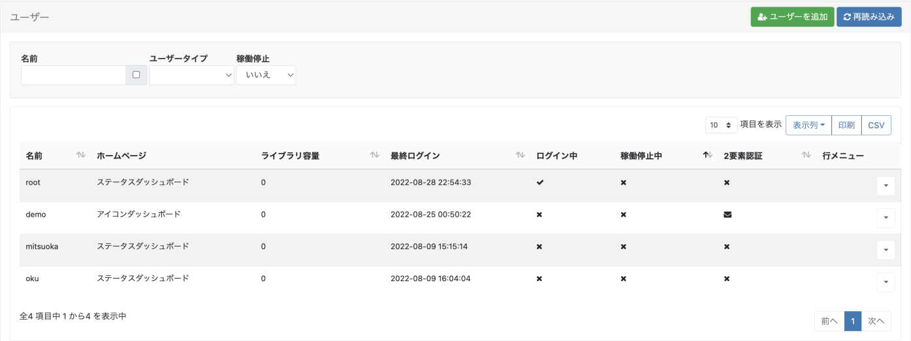
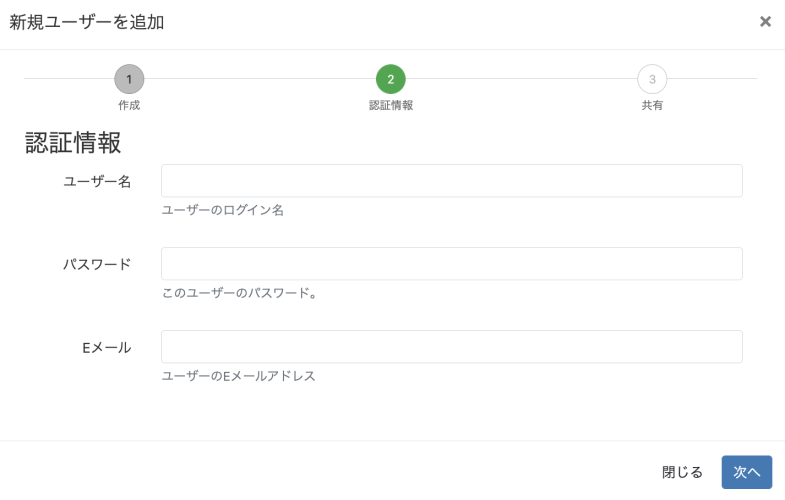
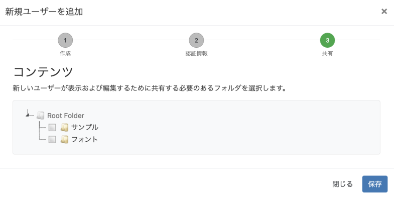
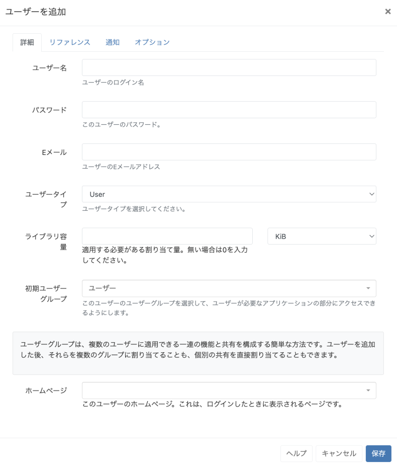
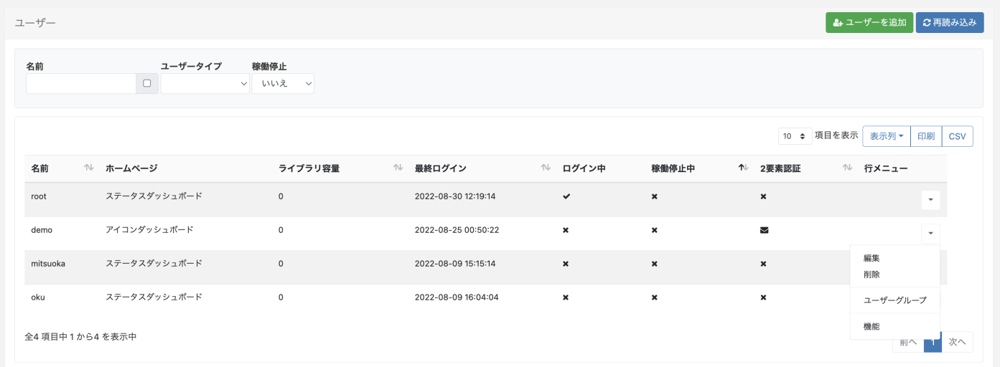
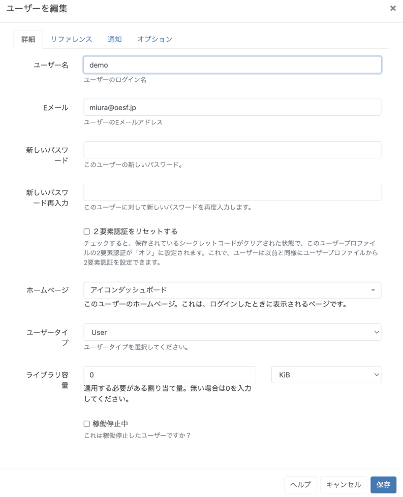
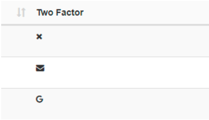
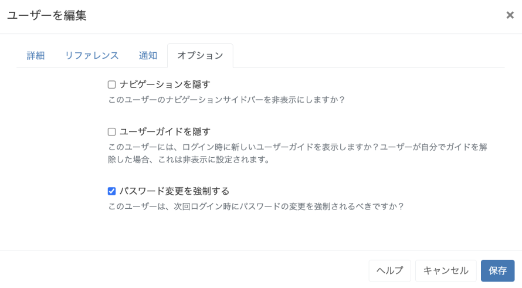
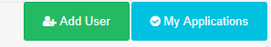

<!--toc=users-->

# ユーザー管理

ユーザーの管理は、メインメニューの**管理**セクションにある**ユーザー**をクリックすることで行います。ユーザー[グリッド](tour_grids.html)が表示され、新規ユーザーの追加や既存ユーザーの管理を行うことができます。



システムのトラブルなど、必要なときにスーパー管理者がCMSを操作できるように、スーパー管理者のアカウントが変更または削除できないことを確認してください。画面の例では`root`がスーパー管理者です。

## ユーザーを追加

**ユーザーを追加**ボタンをクリックします。

ユーザーを追加する方法には、あらかじめ設定されたユーザーグループを使用する新規ユーザーを追加ウィザードと、手動でユーザーを追加する2つの方法があります。


あらかじめ設定されている **グループ** から選択して **新規ユーザーを追加ウィザード** を実行するか、**手動でユーザーを追加** を選択すると **ユーザーを追加** フォームに移動します。

### 新規ユーザーを追加ウィザード

- グループを選択し、**次へ**をクリックします。

  {tip}
  [機能と共有](users_features_and_sharing.html)の設定は、グループ共通の情報としてあらかじめ設定されており、ユーザーレコードを編集することで自由に変更できます。
  {/tip}

  

- **ユーザー名**と**パスワード**を作成します。これらはログインとCMS内でのユーザー識別に使用されます。

  {tip}
  パスワードは少なくとも8文字以上で、大文字と小文字、そして少なくとも1つの数字または特殊文字を含んでいなければなりません。
  {/tip}

- このユーザーのEメールアドレスを入力し、**次へ**をクリックします。

  {tip}
  ユーザーはログイン後、[ユーザープロフィール](tour_user_profile.html)からメールアドレスを入力・編集することができます。
  {/tip}

- 新しいユーザーとオブジェクトを共有するために、利用可能な**フォルダ**から選択します。

  {tip}
  フォルダに含まれる、または移動されたすべてのオブジェクトは、ユーザー/ユーザーグループに対して有効化された、表示、編集、削除、[共有](users_features_and_sharing.html)オプションを引き継ぎます。
  {/tip}
  
  

{tip}
ユーザー（グループ管理者など）が新規ユーザーを追加ウィザードを使用して追加できるようにする場合、表示や編集のためにユーザーとフォルダを共有する必要がある場合は、[機能と共有](users_features_and_sharing.html)でフォルダーが有効になっていることを確認してください。
{/tip}

- **保存**

  新しく作成されたユーザーが追加され、グリッドで確認することができます。

### ユーザーを追加フォーム



{tip}
新しいユーザーをシステムに追加する際、新規ユーザーを追加ウィザードの代わりに、常に手動でユーザー追加フォームを表示するには、[ユーザープロファイル](tour_user_profile.html)の**環境設定**で常に[手動のユーザー追加フォームを使用]オプションを有効にしてください!
{/tip}

#### 詳細設定

- **ユーザー名**とパスワード**を作成し、ログインとCMS内でのユーザー識別に使用します。

  {tip}
  パスワードは少なくとも8文字以上で、大文字と小文字、そして少なくとも1つの数字または特殊文字を含んでいなければなりません。
  {/tip}

- このユーザーのEメールアドレスを入力し、**次へ**をクリックします。

  {tip}
  ユーザーはログイン後、[ユーザープロフィール](tour_user_profile.html)からメールアドレスを入力・編集することができます。
  {/tip}

- ドロップダウンで3種類の[ユーザータイプ](user_types.html)のどれかを選択してください。

- このユーザーがライブラリにアップロードできるコンテンツの最大量を割り当てます。0を入力すると容量制限が適用されません。(容量制限が無制限になります。）

- このユーザーがどの[ユーザーグループ](users_groups.html)に属するかを選択し、必要に応じてシステムの関連部分にアクセスできるようにします。

  {tip}
  **システム通知**は、CMS内へのアクセス権を必要としないが、システム管理者としてシステムの問題発生時に通知メールが必要なユーザーのための初期ユーザーグループとして使用してください。
  {/tip}

- ログイン後に表示される「ホームページ」の[ダッシュボード](tour_status_dashboards.html)をドロップダウンで選択することができます。

#### リファレンス

このタブでは、ユーザーの閲覧や整理のための参考となる情報を任意で記入することができます。

#### 通知

- **システム通知**とディスプレイ通知**のどちらを受信するか、チェックボックスで選択します。

#### オプション

必要に応じて、さらにオプションを設定することができます。

- サイドナビゲーションバーを非表示にします。
- ログイン時に新規ユーザーのガイドを非表示にする。
- ユーザーが次回ログイン時にパスワードを変更するよう強制する。

{tip}
[[PRODUCTNAME]]は、追加できるユーザー数に制限を設けていません。
{/tip}

{cloud}
Sigme Cloudでは、同時アクセスに制限を課したり、ユーザーアクセスにライセンスを与えたりすることは一切ありません。
{/cloud}

## ユーザーを編集

ユーザーの行メニューで、利用可能なオプションから編集を選択してユーザーの情報を変更することができます。



{tip}
[ユーザーグループ](users_groups.html)のメンバー管理、[機能と共有](users_features_and_sharing.html)の管理もこのメニューから可能です。
{/tip}

**編集**をクリックすると、**ユーザーを編集**フォームが表示され、必要に応じてユーザーの設定情報を変更することができます。




## ２要素認証のリセット

ユーザーがメールやGoogle認証アプリにアクセスできなくなり、保存されているリカバリーコードにアクセスできない場合、チェックボックスを使用して**２要素認証のリセット**にチェックを入れてください。

このチェックボックスをオンにすると、この**ユーザプロファイル**の２要素認証はオフになり、保存されているすべてのシークレットコードが消去されます。ユーザーは、ユーザープロファイルから[２要素認証](tour_two_factor_authentication.html)を以前と同様に設定することができます。

{tip}
[カラムの表示]ボタンを使用して、[ユーザー]グリッドに**２要素認証**列を追加します。これにより、２要素認証に関して設定されたユーザーの設定状態が表示されます。(上から順に、オフ/メール/Google認証)



{/tip}

{tip}
CMSにアクセスできない場合、以下のSQLを直接データベースで実行して、指定したユーザー `{yourUserId}` の２要素認データをクリアします。

```
UPDATE `user` SET `twoFactorSecret` = NULL,
`twoFactorTypeId` = 0,
`twoFactorRecoveryCodes` = NULL
WHERE userId = {yourUserId}
```
{/tip}

## パスワード変更を強制する

この機能は、'新規'ユーザーがシステムにアクセスするために最初に与えられたパスワードを変更する場合、またはユーザーアカウントのパスワードがリセットされた場合に使用します。

**オプション**タブをクリックし、**パスワード変更を強制する**にチェックを入れ、保存します。




次回ログイン時にパスワードの再設定ページが表示されます。
  

## ユーザーの削除

行メニューの **削除** オプションからユーザーを削除します。確認画面が表示され、そのユーザーが現在所有しているアイテムに関する詳細なオプションが表示されます。

{tip}
ユーザーを削除すると、メディア、レイアウト、スケジュールなど、そのユーザーが所有しているすべてのアイテムが削除されます。（これらのアイテムがシステム内の他のユーザーによって使用されている場合も同様です。）
セレクターを使用して他の**ユーザーにアイテム**を割り当て、削除したいユーザーが現在所有しているすべてのアイテムを新しい所有者に変更してください。
または、ユーザー編集フォームの下部にある **稼働停止** チェックボックスを使用して、ユーザーがログインできない状態すれば、アイテムはシステムで使用可能な状態のままになります。
{/tip}

## マイアプリケーション

[[PRODUCTNAME]]には、サードパーティアプリケーションが接続し、そのデータを利用できるようにするためのAPIが提供されています。

{tip}
**アプリケーションの追加**とDOOHアプリケーションの追加**は、メインメニューの**設定**セクションの**アプリケーション**から行うことができます。
{/tip}

**アプリケーション**を使用する前に、各ユーザーはCMS内で自分の代わりに行動するアプリケーションを承認する必要があります。一度承認されると、ユーザープロファイルの**マイアプリケーション** ボタンをクリックすることで、現在のリストを表示することができます。

<!--
  
-->

{tip}
現時点では、CMSは個々のユーザーに対して、アプリケーションへのアクセスを取り消す方法を提供していませんが、管理者はアプリケーションを完全に削除することができます。
{/tip}
