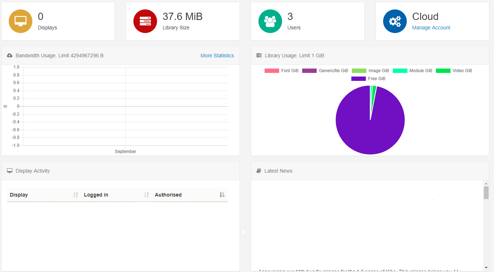

# User Dashboards

Dashboards are assigned to [Users](users_administration.html)/[User Groups](users_groups.html) to serve as a **Homepage** and allow access to only the permitted parts of the CMS for the assigned User.

## Status Dashboard

The **Status Dashboard** is the default User Dashboard for **Super Admin Users** and is intended as a high-level view of the system for administration purposes. This dashboard gives an overview for connected [Displays](displays.html), added [Users](users_administration.html) of the CMS and provides information relating to Library and Bandwidth usage as well as Display Activity:

Scroll down the Status Dashboard to access further charts to view **Display Status** and **Display Content Status**:

Get further breakdowns by clicking on either of these charts:

{tip}
Use the Displays Page link to be redirected straight to the Displays grid in the CMS!
{/tip}

## Icon Dashboard 

The **Icon Dashboard** is a default User Dashboard which is used for all newly assigned **Users** and is intended as a **Launcher** into other areas of the CMS. 

The icons shown within this dashboard are managed by the enabled [Feature](users_features_and_sharing.html) access for the User. 

## Media Manager Dashboard

The **Media Manager Dashboard** gives an overview of the current status of Library Media in the CMS to easily see number and size of items as well as easily view any unreleased or unused media:

## Playlist Dashboard

The **Playlist Dashboard** can be assigned to Users who belong to the **Playlist Dashboard User Group** so that they can only upload or replace media in [Playlists](media_playlists.html) they have been given access to from enabled [Share](users_features_and_sharing.html) options.

The Playlist Dashboard gives a very restricted view of the CMS with a User only able to select specific Playlists to manage using the drop-down menu.

In order to determine how many media files a User can upload to a Playlist, Spots need to be configured by adding the [Playlist Widget](media_module_playlist.html) to a Playlist.

{tip}
**NOTE:** Administrators need to ensure that the **Playlist Widget** has been configured with Spots and added to a Playlist in a Layout before a User can add/replace Media using the **Playlist Dashboard**.
{/tip}

