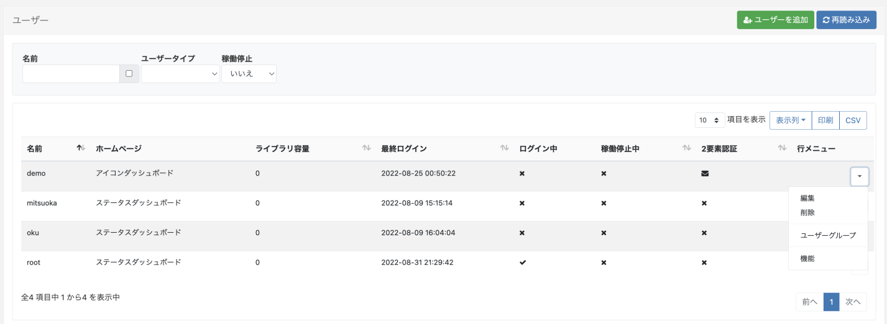
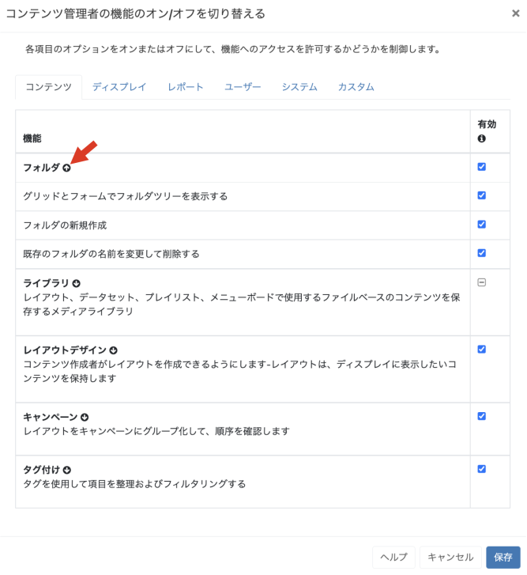
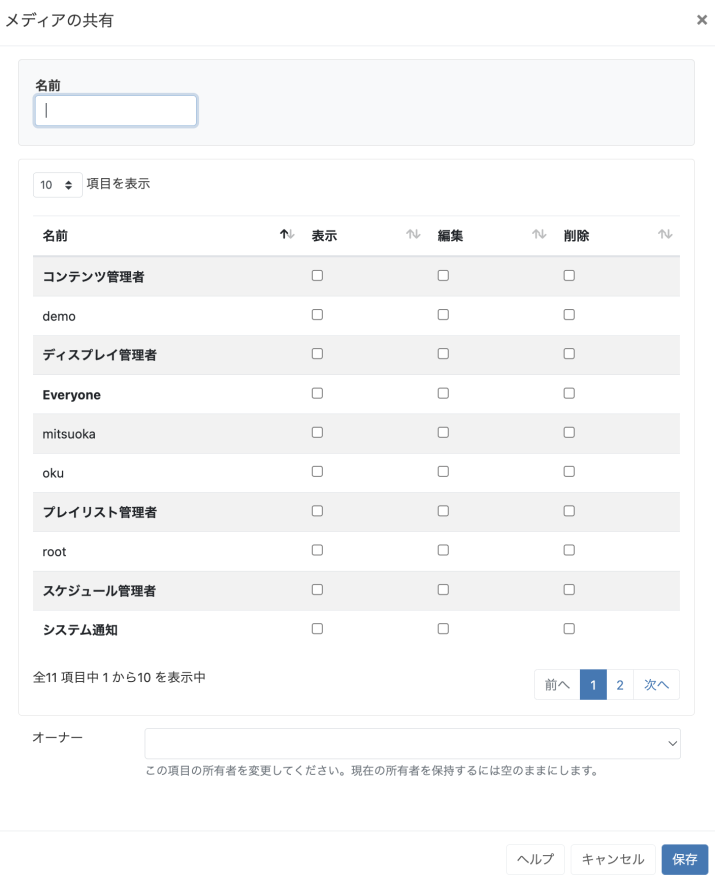
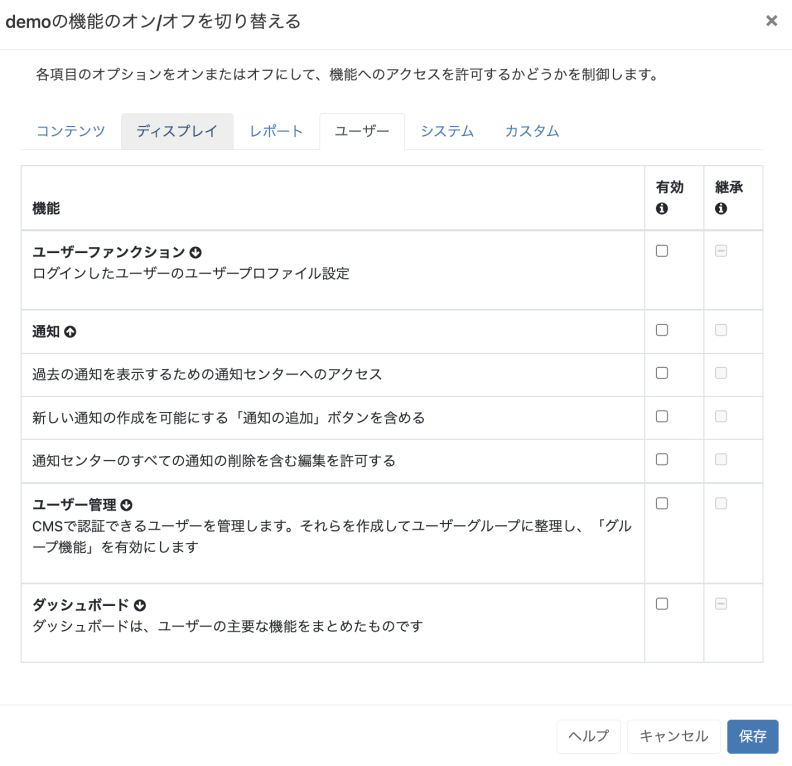

<!--toc=users-->

# 機能と共有

ユーザーとユーザーグループのアクセスは、2つの概念で制御されます。

1. **機能** - ユーザーがCMS内で見ることができるもの、行うことができるものを制御します。
2. **共有** - フォルダ、メディア、プレイリスト、データセット、レイアウト、ディスプレイ/ディスプレイグループなどのユーザーオブジェクトの表示、編集、削除のオプションを制御します。

これらの概念は、互いに組み合わせて使用することで、CMSの関連する部分のみがユーザー/ユーザーグループに表示され、オブジェクトに対して適切なレベルのインタラクションが適用されることを保証します。

## 1. 機能

メニューの **管理** セクションから、**ユーザー** または **ユーザーグループ** をクリックします。

- 選択したユーザーまたはユーザーグループの行メニューを使用し、ドロップダウンメニューから**機能**を選択します。

このタブ付きフォームには、アクセスの有効化/無効化によって制御可能なすべての機能が含まれています。

{tip}
ユーザー個人の記録を閲覧する際、[ユーザーグループ](users_groups.html)のメンバーからすでに有効になっている機能があれば、**継承**の列に表示されます。
{/tip}

各 **機能** には、「機能セット」が含まれています。矢印を使用して展開すると、そのセット内のすべての機能を見ることができます。

上の画像のように、チェックボックス内に表示される線は、「セット」から選択した機能が有効になっていることを示します。拡大すると、何が有効になったかを確認し、必要に応じてさらに編集を行うことができます。チェックボックスの青いチェックは、セット内のすべての機能が有効化されたことを意味します。

{tip}
ユーザーの種類に応じて必要な機能にアクセスできる定義済みのユーザーカテゴリを使用するか、[ユーザーグループ](users_groups.html)を使用して機能アクセスを管理すると、新規ユーザーの加入を容易にします。ユーザーグループ内の特定のユーザーにさらにアクセス権を与える必要がある場合は、そのユーザーのユーザーレコードで直接割り当てます。
{/tip}

## 2. 共有

CMS内のユーザーオブジェクトは、ユーザー/ユーザーグループが必要なアクセス権を持つように、オプションを適用することができます。

- オブジェクトの行メニューを使用し、ドロップダウンメニューから**共有**を選択します。

- このフォームを使用して、個々のユーザーおよびユーザーグループ（ユーザーグループは太字で表示）の**表示**、**編集**および**削除**オプションを有効/無効にします。

{tip}
**注意：**ユーザーがオブジェクトの**共有**オプションを有効にするには、**ユーザー機能**のサブセットである「すべてのユーザーオブジェクトに共有機能を許可する」機能を有効にする必要があります。
{/tip}

{tip}

### シナリオ:

ユーザーグループの全員がデータセットのデータを編集する必要があり、特定のユーザーだけがデータを削除することができるように設定します。

まず、ユーザーグループがデータセットにアクセスできることを確認し、次にデータセットに適切な編集オプションを適用します。

取るべきアクション:

- ユーザーグループの行メニューから、**機能**を選択します。
- **コンテンツ** タブから、**ライブラリ** 機能セットを展開します。
- 「レイアウトとは別に、データセットに含まれるすべてのデータに対して削除を含む編集を許可する」を有効にするためにチェックを入れます。
- CMSの**ライブラリ**セクションの**データセット**に移動し、選択したデータセットの行メニューで**共有**を選択します。
- ユーザーグループ**の**表示**と**編集**にチェックを入れます。
- **ユーザー**の**削除**にチェックを入れます（グループの表示と編集は既に有効になっているので、ユーザーのチェックを入れる必要はありません）。

{/tip}

ユーザーには、常に最も高い編集レベルが使用されます。あるユーザーが2つのグループに所属しており、一方のグループがオブジェクトの削除を有効にしており、他方が無効にしている場合、そのユーザーはオブジェクトの削除アクセス権を持ちます。

{tip}
**リージョン**と**ウィジェット**の共有オプションは、レイアウトデザイナーの[ツールメニュー](layouts_tools.html)を使って割り当てます!
{/tip}

アイテムに加えられた変更は「リアルタイム」で利用可能で、ユーザーが次にオブジェクトを操作したときに、新しく設定されたオプションが適用されることを意味します。

{tip}
[グリッド](tour_grids.html) の下部にある **個別選択** を使用すると、共有で一括操作ができます!
{/tip}

{tip}
ログインしている場合、**ユーザー**は、**共有**をクリックすると、自分のユーザーグループの他のユーザーのリストのみが表示されます。**スーパー管理者**は、システム内のすべてのユーザーを見ることができます。
{/tip}

{tip}
アイテムの共有権限は、オーナー、グループ管理者、スーパー管理者のいずれかが変更できます。
所有者がいないディスプレイとディスプレイグループの共有権限は、スーパー管理者のみが変更できます。
{/tip}

### フォルダ

フォルダを作成し、**共有**オプションを割り当てることで、そのフォルダ内に保存されたレイアウト、ライブラリメディア、データセット、ディスプレイ/ディスプレイグループなどに対して、ユーザー/ユーザーグループごとに必要なアクセスを簡単に設定することができます。

{nonwhite}
For further information on Folder Administration, click [here](https://xibo.org.uk/docs/setup/folders-administration)
{/nonwhite}

