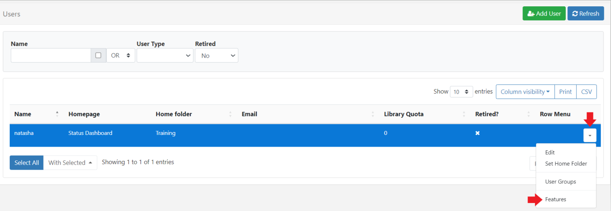
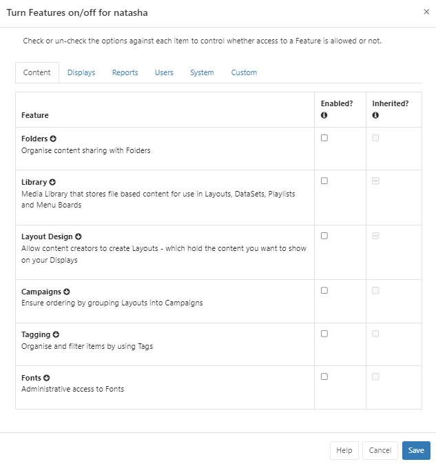

# Features and Sharing

Access to the CMS for all system objects and User objects is controlled for Users/User Groups using two concepts:

- **Features** - control what a User can see and do within the CMS (system objects)
- **Share** - controls View, Edit and Delete options for user objects such as; Folders, Media, Layouts, Displays/Display Groups. (User objects)

When used in conjunction with each other, these concepts ensure that only the relevant parts of the CMS are visible to Users/User Groups with the appropriate level of user interaction applied.

## Features

Features are used to set the required access within the CMS for Users by restricting pages and page functionality (controlling what a User can see and do in the CMS).

{tip}
**We recommend** utilising User Groups in order to set the required Feature access for multiple Users within the CMS and then adding Users to this group who will then inherit enabled Features for an easier and safer work flow with less room for error.

If you need to give further access to specific Users within User Groups, assign these directly to the User.
{/tip}

- Features are configured from the row menu for [Users](users_administration.html) or [User Groups](users_groups.html):

Features have been grouped into logical tabs to make it easier to control the appropriate areas of access:

An **Inherited** column is shown when viewing **Users** to indicate if a Feature has been inherited from an existing **User Group** membership.

A `-` shown in a column for a Feature tells you that that only selected Features within that Feature Set have been enabled. Expand a Feature using the arrow to see all available Features within the set:

A tick tells you that all the Features within that set have been enabled.

- Click in the Enabled column to turn on the required Features for the User/User Group.

{tip}
Make it easier to onboard new Users by using the predefined [User Groups](users_groups.html) which already contain the appropriate Feature access for the type of User. 
{/tip}

## Share

Share options are used to set View/Edit/Delete options for User objects within the CMS for Users (controlling the level of interaction for an item, such as a Layout or Media file, for a User).

### Set Share options on Folders (Recommended)

The easiest and quickest route is to create and use [Folders](tour_folders.html) to set the necessary access rights directly to the Folder which means you do not have to set multiple options for multiple items individually.  All objects that are contained or later moved into the Folder will automatically inherit the View/Edit/Delete options set for Users/User Groups.

- Create a [Folder](tour_folders.html#content-creating-folders)
- Set **Share** access for Users to apply to all objects contained within the Folder.

- Move/Save objects into the Folder which Users need to access by using the row menu for selected items and click **Select Folder** or select the Folder when creating/uploading an item.

{tip}
**NOTE:** Share options for Folders can only be set by a Super Administrator.
{/tip}

{version}
**IMPORTANT:** All elements of an item that need to be shared should also be moved to the Folder, this includes moving Media files contained on Layouts, and Layouts within Campaigns, as an example,  if Users need access to those to!
{/version}

### Set Share options on objects

Access rights for a User can also be assigned directly from the object itself:

- Use the row menu for the object and select **Share**.

- Use the form to enable/disable **View**, **Edit** and **Delete** options for Users (User Groups are shown in bold).

{version}
**NOTE:** In order for Users to have the ability to **Share** items with other Users of the system, the User would first need the 'Allow Sharing capabilities for all User objects' Feature enabled which is within the **User functions** subset of **User** Features.

{/version}

{tip}
When logged in, a **User** will only see a list of other Users from their own User Group on clicking **Share**. A **Super Admin User** will see all Users in the system.

Sharing options for **Widgets** are assigned using the [context menu](layouts_editor.html#content-context-menu) in the Layout Editor!

{/tip}

### Scenario:

All members of a User Group need to edit DataSet data with only one specific User able to **Delete** the data:

- Use the row menu for the User Group and select **Features**.
- From the **Content** tab expand the **Library** Feature set.
- Enable the checkbox for  'Allow edits including deletion to all data contained within a DataSet independently to Layouts'.
- Move the DataSets to a **Folder** which has been shared with the User Group (View and Edit options enabled so the DataSets will inherit those options) or use the row menu for each DataSet and select Share to enable View and Edit options for the User Group.
- Tick **Delete** for the **User** (View and Edit are already enabled for the Group so do not need to be ticked for the User).

{tip}
The highest editing level will always be used for Users. If a User belongs to two groups where one group has Delete enabled for an object and the other does not, the User will have Delete access for the object.
{/tip}

Modifications made to items are available in 'real time' which means that the next time a User interacts with the object the newly set options will be applied.

{tip}
Use **With Selected** at the bottom of [Grids](tour_cms_navigation#content-grids) to perform bulk actions with Sharing.

**Share** options on a **User Object** can be changed by the owner, Group Admin or a Super Administrator.

**Share** options for **Displays** and **Display Groups**, that have no owner, can only be changed by a Super Administrator.
{/tip}

