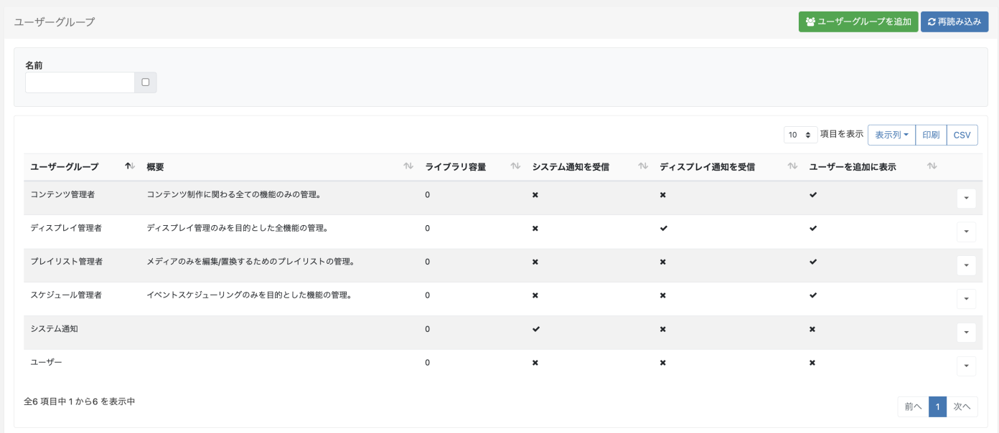
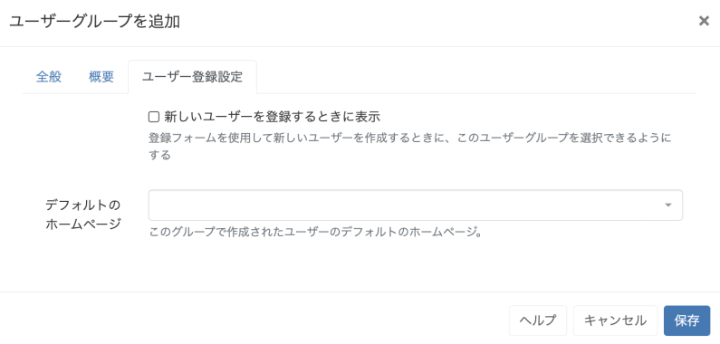
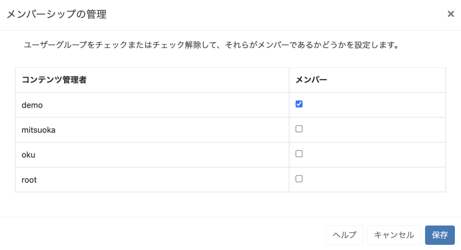
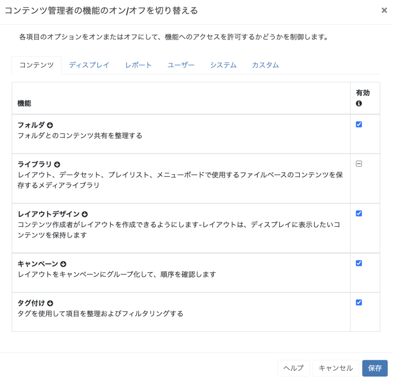

<!--toc=users-->

# ユーザーグループ

ユーザーグループは、指定されたグループ内のすべてのユーザーに適用される[機能と共有](users_features_and_sharing.html)オプションの設定を可能にします。

[[PRODUCTNAME]]には、インストール時にあらかじめ設定されたユーザーグループがあります。

これらのグループは、ユーザーが選択した役割に必要な機能がすでに有効になっており、必要に応じて変更することができます。

{tip}
ユーザーグループを利用することで、新しいユーザーの獲得やシステムアクセスの管理が容易になります。ユーザーは、ユーザーグループで有効化された[機能と共有](users_features_and_sharing.html)を引き継ぎます。
{/tip}

メニューの **管理** セクションにある **ユーザーグループ** をクリックして、新規作成および既存の管理をしてください。

{tip}
[ユーザーを追加](users_administration.html)のグループ登録設定ウィザードで、作成したユーザーグループの表示を有効にすることができます!
{/tip}

新しいグループを作成するには、**ユーザーグループを追加** ボタンをクリックし、フォームを開きます。

### 全般

- このタブで、ユーザーグループを識別するための **名前** を指定します。
- ライブラリにアップロードできるコンテンツの最大量を決定するために、グループに**ライブラリ容量**を割り当てます。クォータを適用しない場合は、0を入力してください。適用されたライブラリクォータについては、管理者にご相談ください。
- グループに必要な場合は、**通知** オプションを有効にします。

### 概要

作成されたグループを説明するためのオプションのテキストを入力します。

{tip}
有効にすると、この説明は新しいユーザーをグループ登録する際に表示されるので、選択するためにグループの役割を明確に説明する必要があります。
{/tip}

### グループ登録設定

このタブでは、新しいユーザーを登録するためのオプションを設定します。

- このチェックボックスを使用すると、新しいユーザーのためのグループ登録設ウィザードを使用するときに、このユーザーグループを選択するために含めることができます。
- グループで作成したユーザーのホームページとして使用する[ダッシュボード](tour_status_dashboard.html)をドロップダウンで選択してください。

すべてのタブが作成されたら、**保存**をクリックします。

## グループメンバー 

一度作成したユーザは、**行メニュー** を使用して、**メンバー** をクリックして、グループに割り当てることができます。

- チェックボックスを使って**ユーザー**を**グループ**に割り当て、[保存]をクリックします。

{tip}
ユーザーは、1つまたは複数の**ユーザーグループ**に割り当てることができ、共有と共同作業を容易にすることができます!
{/tip}

{tip}
ユーザーメンバーシップは、ユーザーグリッドから行メニューを使用して制御することもできます。**ユーザーグループ**をクリックすると、**メンバーシップの管理**フォームが表示されます。
{/tip}

## 機能

ユーザーグループに必要なアクセスを制御するために、**行メニュー**から**機能**をクリックします。

詳しくは、以下のページをご覧ください。[機能と共有](users_features_and_sharing.html)をご覧ください。

{tip}
ユーザーグループの行メニューから**コピー**を使用すると、簡単にニーズに合わせた新しいグループを作成することができます!
{/tip}

